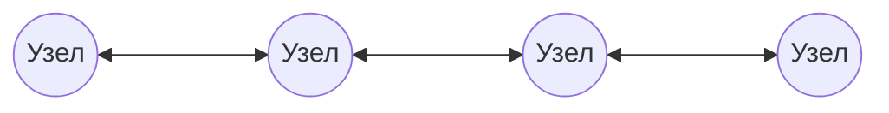
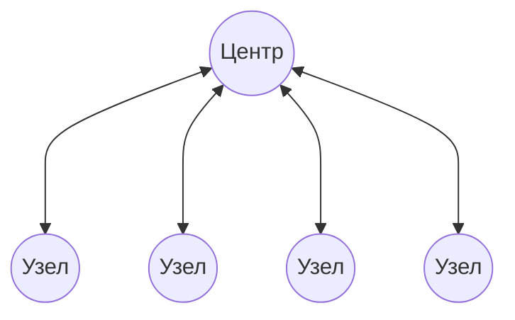
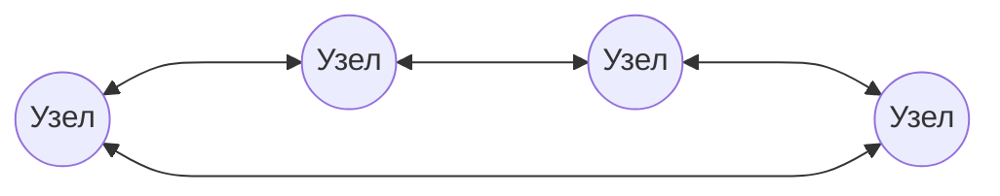
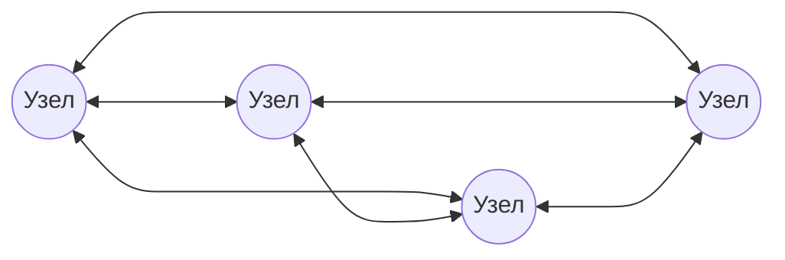
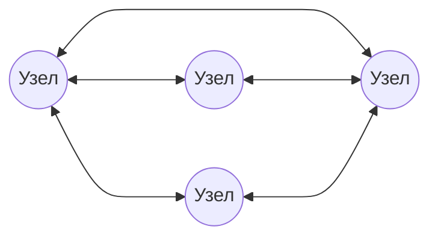
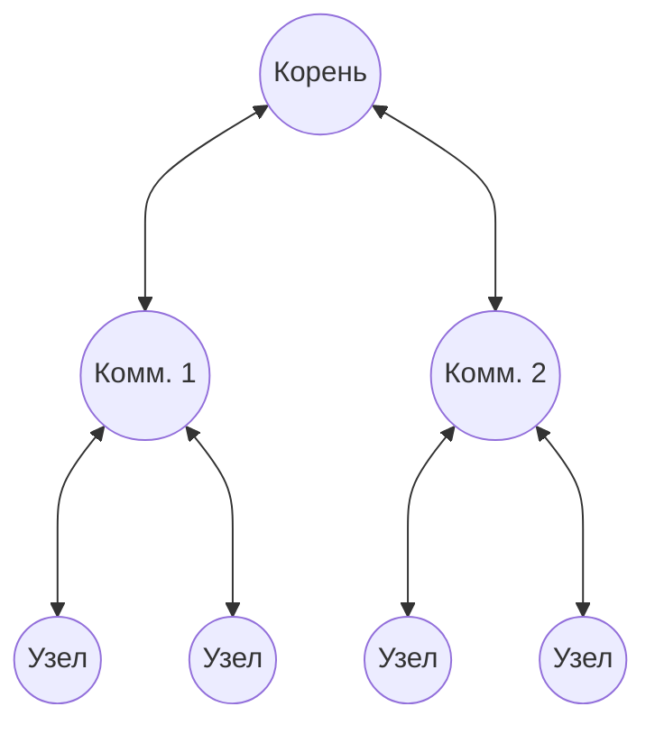

#введение #фундаментальные_понятия #PAN #LAN #MAN #WAN #шина #звезда #кольцо #полносвязная #ячеистая #древовидная
___
## Введение

Классификация - это первый шаг к системному пониманию любой сложной области. Компьютерные сети можно классифицировать по множеству признаков: по размеру (географическому охвату), по топологии (способу соединения узлов), по типу среды передачи, по способу управления. В этой заметке мы подробно разберём два наиболее фундаментальных критерия, которые определяют архитектуру сети с самого начала её проектирования: **размер** (масштаб) и **топологию** (структуру)

Важно сразу разделить понятия **физической топологии** (как реально проложены кабели и установлены устройства) и **логической топологии** (как данные передаются между узлами с точки зрения доступа к среде). Эти две структуры могут не совпадать, и это ключевой момент для понимания работы канального уровня

---

## Классификация сетей по размеру (географическому охвату)

В академической литературе (Таненбаум, Куроуз) принято выделять иерархию сетей, основанную на физическом расстоянии между узлами. Эта иерархия определяет не только масштаб, но и используемые технологии, протоколы и задержки

### 1. PAN (Personal Area Network) - Персональная сеть

- **Охват**: в пределах одного рабочего места или нескольких метров (обычно до 10 м)
- **Назначение**: соединение личных устройств (смартфон, ноутбук, наушники, умные часы) между собой
- **Технологии**: Bluetooth, ZigBee, IrDA, NFC
- **Характеристики**: крайне малые задержки, низкое энергопотребление, отсутствие сложной маршрутизации

### 2. LAN (Local Area Network) - Локальная сеть

- **Охват**: в пределах одного здания, офиса, кампуса (обычно до 1–2 км)
- **Назначение**: объединение компьютеров и периферии внутри организации для совместного использования ресурсов
- **Технологии**: Ethernet (IEEE 802.3), Wi-Fi (IEEE 802.11)
- **Ключевые особенности**:
    - Высокая скорость передачи данных (от 100 Мбит/с до 100 Гбит/с и выше)
    - Низкий уровень ошибок (из-за коротких расстояний и контролируемой среды)
    - Сеть находится в единоличной собственности организации (администрируется локально)
    - Не требует маршрутизации в глобальном смысле (работает на канальном уровне)

### 3. MAN (Metropolitan Area Network) - Городская сеть

- **Охват**: в пределах города или крупного населённого пункта (до 50–100 км)
- **Назначение**: соединение нескольких локальных сетей (LAN) на территории мегаполиса, связь офисов одного предприятия, доступ к городским ресурсам
- **Технологии**: Ethernet (в метро-реализациях), MPLS, оптические кольца (SONET/SDH)
- **Ключевые особенности**:
    - Занимает промежуточное положение между LAN и WAN
    - Часто использует оптоволоконные магистрали
    - Может принадлежать как частной компании, так и муниципалитету

### 4. WAN (Wide Area Network) - Глобальная сеть

- **Охват**: в пределах страны, континента или всей планеты
- **Назначение**: соединение разнородных сетей (LAN, MAN) на больших географических расстояниях. Интернет - самый яркий пример WAN
- **Технологии**: выделенные линии, спутниковые каналы, xDSL, GPON, IP-маршрутизация
- **Ключевые особенности**:
    - Относительно низкая скорость по сравнению с LAN (из-за расстояний и аренды каналов)
    - Высокий уровень задержек и вариативности (джиттера)
    - Высокая вероятность ошибок и потерь пакетов
    - Сеть представляет собой сложную инфраструктуру, находящуюся в ведении провайдеров (ISP)

> **Примечание**: Иногда выделяют **GAN (Global Area Network)**, как синоним для глобального Интернета, либо подчёркивают космические спутниковые группировки. Однако в стандартной 4-уровневой иерархии (PAN, LAN, MAN, WAN) охвачены все основные случаи

---

## Классификация сетей по топологии

**Топология сети** - это геометрическая форма расположения узлов (компьютеры, коммутаторы, маршрутизаторы) и каналов связи между ними. Выбор топологии влияет на три ключевых аспекта: **стоимость** (длина кабеля), **отказоустойчивость** (живучесть при обрывах) и **производительность** (коллизии, задержки)

### 1. Физическая топология

Описывает реальное расположение кабелей и устройств в пространстве

#### 1.1 Шина (Bus)

- **Устройство**: Все узлы подключены к одному общему кабелю (магистрали) через трансиверы. Сигнал распространяется в обе стороны
- **Преимущества**: Минимальный расход кабеля, простота монтажа
- **Недостатки**: Обрыв кабеля парализует всю сеть. При высокой загрузке возникают коллизии (одновременные передачи). Сложность диагностики
- **Применение**: Исчезающий вид (ранний 10BASE-2 Ethernet). В чистом виде сейчас не используется

#### 1.2 Звезда (Star)

- **Устройство**: Все узлы соединены радиально с центральным устройством (коммутатором, концентратором). Каждый узел имеет свой отдельный канал
- **Преимущества**: Высокая отказоустойчивость - выход из строя одного узла или одного кабеля не влияет на остальных. Простота поиска неисправностей. Высокая производительность (отсутствие коллизий в современных коммутируемых сетях)
- **Недостатки**: Высокий расход кабеля. Центральное устройство является единственной точкой отказа (SPOF)
- **Применение**: Доминирующая топология современных LAN (Ethernet на витой паре)

#### 1.3 Кольцо (Ring)

- **Устройство**: Узлы соединены последовательно в замкнутый контур. Данные передаются по кругу от узла к узлу (с активной регенерацией)
- **Преимущества**: Каждый узел является ретранслятором, что позволяет охватывать большие расстояния без дополнительного оборудования. Нет терминаторов
- **Недостатки**: Обрыв кабеля или отказ узла разрывает кольцо (хотя в современных реализациях, например FDDI, используются двойные кольца). Сложность добавления новых узлов
- **Применение**: Исторически - Token Ring и FDDI. В современных оптических сетях (SONET/SDH) логика кольца используется для резервирования

#### 1.4 Полносвязная (Mesh / Fully Connected)

- **Устройство**: Каждый узел соединён напрямую с каждым другим узлом отдельным каналом
- **Преимущества**: Максимальная отказоустойчивость и надёжность. Минимальная задержка (передача идёт напрямую)
- **Недостатки**: Экспоненциальный рост числа каналов (n(n-1)/2). Чрезвычайно высокая стоимость прокладки и оборудования. Не масштабируется
- **Применение**: Используется только на магистральном уровне между ядрами крупных маршрутизаторов или в кластерных суперкомпьютерах

#### 1.5 Ячеистая (Mesh / Partial Mesh)

- **Устройство**: Частный случай полносвязной топологии, где связь есть не между всеми парами, а только между наиболее критичными узлами (обычно маршрутизаторами)
- **Преимущества**: Баланс между надёжностью и стоимостью. Наличие альтернативных путей (основа маршрутизации)
- **Недостатки**: Сложность управления путями
- **Применение**: Ядро Интернета (магистральные маршрутизаторы операторов связи)

#### 1.6 Древовидная (Tree) / Иерархическая (Hierarchical)

- **Устройство**: Комбинация "звёзд", расположенных в несколько ярусов (корень, ветви, листья). Каждый коммутатор нижнего уровня подключён к одному или нескольким коммутаторам верхнего уровня
- **Преимущества**: Иерархия позволяет структурировать огромные сети (например, сеть университета). Легко масштабируется добавлением новых ветвей
- **Недостатки**: Отказ корневого элемента (или магистрали) нарушает работу целой ветви
- **Применение**: Практически все современные крупные LAN построены по иерархической схеме (3-уровневая модель: Core, Distribution, Access)

---

### 2. Логическая топология

В отличие от физической, логическая топология описывает **способ передачи данных** между узлами с точки зрения того, как они "видят" среду передачи и как конкурируют за доступ к ней. Один и тот же физический "звезда" может иметь логическую "шину" или логическое "кольцо"

- **Логическая шина**: Все узлы получают все передаваемые пакеты, и узел сам решает, адресованы ли они ему. Возможны коллизии, если два узла передают одновременно. _Пример: классический Ethernet с CSMA/CD (на физической шине или концентраторе)_
- **Логическое кольцо**: Маркер (специальный пакет) передаётся по кругу от узла к узлу. Право на передачу имеет только тот узел, который захватил маркер. Коллизии отсутствуют. _Пример: Token Ring (физически звезда, логически кольцо), FDDI_
- **Логическая точка-точка (коммутируемая)**: Каждый узел имеет выделенный канал к коммутатору. Коммутатор анализирует заголовки и передаёт кадр строго адресату. Коллизионный домен разбит. _Пример: Современный коммутируемый Ethernet (Switch) — физически звезда, логически полноценная точка-точка между портом и устройством_

> **Ключевой вывод**: Понимание разницы между физической и логической топологией критически важно для понимания канального уровня (раздел 2). Коммутатор (Switch) кардинально меняет логику работы сети, превращая общую "шину" в набор изолированных каналов, что устраняет коллизии.

