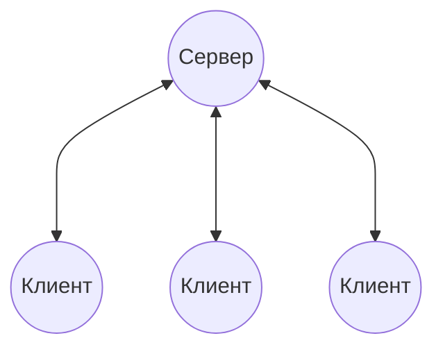
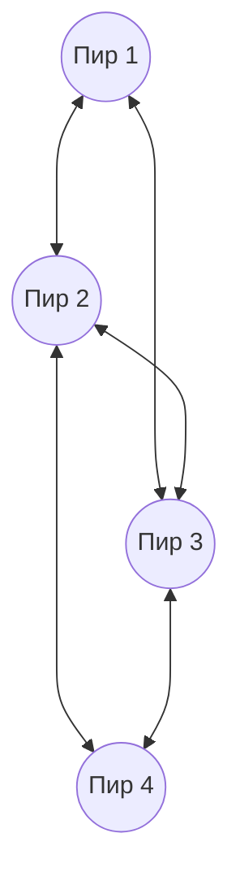
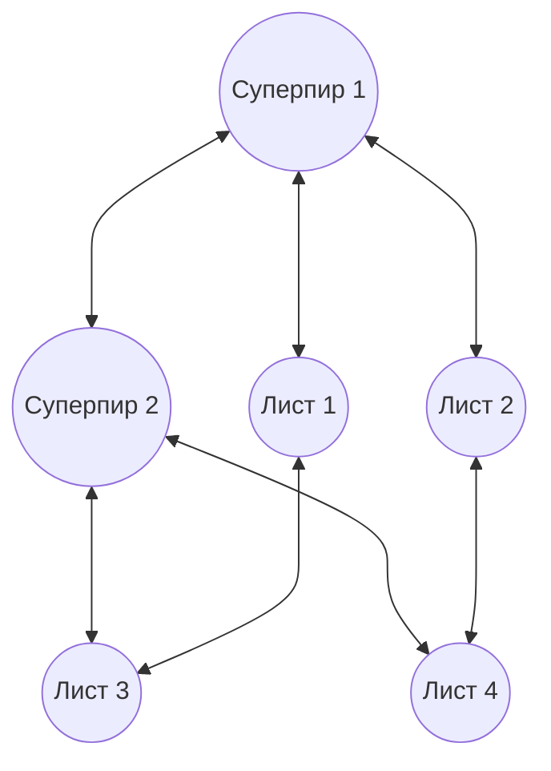

#введение #фундаментальные_понятия #client_server #peer_to_peer #superpeer
___
## Введение

В любой сети узлы (компьютеры, устройства) взаимодействуют друг с другом, чтобы обмениваться данными или предоставлять ресурсы. Способ организации этого взаимодействия определяет архитектуру сети. Существуют две фундаментальные парадигмы, различающиеся по принципу распределения ролей и управления:
- **Клиент-серверная модель** (Client-Server) - жёсткое разделение ролей: одни узлы предоставляют ресурсы (серверы), другие - запрашивают их (клиенты)
- **Одноранговая модель** (Peer-to-Peer, P2P) - все узлы равноправны (пиры), каждый может одновременно быть и поставщиком, и потребителем ресурсов

Выбор модели влияет на масштабируемость, отказоустойчивость, стоимость и сложность администрирования. Эти две парадигмы не являются взаимоисключающими - в реальных сетях часто используются гибридные подходы, сочетающие элементы обеих

---

## Клиент-серверная модель (Client-Server)

### Определение

Клиент-серверная архитектура - это модель распределённых вычислений, в которой функции разделены между двумя типами узлов:
- **Сервер** - мощный, постоянно работающий узел, предоставляющий определённые сервисы (файлы, базы данных, веб-страницы, вычислительные мощности). Сервер ожидает входящие запросы от клиентов и обрабатывает их
- **Клиент** - узел, инициирующий запросы к серверу, используя его ресурсы. Клиент обычно активен только во время сеанса работы и не обязан предоставлять свои ресурсы другим

### Характерные черты

- **Централизованное управление** - сервер является единственным источником данных и правил доступа. Это упрощает администрирование (контроль доступа, резервное копирование, обновления)
- **Асимметричность ролей** - сервер всегда выступает в роли поставщика, клиент - в роли потребителя. Роли строго фиксированы (хотя сервер может быть клиентом для другого сервера, но это уже иерархия)
- **Масштабируемость** - увеличение нагрузки решается путём замены сервера на более мощный (вертикальное масштабирование) или добавления новых серверов с балансировкой нагрузки (горизонтальное масштабирование)
- **Отказоустойчивость** - выход из строя сервера парализует всю систему (единая точка отказа). Резервирование (кластеризация) решает эту проблему, но требует дополнительных затрат
- **Безопасность** - проще обеспечить защиту, поскольку все критичные данные находятся в одном месте

### Примеры

- Веб-сервер (HTTP) и браузер
- Почтовые серверы (SMTP, IMAP) и почтовые клиенты
- Сервер баз данных (SQL) и приложения, выполняющие запросы
- Файловые серверы (SMB, NFS)

---

## Одноранговая модель (Peer-to-Peer, P2P)

### Определение

Одноранговая сеть (P2P) - это децентрализованная архитектура, в которой каждый узел (пир, peer) одновременно является и клиентом, и сервером. Пиры напрямую обмениваются ресурсами (файлами, процессорным временем, дисковым пространством) без обязательного участия центральных серверов

### Характерные черты

- **Равноправие ролей** - каждый пир может инициировать запросы и отвечать на них. Роли динамически меняются в зависимости от текущей задачи
- **Децентрализация** - нет единого центра управления. Координация может осуществляться распределёнными алгоритмами (например, DHT - распределённые хеш-таблицы) или через небольшие координационные узлы (гибридный подход)
- **Самомасштабируемость** - при добавлении новых пиров общая пропускная способность и доступные ресурсы растут, так как каждый новый узел также вносит свой вклад
- **Отказоустойчивость** - сеть продолжает функционировать при выходе из строя части узлов, так как данные имеют множество копий и маршрутизация адаптивна
- **Сложность управления** - отсутствие центра усложняет безопасность, контроль версий, авторизацию и поиск ресурсов 
- **Потенциальные проблемы** - анонимность и отсутствие центра могут способствовать распространению вредоносного контента, нелегальному обмену файлами

### Примеры

- Файлообменные сети: BitTorrent, eMule (раньше Napster - гибридный)
- Блокчейн-системы (криптовалюты) - P2P-сеть для поддержания распределённого реестра
- Мессенджеры с прямой передачей (например, Tox)
- Распределённые вычислительные проекты (SETI@home) - хотя они ближе к модели клиент-сервер, но с элементами P2P

---

## Сравнительный анализ

|Критерий|Клиент-сервер|Одноранговая (P2P)|
|---|---|---|
|**Распределение ролей**|Фиксированное (сервер/клиент)|Равноправное (пиры)|
|**Централизация**|Высокая (центр управления)|Минимальная (децентрализована)|
|**Масштабируемость**|Ограничена мощностью сервера (требует инвестиций)|Автоматическая (растёт с числом пиров)|
|**Отказоустойчивость**|Уязвим к отказу сервера|Устойчив к отказам отдельных узлов|
|**Управление доступом**|Легко контролировать|Трудно обеспечить безопасность и контроль|
|**Производительность**|Зависит от сервера и пропускной способности канала|Распределяется между всеми пирами|
|**Применение**|Корпоративные сети, веб-сервисы, облака|Файлообмен, децентрализованные приложения|

---

## Гибридные и смешанные модели

На практике редко встречаются "чистые" реализации. Часто применяются гибридные подходы:
- **Сервер-координатор** (например, ранний Napster): центральный сервер хранит индекс (список файлов и их местоположений), но сами файлы передаются напрямую между пирами. Это сочетает централизованный поиск с децентрализованной передачей
- **Суперпиры** (Supernodes) - некоторые мощные узлы выполняют функции координации (индексация, маршрутизация) для облегчённых пиров (например, в Skype или некоторых реализациях eMule)
- **Клиент-сервер с элементами P2P** - например, обновления программного обеспечения могут распространяться через P2P (как в Windows Update или игровых платформах), чтобы снизить нагрузку на центральные серверы

Такой подход позволяет балансировать между контролем и эффективностью

---

## Схемы архитектур

### 1. Клиент-серверная модель (централизованная)

_Все клиенты общаются только с сервером, а не друг с другом напрямую_

---

### 2. Одноранговая модель (децентрализованная)

_Каждый пир может напрямую соединяться с другими пирами_

---

### 3. Гибридная модель (с суперпирами)

_Суперпиры координируют работу, а листовые пиры могут обмениваться данными напрямую_

---

## Заключение

Выбор между клиент-серверной и одноранговой архитектурой - это компромисс между контролем, надёжностью, масштабируемостью и сложностью. Клиент-сервер доминирует в корпоративных и веб-приложениях благодаря простоте управления, а P2P - в распределённых системах, где важна устойчивость к цензуре и децентрализация

Понимание этих моделей необходимо для изучения прикладных протоколов (HTTP, FTP, BitTorrent) и проектирования сетевых приложений. В дальнейшем мы увидим, как эти парадигмы реализуются на транспортном и прикладном уровнях