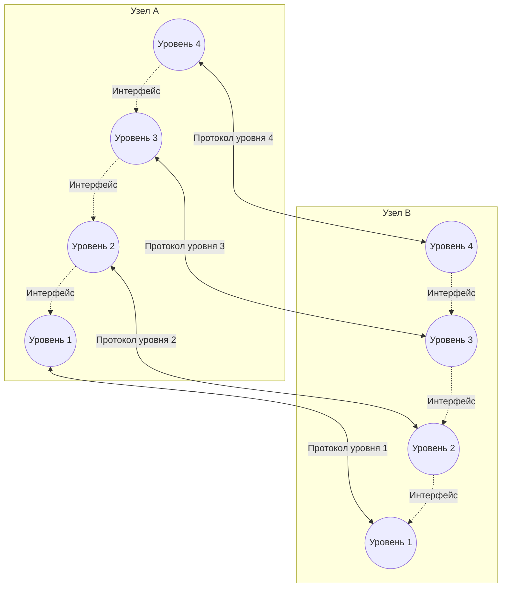
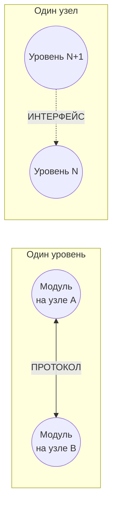

#введение #ключевые_принципы_и_механизмы #протокол #интерфейс
___
## Введение

Сложность организации обмена данными между компьютерами требует разбиения этой задачи на множество более простых подзадач. Такой подход, называемый **декомпозицией**, лёг в основу многоуровневого представления сетевого взаимодействия. Каждый уровень решает свою частную задачу и взаимодействует с другими уровнями по строго определённым правилам

В этой архитектуре возникают два фундаментальных понятия, которые часто путают, но которые имеют принципиально разную область действия: **протокол** и **интерфейс**

---

## Протокол (Protocol)

### Определение

**Протокол** - это формализованный набор правил, определяющих последовательность, формат и назначение сообщений, которыми обмениваются сетевые компоненты (модули), лежащие на **одном уровне**, но в **разных узлах** сети

Протокол описывает:
- **Синтаксис** - структуру и формат данных (например, расположение полей в заголовке)
- **Семантику** - смысл и интерпретацию каждого поля
- **Тайминг** - порядок и временные характеристики обмена (когда и в какой последовательности отправлять сообщения)

Проще говоря, протокол - это **язык общения** между одноуровневыми сущностями на разных машинах. Он отвечает на вопрос: _«Как именно два компьютера одного уровня должны обмениваться данными?»_

### Примеры протоколов

- **IP** (Internet Protocol) - протокол сетевого уровня, определяющий формат пакетов и способ адресации
- **TCP** (Transmission Control Protocol) - протокол транспортного уровня, устанавливающий правила надёжной доставки потока данных
- **HTTP** (HyperText Transfer Protocol) - протокол прикладного уровня, описывающий, как веб-браузер и сервер обмениваются запросами и ответами

---

## Интерфейс (Interface)

### Определение

**Интерфейс** - это формализованный набор правил, определяющих, каким образом модули **соседних уровней** в пределах **одного узла** взаимодействуют друг с другом

Интерфейс определяет **набор сервисов (услуг)**, которые нижележащий уровень предоставляет вышележащему. Он отвечает на вопрос: _«Какие функции и в каком виде доступны от одного уровня к другому внутри одного компьютера?»_

Ключевая особенность: интерфейс **скрывает внутреннюю реализацию** уровня. Вышележащему уровню не важно, _как_ именно нижележащий уровень выполняет свои функции - важно только _что_ он может предоставить

### Примеры интерфейсов

- **Сокеты (Berkeley Sockets)** - интерфейс между прикладным и транспортным уровнями, предоставляющий приложению функции для отправки и приёма данных через сеть
- **NDIS** (Network Driver Interface Specification) - интерфейс между сетевым уровнем и драйвером сетевой карты в операционных системах Windows
- **API** (Application Programming Interface) в широком смысле - тоже является интерфейсом между разными программными компонентами

---

## Ключевое различие: протокол vs интерфейс

Хотя в сущности и протокол, и интерфейс описывают формализованные процедуры взаимодействия, их **область действия** принципиально разная:

|Характеристика|**Протокол**|**Интерфейс**|
|---|---|---|
|**Направление**|Горизонтальное|Вертикальное|
|**Участники**|Одноуровневые модули в **разных узлах**|Соседние уровни в **одном узле**|
|**Назначение**|Обеспечить совместимость при обмене данными по сети|Обеспечить взаимодействие между уровнями внутри системы|
|**Пример**|TCP-сегменты, которыми обмениваются два компьютера|Системный вызов `send()` в программе|

Это различие - один из краеугольных камней многоуровневых моделей, таких как OSI и TCP/IP

---

## Стек протоколов

**Стек протоколов** - это иерархически организованная совокупность протоколов, достаточная для организации взаимодействия узлов в сети

Протоколы в стеке:
- Распределены по уровням, каждый из которых решает свою задачу
- Взаимодействуют друг с другом **по вертикали** через **интерфейсы**
- Взаимодействуют с одноуровневыми модулями на других узлах **по горизонтали** через **протоколы**

Примеры стеков протоколов: **TCP/IP**, **IPX/SPX**, **NetBIOS/SMB**. Наиболее распространённый в современных сетях - стек **TCP/IP**

---

## Реализация протоколов

Коммуникационные протоколы могут быть реализованы как **программно**, так и **аппаратно**:
- **Протоколы нижних уровней** (физический, канальный) часто реализуются комбинацией программных и аппаратных средств (например, сетевая карта + её драйвер)
- **Протоколы верхних уровней** (транспортный, прикладной) реализуются, как правило, чисто программными средствами (например, стек TCP/IP в ядре ОС)

Программный модуль, реализующий некоторый протокол, часто для краткости также называют «протоколом». Соотношение между протоколом как формально определённой процедурой и протоколом как программным модулем аналогично соотношению между алгоритмом и программой, его реализующей

---

## Схематическое представление

### 1. Протоколы и интерфейсы в многоуровневой модели

На этой схеме показано, как протоколы работают **горизонтально** (между узлами), а интерфейсы - **вертикально** (внутри узла)

**Обозначения:**
- **Сплошные линии** - протоколы (горизонтальное взаимодействие одноуровневых модулей)
- **Пунктирные линии** - интерфейсы (вертикальное взаимодействие соседних уровней внутри узла)

---

### 2. Ключевое различие: направление взаимодействия

---

## Заключение

Понимание различия между протоколом и интерфейсом критически важно для осмысления работы любых сетевых архитектур:
- **Протокол** решает проблему **совместимости** между разными устройствами в сети
- **Интерфейс** решает проблему **организации** взаимодействия между уровнями внутри одного устройства

Без чёткого разделения этих понятий невозможно правильно спроектировать или проанализировать сетевой стек. Именно это разделение позволяет заменять один протокол на другой (например, IPv4 на IPv6) или модернизировать реализацию уровня, не затрагивая соседние уровни, - пока сохраняется интерфейс между ними