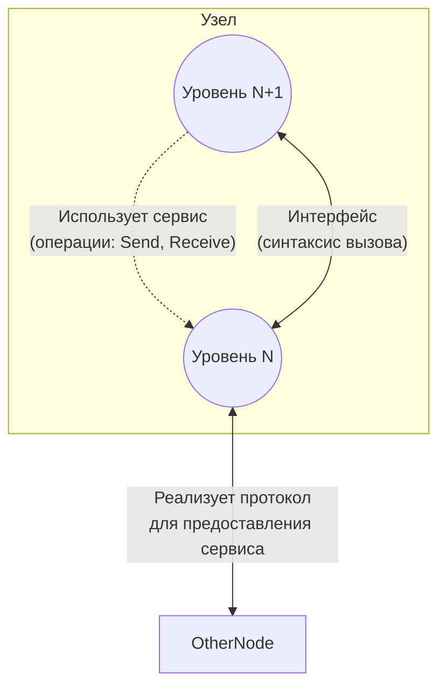
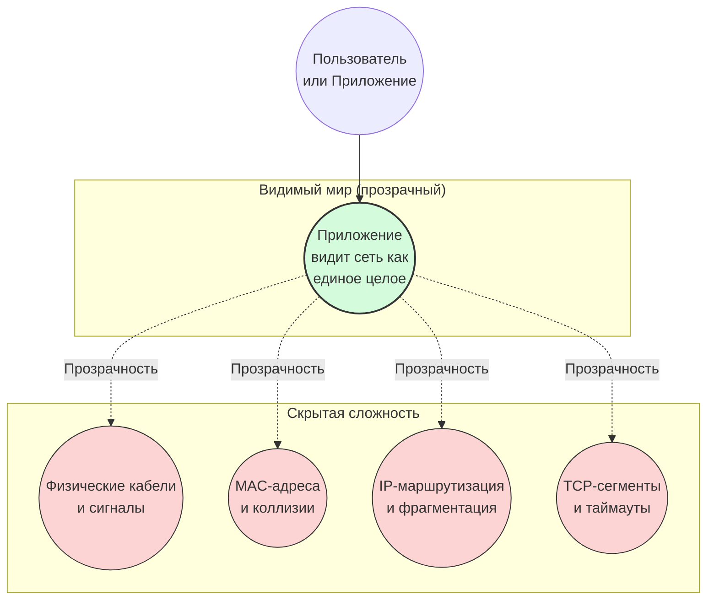
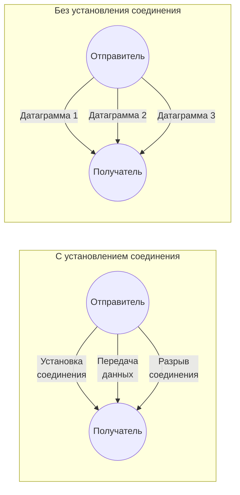

#введение #ключевые_принципы_и_механизмы #сервис #прозрачность
___
## Введение

В предыдущей заметке мы разобрали, что протоколы обеспечивают _горизонтальное_ взаимодействие между одноуровневыми модулями на разных узлах, а интерфейсы - _вертикальное_ взаимодействие между соседними уровнями внутри одного узла

Теперь мы поднимаемся на уровень абстракции выше и рассматриваем **содержательную сторону** этого вертикального взаимодействия. А именно: _что именно_ нижележащий уровень предоставляет вышележащему? Ответ на этот вопрос даёт понятие **сервиса (service)**. А свойство системы, благодаря которому сложность скрыта от пользователя и приложений, называется **прозрачностью (transparency)**

Эти два понятия неразрывно связаны: сервис - это то, что доступно, а прозрачность - это то, как скрыта реализация этого сервиса.

---

## Сервис (Service)

### Определение

**Сервис** (или **служба**) - это набор операций (функций, примитивов), которые один уровень предоставляет вышележащему уровню через свой интерфейс. Сервис определяет _что_ может сделать вышележащий уровень, но не определяет _как_ это реализовано

Сервис - это **абстракция** нижележащего уровня. Он скрывает детали реализации и предоставляет вышележащему уровню унифицированный способ доступа к своим возможностям

### Ключевые аспекты

- **Сервис - это вертикальное понятие** (как и интерфейс). Он описывает отношения между соседними уровнями в пределах одного узла
- **Сервис не зависит от протокола** - один и тот же сервис может быть реализован разными протоколами (например, надёжная доставка может быть реализована через TCP или SCTP)
- **Сервис описывает операции**, а не сообщения. Например, сервис транспортного уровня предоставляет операцию `Отправить_данные(адрес, буфер)`, а не описывает формат TCP-сегмента

### Отличие сервиса от протокола и интерфейса

|Понятие|Направление|Описывает|Пример|
|---|---|---|---|
|**Протокол**|Горизонтальное|Правила обмена сообщениями между одноуровневыми модулями|Формат TCP-сегмента, порядок установки соединения|
|**Интерфейс**|Вертикальное|Способы вызова функций соседнего уровня|Системный вызов `send()`|
|**Сервис**|Вертикальное|Набор операций, доступных вышележащему уровню|Надёжная потоковая доставка данных|

> **Важно**: Интерфейс определяет _как_ вызывать сервис (синтаксис), а сервис определяет _что_ можно вызвать (семантику). На практике эти понятия часто используют как синонимы, но академически они различаются

### Типы сервисов

В сетях принято различать сервисы по **способу установления соединения** и **надёжности**:
1. **Сервис с установлением соединения (connection-oriented)**:
    - Перед обменом данными необходимо установить логическое соединение (канал) между узлами
    - Обеспечивает упорядоченную и надёжную доставку (или с гарантией качества)
    - _Пример_: TCP-сервис (надёжный поток)
2. **Сервис без установления соединения (connectionless)**:
    - Каждое сообщение (датаграмма) передаётся независимо, без предварительной установки канала
    - Не гарантирует порядок и доставку (best-effort)
    - _Пример_: UDP-сервис (ненадёжная датаграммная доставка)
3. **Надёжный и ненадёжный сервис**:
    - Надёжный сервис гарантирует доставку всех данных в правильном порядке (с использованием подтверждений и повторных передач)
    - Ненадёжный сервис не даёт таких гарантий, но быстрее и легче

---

## Прозрачность (Transparency)

### Определение

**Прозрачность** - это свойство распределённой системы (в частности, сети), при котором внутренняя сложность (география, топология, протоколы, аппаратные особенности) скрыта от пользователя и приложений. Система выглядит как единое целое, а не как совокупность разнородных компонентов

Прозрачность - это **цель проектирования** сетей и распределённых систем. Она достигается за счёт многоуровневой архитектуры, где каждый уровень скрывает детали нижележащих уровней

### Виды прозрачности

В классической литературе (Таненбаум, Coulouris) выделяют несколько аспектов прозрачности:

|Вид прозрачности|Что скрывается|Пример|
|---|---|---|
|**Прозрачность доступа**|Различия в аппаратных платформах и ОС|Приложение обращается к файлу одинаково, независимо от того, локальный он или сетевой (NFS)|
|**Прозрачность местоположения**|Где физически находится ресурс|Пользователь не знает, в какой стране находится веб-сервер|
|**Прозрачность перемещения**|Перемещение ресурса в процессе работы|Сессия не прерывается при смене точки доступа (мобильность)|
|**Прозрачность масштабирования**|Рост системы без изменения поведения|Сайт выдерживает миллионы пользователей без изменения интерфейса|
|**Прозрачность отказов**|Сбои и восстановление|Приложение продолжает работать при обрыве канала (автоматическое переподключение)|
|**Прозрачность параллельности**|Одновременный доступ нескольких пользователей|Разделяемые ресурсы корректно синхронизируются|

### Примеры прозрачности в сетях

- **DNS** (Domain Name System) - скрывает IP-адреса за именами. Пользователь вводит `google.com`, а не `142.250.185.78`
- **Инкапсуляция** - скрывает детали работы нижележащих уровней от вышележащих
- **Маршрутизация** - скрывает топологию сети от приложений
- **Виртуальные частные сети (VPN)** - скрывают физическую структуру интернета, создавая иллюзию локальной сети

---

## Взаимосвязь сервиса и прозрачности

Эти два понятия тесно связаны:
- **Сервис** - это _инструмент_ достижения прозрачности. Предоставляя унифицированный интерфейс (сервис), уровень скрывает свою внутреннюю реализацию, что и даёт эффект прозрачности
- **Прозрачность** - это _свойство_ системы, которое становится возможным благодаря чётко определённым сервисам на каждом уровне

**Пример**: Транспортный уровень предоставляет надёжный потоковый сервис (TCP). Приложение, использующее этот сервис, не знает:
- по какому маршруту идут пакеты (прозрачность маршрутизации);
- какие сетевые карты и кабели используются (прозрачность оборудования);
- произошли ли потери и повторные передачи (прозрачность отказов)

Всё это скрыто за простым интерфейсом `send()`/`recv()`

---

## Схематическое представление

### 1. Сервис как набор операций, предоставляемых интерфейсом

На этой схеме показано, как уровень N предоставляет сервис уровню N+1 через интерфейс. Сервис описывает операции (примитивы), а интерфейс - способ их вызова

_Здесь:_
- **Протокол** (горизонтально) обеспечивает сам механизм обмена
- **Сервис** (вертикально) определяет, какие операции доступны
- **Интерфейс** (вертикально) определяет, как эти операции вызывать

---

### 2. Прозрачность: скрытие сложности

Эта схема показывает, как многоуровневая архитектура скрывает детали от пользователя и приложения

_Приложение взаимодействует с сетью через простой интерфейс, не подозревая о сложности, скрытой под слоями_

---

### 3. Типы сервисов: с установлением соединения и без

_В первом случае каждое сообщение независимо. Во втором -  есть фазы установки, передачи и разрыва_

---

## Заключение

Понятия **сервиса** и **прозрачности** являются краеугольными камнями при проектировании сетевых архитектур:
- **Сервис** определяет _что_ доступно вышележащему уровню, абстрагируя реализацию. Он бывает с установлением соединения и без, надёжным и ненадёжным
- **Прозрачность** - это свойство системы, при котором сложность скрыта. Она достигается за счёт иерархии сервисов и интерфейсов

Вместе они позволяют создавать масштабируемые, надёжные и удобные для разработчиков сети. Без прозрачности каждое приложение должно было бы учитывать все детали физической среды, что сделало бы разработку невозможной. Без сервисов не было бы чёткого разделения обязанностей между уровнями

Понимание этих концепций необходимо для осмысления того, как работает инкапсуляция, как устроены транспортные протоколы и как прикладные программы взаимодействуют с сетью