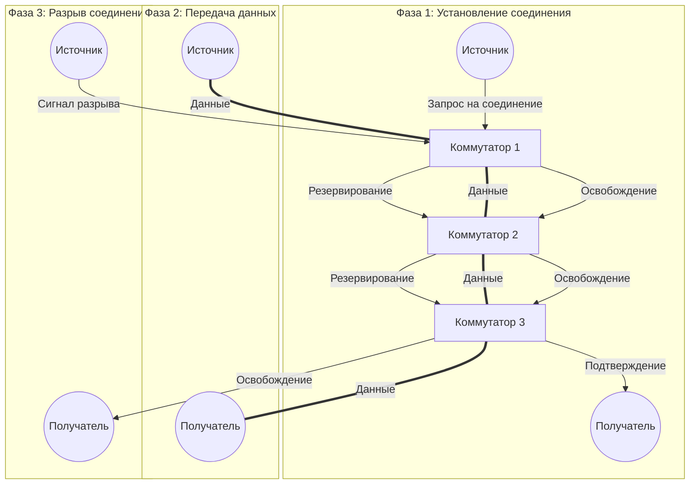
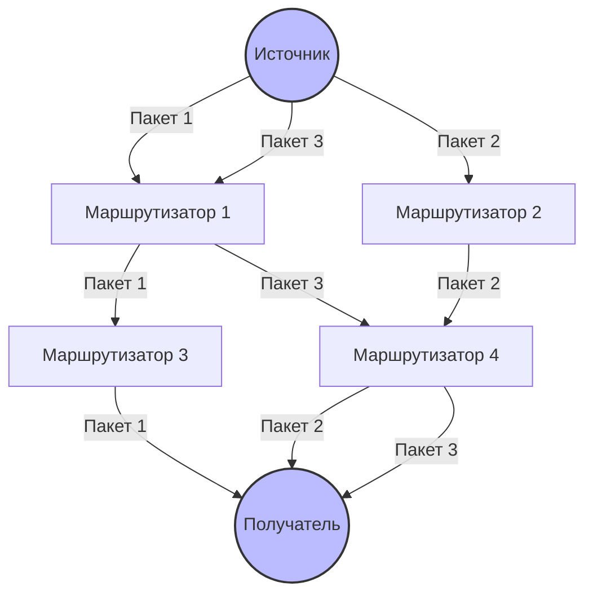
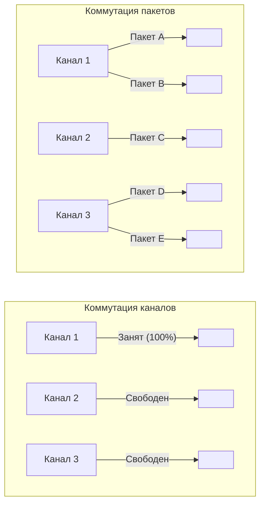

#введение #ключевые_принципы_и_механизмы #коммутация_каналов #коммутация_сообщений #коммутация_пакетов
___
## Введение

В любой сети, состоящей из множества узлов, возникает фундаментальная задача: как организовать передачу данных от одного конечного устройства (источника) к другому (получателю), когда между ними нет прямого физического соединения? Решение этой задачи называется **коммутацией** (switching)

Коммутация - это комплекс технических решений, определяющий, каким образом сетевые устройства (коммутаторы, маршрутизаторы) прокладывают маршруты, продвигают данные и совместно используют каналы связи. От выбранного подхода зависят фундаментальные свойства сети: её производительность, надёжность, задержки и стоимость

В истории и практике сетей сложились три основных подхода к коммутации:
1. **Коммутация каналов** (Circuit Switching)
2. **Коммутация сообщений** (Message Switching)
3. **Коммутация пакетов** (Packet Switching)

Первые два подхода появились раньше, но именно **коммутация пакетов** стала основой современного Интернета

---

## Коммутация каналов (Circuit Switching)

### Определение

**Коммутация каналов** - это метод, при котором между источником и получателем перед началом передачи данных устанавливается **сквозной физический (или логический) канал**, который остаётся зарезервированным исключительно для этой пары абонентов на всё время сеанса связи

Этот метод основан на тех же принципах, что и традиционная телефонная сеть общего пользования (PSTN)

### Процесс передачи

Процесс передачи в сетях с коммутацией каналов состоит из трёх фаз:
1. **Установка соединения (Setup phase)**: Источник посылает специальный запрос (сигнал вызова), который проходит через сеть, резервируя ресурсы (пропускную способность) на каждом промежуточном коммутаторе. Если все необходимые каналы свободны, формируется непрерывный составной канал
2. **Передача данных**: После успешного установления соединения данные передаются непрерывным потоком по зарезервированному каналу. Коммутаторы не анализируют данные, а просто "пропускают" их дальше
3. **Разрыв соединения (Teardown phase)**: По окончании обмена одна из сторон инициирует разрыв соединения, и все зарезервированные ресурсы освобождаются

### Ключевые характеристики

- **Выделенный канал**: Весь ресурс линии связи зарезервирован для одной пары абонентов
- **Постоянная пропускная способность**: Скорость передачи известна и фиксирована на всё время сеанса
- **Низкая задержка**: После установления соединения данные передаются без задержек на принятие решений в промежуточных узлах
- **Гарантированный порядок доставки**: Данные всегда приходят в том порядке, в котором были отправлены

### Преимущества

- **Предсказуемость и стабильность**: Гарантированная пропускная способность и минимальные вариации задержек (джиттера). Это критически важно для приложений реального времени, таких как голосовая связь
- **Прозрачность**: Сеть не интересуется форматом данных и полностью прозрачна для абонентов
- **Простота коммутации**: Продвижение данных не требует сложного анализа заголовков - достаточно простого табличного поиска

### Недостатки

- **Неэффективное использование ресурсов**: Канал остаётся зарезервированным даже в моменты, когда данные не передаются (паузы в разговоре). Это приводит к низкой утилизации сетевых ресурсов
- **Длительное время установления соединения**: Процесс резервирования канала может занимать значительное время, особенно в больших сетях
- **Отказоустойчивость**: Отказ любого промежуточного узла или канала приводит к обрыву всего соединения
- **Плохая масштабируемость**: С ростом числа абонентов требования к пропускной способности растут линейно

### Примеры применения

- Традиционные телефонные сети (PSTN)
- Выделенные арендованные линии (leased lines) для корпоративных сетей
- ISDN (Integrated Services Digital Network) для видеоконференций

---

## Коммутация сообщений (Message Switching)

### Определение

**Коммутация сообщений** - это метод, при котором данные передаются как единое целое сообщение, которое целиком сохраняется на каждом промежуточном узле (коммутаторе) и затем пересылается далее, когда освободится следующий канал

Этот подход часто называют принципом **"горячей картошки" (hot potato)** - узел немедленно начинает передачу, как только появляется свободный исходящий канал

### Ключевые характеристики

- **Хранение-и-пересылка (Store-and-Forward)**: Сообщение целиком записывается в буфер узла, прежде чем быть переданным дальше
- **Отсутствие предварительного установления соединения**: В отличие от коммутации каналов, здесь не нужно ждать создания сквозного пути
- **Лучшее использование каналов**: Канал занят только на время фактической передачи сообщения на следующем участке

### Недостатки (приведшие к отказу от метода)

- **Большой размер буферов**: Сообщения могут быть произвольного размера, что требует больших объёмов памяти на каждом коммутаторе
- **Непредсказуемые задержки**: Крупное сообщение может надолго заблокировать канал, создавая очереди
- **Непригодность для интерактивных приложений**: Диалоговый режим и работа в реальном времени затруднены

Именно из-за этих недостатков коммутация сообщений не получила широкого распространения в компьютерных сетях и была вытеснена коммутацией пакетов

---

## Коммутация пакетов (Packet Switching)

### Определение

**Коммутация пакетов** - это метод, при котором передаваемые данные разбиваются на небольшие блоки фиксированного или переменного размера, называемые **пакетами** (packets). Каждый пакет снабжается заголовком, содержащим адрес получателя, и передаётся по сети независимо от других пакетов, используя те каналы, которые в данный момент свободны

### Процесс передачи

1. **Разбиение на пакеты**: Исходное сообщение (например, веб-страница или файл) разбивается на небольшие части - пакеты
2. **Формирование заголовков**: К каждому пакету добавляется заголовок с информацией о пункте назначения, порядковом номере и других служебных данных
3. **Независимая маршрутизация**: Каждый пакет отправляется в сеть и продвигается от одного узла к другому. Маршрут каждого пакета может быть выбран независимо, в зависимости от текущей загрузки сети
4. **Сборка на стороне получателя**: Все пакеты достигают получателя (возможно, разными путями и в разном порядке), где из них собирается исходное сообщение

### Два подхода к коммутации пакетов

#### Дейтаграммный режим (Datagram)

- Каждый пакет маршрутизируется **полностью независимо**
- Пакеты одного сообщения могут идти разными маршрутами
- Не требуется предварительного установления соединения
- _Пример_: Протокол IP (Интернет)

#### Режим виртуального канала (Virtual Circuit)

- Перед передачей пакетов устанавливается **логический** (виртуальный) канал
- Все пакеты следуют по одному заранее определённому маршруту
- Коммутаторы запоминают идентификатор виртуального канала и продвигают пакеты без повторного принятия решений о маршруте
- _Пример_: Протокол Frame Relay, MPLS, ATM

### Ключевые характеристики

- **Разделение ресурсов**: Каналы используются совместно многими пользователями (статистическое мультиплексирование)
- **Отсутствие выделенного пути**: Нет монопольного занятия канала на всё время сеанса
- **Неопределённая пропускная способность**: Скорость передачи зависит от текущей загрузки сети
- **Переменная задержка**: Время доставки пакетов может варьироваться

### Преимущества

- **Эффективное использование ресурсов**: Каналы заняты только тогда, когда есть что передавать
- **Отказоустойчивость**: При отказе одного маршрута пакеты могут быть перенаправлены по альтернативному пути
- **Масштабируемость**: Добавление новых пользователей не требует пропорционального увеличения пропускной способности
- **Экономичность**: Стоимость передачи ниже, так как ресурсы используются совместно

### Недостатки

- **Переменная задержка (джиттер)**: Задержки могут сильно колебаться в зависимости от загрузки сети
- **Накладные расходы**: Каждый пакет содержит заголовок со служебной информацией, что увеличивает общий объём передаваемых данных
- **Потери пакетов**: При перегрузках пакеты могут отбрасываться (требуется механизм повторной передачи на более высоких уровнях, например TCP)
- **Сложность маршрутизации**: Требуются сложные алгоритмы для определения наилучшего пути для каждого пакета

### Примеры применения

- Интернет (основной метод передачи данных)
- Все современные компьютерные сети (LAN, WAN)
- Облачные сервисы, передача файлов, веб-серфинг, потоковое видео

---

## Сравнительная таблица

| Характеристика              | **Коммутация каналов**               | **Коммутация пакетов**                                                                                                                                                         |
| --------------------------- | ------------------------------------ | ------------------------------------------------------------------------------------------------------------------------------------------------------------------------------ |
| **Установление соединения** | Обязательно (фаза setup)             | Не обязательно (или виртуальный канал)                                                                                                                                         |
| **Выделенный путь**         | Да, физический канал                 | Нет, разделяемая среда                                                                                                                                                         |
| **Пропускная способность**  | Фиксированная, гарантированная       | Переменная, зависит от загрузки                                                                                                                                                |
| **Задержка**                | Низкая, постоянная                   | Переменная (джиттер)                                                                                                                                                           |
| **Использование ресурсов**  | Неэффективное (простои)              | Эффективное (статистическое мультиплексирование)                                                                                                                               |
| **Порядок доставки**        | Гарантированный                      | Не гарантирован (сборка на получателе)                                                                                                                                         |
| **Отказоустойчивость**      | Низкая (обрыв канала = обрыв сеанса) | Высокая (обход отказавших узлов)                                                                                                                                               |
| **Накладные расходы**       | Минимальные                          | Заголовки пакетов |
| **Сложность**               | Низкая (простая коммутация)          | Высокая (сложная маршрутизация)                                                                                                                                                |
| **Типичные приложения**     | Голосовая связь, выделенные линии    | Интернет, передача данных                                                                                                                                                      |

---

## Схематическое представление

### 1. Коммутация каналов: установка соединения и передача

### 2. Коммутация пакетов: независимая маршрутизация

_Пакеты одного сообщения могут идти разными маршрутами и прибывать в разном порядке_

### 3. Сравнение использования ресурсов

_При коммутации каналов ресурсы либо полностью заняты, либо простаивают. При коммутации пакетов каналы заполняются пакетами от разных пользователей, что обеспечивает более высокую утилизацию_

---

## Заключение

Коммутация каналов и коммутация пакетов представляют собой два фундаментально разных подхода к организации передачи данных в сетях

**Коммутация каналов** - это подход, ориентированный на **качество и предсказуемость**. Он идеально подходит для приложений, требующих постоянной пропускной способности и минимальных задержек (голос, видеоконференции), но платой за это является неэффективное использование ресурсов

**Коммутация пакетов** - это подход, ориентированный на **эффективность и масштабируемость**. Он позволяет максимально загружать сетевые каналы и легко адаптироваться к росту числа пользователей, но вносит вариативность задержек и требует более сложных механизмов управления

Именно коммутация пакетов, благодаря своей гибкости и эффективности, стала основой Интернета. Однако принципы коммутации каналов продолжают использоваться в специализированных областях, где качество обслуживания (QoS) критически важно. Понимание этих двух подходов является ключом к осмыслению архитектуры современных сетей и причин, по которым протоколы (такие как TCP и UDP) устроены именно так