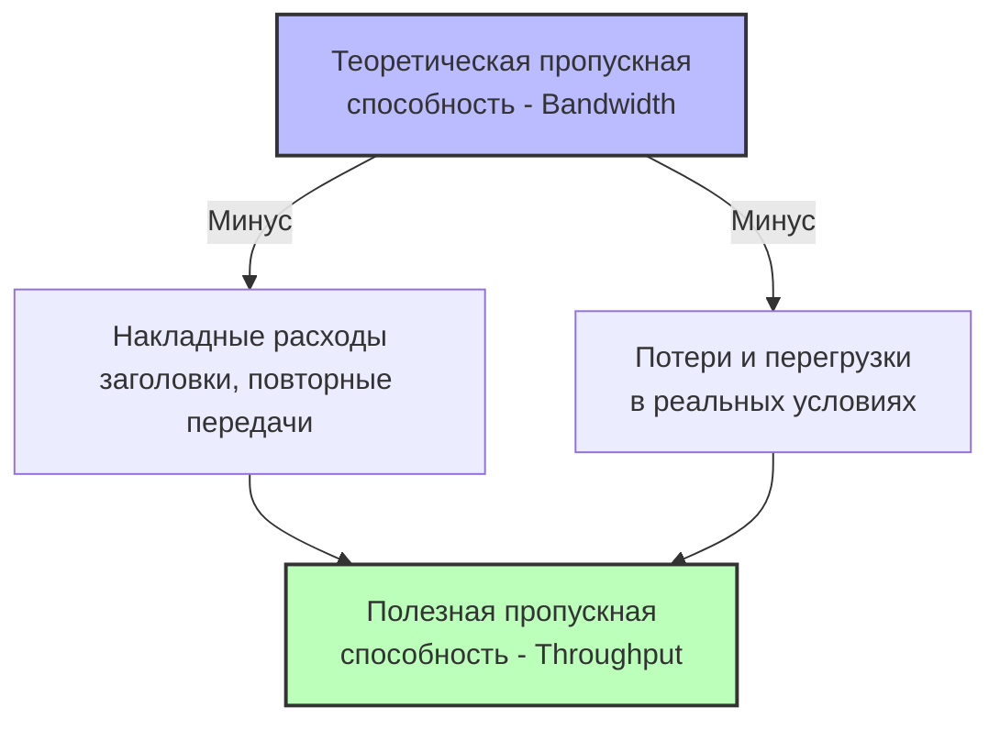
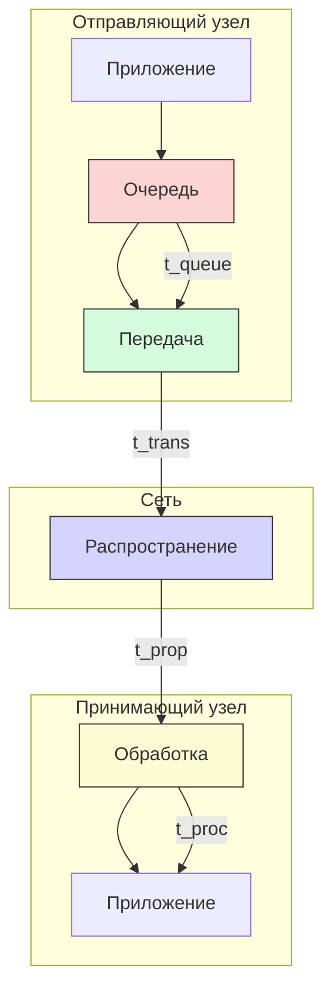
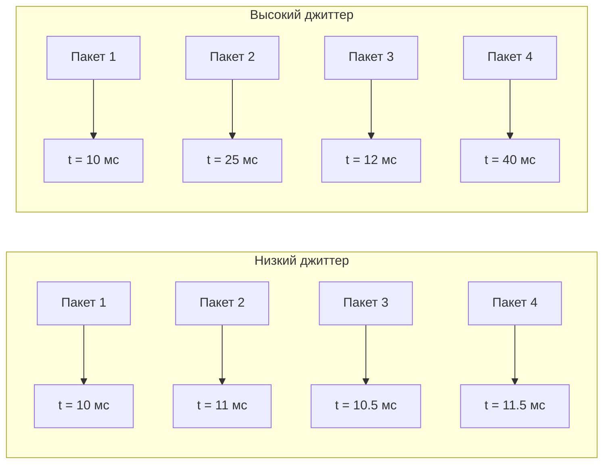

#введение #ключевые_принципы_и_механизмы #пропускная_способность #полезная_пропускная_способность #задержка #джиттер #потери_пакетов
___
## Введение

Проектирование, эксплуатация и анализ компьютерных сетей требуют объективных количественных показателей, позволяющих оценить, насколько хорошо сеть выполняет свои функции. Эти показатели называются **метриками производительности** (performance metrics)

Понимание метрик критически важно по нескольким причинам:
- **Диагностика**: Позволяет выявить узкие места и причины проблем
- **Планирование**: Помогает прогнозировать потребности в ресурсах при росте нагрузки
- **Сравнение**: Даёт возможность объективно сравнивать разные сетевые технологии и провайдеров
- **Контроль качества (SLA)**: Служат основой для соглашений об уровне обслуживания между провайдером и клиентом

В этой заметке мы рассмотрим фундаментальные метрики, которые используются для описания работы любой сети: **пропускную способность**, **задержку**, **джиттер** и **потери пакетов**. Эти четыре метрики образуют базовый набор, известный как **"четыре столпа" производительности сетей**

---

## Пропускная способность (Bandwidth) и полезная пропускная способность (Throughput)

### 1. Пропускная способность (Bandwidth)

**Пропускная способность** (bandwidth) - это теоретическая максимальная скорость передачи данных по каналу связи, измеряемая в битах в секунду (бит/с, Кбит/с, Мбит/с, Гбит/с). Это **потенциальная** возможность канала, определённая его физическими и протокольными характеристиками

Иногда этот термин путают с пропускной способностью в аналоговой электронике (ширина полосы частот), но в контексте цифровых сетей речь всегда идёт о скорости передачи данных.

**Примеры**:
- Ethernet 100 Мбит/с - пропускная способность канала
- Wi-Fi 802.11ac - теоретическая пропускная способность до 1.3 Гбит/с
- Оптоволоконный канал - может иметь пропускную способность 10 Гбит/с, 40 Гбит/с и выше

### 2. Полезная пропускная способность (Throughput)

**Полезная пропускная способность** (throughput) - это фактическая скорость передачи полезных данных, достигаемая в реальных условиях. Она всегда меньше или равна теоретической пропускной способности и измеряется в тех же единицах (бит/с)

Разница между bandwidth и throughput возникает из-за:
- **Накладных расходов протоколов**: Заголовки пакетов (IP, TCP, Ethernet) занимают часть пропускной способности
- **Задержек и повторных передач**: Потери пакетов требуют повторной отправки
- **Перегрузок сети**: Коллизии, очереди, ограничения на стороне получателя
- **Ограничений прикладного уровня**: Медленная обработка данных на сервере или клиенте

**Пример**:
- Канал с пропускной способностью 100 Мбит/с. При передаче файла через TCP реальная полезная скорость (throughput) может составить 85-95 Мбит/с из-за служебных заголовков TCP/IP и управляющих сообщений

### 3. Отличие и взаимосвязь



_Throughput всегда меньше Bandwidth. Разница - это "цена" за надёжность и универсальность сетевых протоколов_

---

## Задержка (Latency)

### Определение

**Задержка** (latency) - это время, необходимое для передачи данных от источника к получателю. Измеряется в миллисекундах (мс) или микросекундах (мкс) для локальных сетей и в секундах для спутниковых каналов

Задержка критически важна для интерактивных приложений (веб-серфинг, онлайн-игры, видеоконференции) и сильно влияет на восприятие качества работы сети пользователем

### Составляющие задержки

Полная задержка складывается из четырёх компонентов, каждый из которых имеет свою природу:

#### 1. Задержка распространения (Propagation delay)

- **Определение**: Время, необходимое сигналу для распространения по физической среде
- **Формула**: `t_prop = расстояние / скорость распространения`
- **Скорость распространения**: Для медных кабелей ~ 2/3 скорости света (~ 2×10⁸ м/с), для оптоволокна немного выше (~ 2.1×10⁸ м/с)
- **Особенность**: Зависит только от расстояния и среды, не зависит от объёма данных
- **Пример**: Сигнал проходит 100 км по оптоволокну за 100,000 / (2.1×10⁸) ≈ 0.476 мс

#### 2. Задержка передачи (Transmission delay)

- **Определение**: Время, необходимое для передачи всех битов пакета в канал
- **Формула**: `t_trans = размер_пакета / пропускная_способность_канала`
- **Особенность**: Зависит от размера пакета и пропускной способности, не зависит от расстояния
- **Пример**: Пакет размером 1500 байт (12,000 бит) передаётся по каналу 10 Мбит/с за 12,000 / 10,000,000 = 1.2 мс

#### 3. Задержка обработки (Processing delay)

- **Определение**: Время, необходимое сетевому устройству (маршрутизатору, коммутатору) на анализ заголовка пакета, проверку контрольной суммы и принятие решения о дальнейшей маршрутизации
- **Особенность**: Зависит от производительности устройства, сложности протоколов и загрузки процессора
- **Типичные значения**: От микросекунд (для простых коммутаторов) до миллисекунд (для сложных маршрутизаторов с глубокой инспекцией пакетов)

#### 4. Задержка в очереди (Queuing delay)

- **Определение**: Время ожидания пакета в выходной очереди перед отправкой
- **Особенность**: Переменная составляющая, зависит от текущей загрузки устройства и приоритетов. При сильной перегрузке может достигать больших значений
- **Зависимость**: Растёт с увеличением коэффициента использования канала

### Общая формула задержки

```text
Latency = t_prop + t_trans + t_proc + t_queue
```

### Визуализация составляющих задержки



---

## Джиттер (Jitter)

### Определение

**Джиттер** (вариация задержки) - это изменение времени задержки между последовательными пакетами в одном потоке данных. Измеряется в миллисекундах (мс) как стандартное отклонение или размах вариаций задержки

### Причины возникновения

- **Переменная загрузка сети**: Пакеты могут попадать в разные по длине очереди на разных маршрутизаторах
- **Разные маршруты**: Пакеты одного потока могут идти разными путями с разными задержками
- **Приоритизация**: Пакеты с низким приоритетом могут ждать обработки высокоприоритетных

### Влияние на приложения

Джиттер особенно критичен для **приложений реального времени**:
- **Голос по IP (VoIP)**: Джиттер > 30 мс заметен как "дрожание" голоса
- **Видеоконференции**: Высокий джиттер вызывает замирания и артефакты изображения
- **Онлайн-игры**: Нестабильная задержка делает игру неотзывчивой

Для борьбы с джиттером на принимающей стороне используют **джиттер-буферы** (playout buffers), которые накапливают пакеты и воспроизводят их с постоянной задержкой, сглаживая вариации. Однако это вносит дополнительную задержку

### Визуализация джиттера



---

## Потери пакетов (Packet Loss)

### Определение

**Потери пакетов** - это доля пакетов, которые не достигли получателя. Измеряется в процентах от общего числа отправленных пакетов

### Причины потерь

1. **Перегрузки (Congestion)**: Когда очередь на сетевом устройстве переполняется, новые пакеты отбрасываются (drop)
2. **Битовые ошибки**: Ошибки в канале связи приводят к повреждению пакета, и он отбрасывается после проверки контрольной суммы
3. **Обрывы соединения**: Физические проблемы с кабелями, сбои в работе оборудования
4. **Активное управление**: Политика качества обслуживания (QoS) может отбрасывать пакеты с низким приоритетом

### Влияние на приложения

- **TCP**: Обнаруживает потери и инициирует повторную передачу, что увеличивает задержку и снижает полезную пропускную способность. Потери > 1-2% сильно замедляют TCP-соединения
- **UDP**: Не восстанавливает потерянные пакеты. Для потокового видео/аудио это проявляется как артефакты, пропуски кадров или "заикания"

### Допустимые уровни потерь

|Тип приложения|Допустимые потери|Последствия превышения|
|---|---|---|
|Веб-серфинг (TCP)|< 1%|Замедление загрузки страниц|
|VoIP (UDP)|< 1-2%|Разборчивость речи падает|
|Видео (UDP)|< 5-10%|Артефакты, замирания|
|Файловые передачи (TCP)|< 0.1%|Резкое падение скорости|

---

## Взаимосвязь метрик

Все четыре метрики тесно связаны и влияют друг на друга:
- **Пропускная способность и задержка**: Высокая пропускная способность не означает низкую задержку. Спутниковый канал имеет высокую пропускную способность (сотни Мбит/с), но задержку ~ 500 мс из-за расстояния
- **Задержка и потери**: При перегрузке задержка в очереди растёт, и при достижении предела начинаются потери
- **Потери и пропускная способность**: Потери вызывают повторные передачи TCP, что снижает полезную пропускную способность (эффект "шторма повторных передач")
- **Джиттер и потери**: Высокий джиттер часто является предвестником перегрузки и будущих потерь

### Ключевая формула: Закон Литтла для сетей

В теории массового обслуживания существует **закон Литтла**, который применим к сетевым очередям:

```text
Средняя_задержка = Средняя_длина_очереди / Интенсивность_поступления_пакетов
```

Эта формула показывает, что рост длины очереди (при перегрузке) линейно увеличивает задержку

---

## Практическое измерение метрик

### Инструменты

| Метрика                    | Инструменты               | Принцип измерения                            |
| -------------------------- | ------------------------- | -------------------------------------------- |
| **Пропускная способность** | iperf, speedtest          | Отправка тестового трафика и расчёт скорости |
| **Задержка**               | ping, traceroute          | Измерение времени ответа на ICMP-запросы     |
| **Джиттер**                | ping -j, VoIP-анализаторы | Статистический анализ серии замеров задержки |
| **Потери пакетов**         | ping, iperf -u            | Подсчёт доли неполученных пакетов            |

### Пример: Измерение задержки с помощью ping

```text
ping google.com
PING google.com (142.250.185.78): 56 data bytes
64 bytes from 142.250.185.78: icmp_seq=0 ttl=113 time=12.3 ms
64 bytes from 142.250.185.78: icmp_seq=1 ttl=113 time=11.9 ms
64 bytes from 142.250.185.78: icmp_seq=2 ttl=113 time=14.1 ms
64 bytes from 142.250.185.78: icmp_seq=3 ttl=113 time=13.7 ms

--- google.com ping statistics ---
4 packets transmitted, 4 packets received, 0.0% packet loss
round-trip min/avg/max/stddev = 11.9/13.0/14.1/0.9 ms
```

Здесь мы видим:
- **Задержка (RTT)**: ~ 13 мс (среднее)
- **Потери**: 0.0%
- **Джиттер**: Стандартное отклонение 0.9 мс

---

## Сводная таблица метрик

|Метрика|Единицы измерения|Определение|Ключевое влияние|
|---|---|---|---|
|**Bandwidth**|бит/с|Теоретическая макс. скорость канала|Потенциальная производительность|
|**Throughput**|бит/с|Фактическая скорость полезных данных|Реальная производительность|
|**Latency**|мс, мкс|Время доставки от источника к получателю|Отзывчивость приложений|
|**Jitter**|мс|Вариация задержки|Качество потоковых приложений|
|**Packet Loss**|%|Доля не доставленных пакетов|Надёжность и производительность TCP|

---

## Заключение

Метрики производительности - это язык, на котором сетевые инженеры описывают состояние сети. Каждая метрика важна по-своему, и только их совместный анализ даёт полную картину:
- **Bandwidth/Throughput** показывают, _сколько_ данных может быть передано
- **Latency** показывает, _как быстро_ данные достигают цели
- **Jitter** показывает, _насколько стабильна_ скорость доставки
- **Packet Loss** показывает, _надёжна ли_ передача

Для разных типов приложений критичны разные метрики:
- **Передача файлов**: Важна Throughput (скорость), потерям и задержкам уделяют меньше внимания
- **Голос/Видео**: Критичны Low Latency, Low Jitter и Low Loss
- **Интерактивные игры**: Критичны Low Latency и Low Jitter

Понимание этих метрик необходимо для дальнейшего изучения механизмов управления перегрузками в TCP, алгоритмов качества обслуживания (QoS) и проектирования сетевых приложений