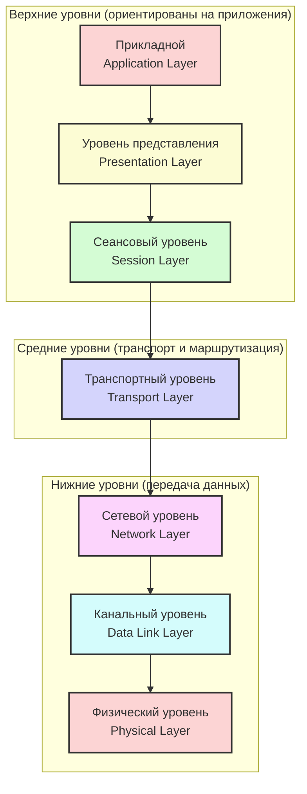
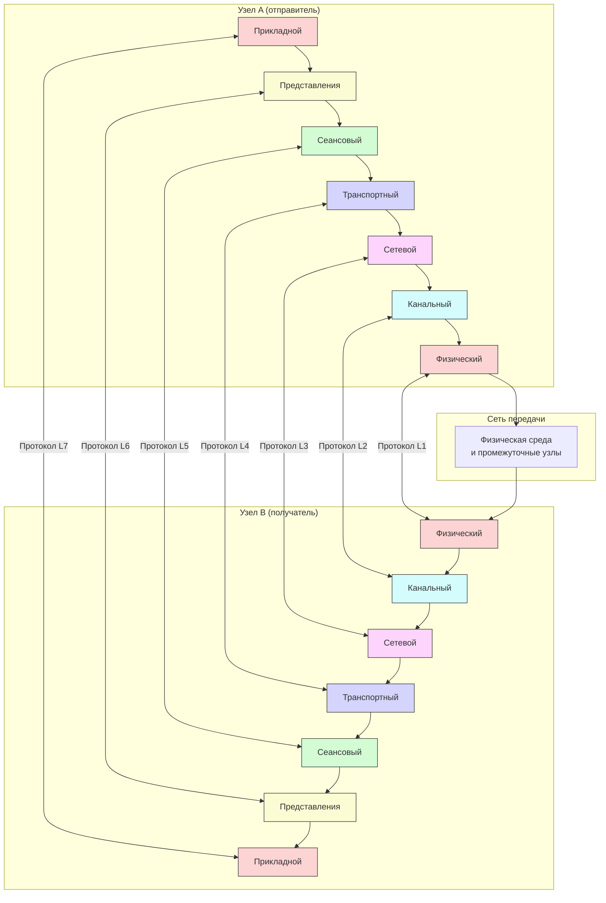

#введение #эталонные_модели_взаимодействия #OSI #физический_уровень #канальный_уровень #сетевой_уровень #транспортный_уровень #сеансовый_уровень #уровень_представления #прикладной_уровень
___
## Введение

**Модель OSI** (Open Systems Interconnection Basic Reference Model) - это концептуальная модель, которая обобщает и стандартизирует представление средств сетевого взаимодействия в телекоммуникационных и компьютерных системах, независимо от их внутреннего устройства и используемых технологий. В русскоязычной литературе часто используется аббревиатура **ЭМВОС** (эталонная модель взаимодействия открытых систем)

Модель OSI была разработана Международной организацией по стандартизации (ISO) в 1984 году. Её основная цель - решение проблемы несовместимости устройств, использующих различные коммуникационные протоколы, путём перехода на единый, общий для всех систем стек протоколов

Важно понимать: **модель OSI - это не протокол, а эталонная архитектура** (framework) для понимания и проектирования сетевого взаимодействия. Она описывает _что_ должно происходить на каждом этапе передачи данных, но не определяет _как_ именно это реализовать. Эталонная модель предоставляет общую основу для координации разработки стандартов, позволяя при этом размещать существующие стандарты в перспективе общей модели

---

## Исторический контекст: почему возникла необходимость в модели OSI?

### Эпоха проприетарных решений

В ранние дни компьютерных сетей (до 1969 года) соединения между компьютерами были жёстко проводными, а программное обеспечение для реализации связи создавалось индивидуально под операционные системы подключаемых компьютеров. Каждый производитель разрабатывал собственные сетевые протоколы, которые работали только с оборудованием и программным обеспечением этого же производителя. Сети IBM, DEC, Honeywell и других компаний не могли взаимодействовать друг с другом

### Проблема несовместимости

По мере того как компьютеры становились всё более распространёнными, а потребность в обмене данными между разными системами росла, проблема несовместимости становилась всё более острой. Организации хотели подключать оборудование разных производителей в единую сеть, но проприетарные протоколы этого не позволяли

### Рождение OSI

В ответ на эту проблему Международная организация по стандартизации (ISO) в 1970-х годах начала работу над созданием универсальной эталонной модели, которая бы описывала все аспекты сетевого взаимодействия в терминах абстрактных уровней. Концепция семиуровневой модели была описана в работах Чарльза Бахмана. В 1984 году модель была официально опубликована как стандарт ISO/IEC 7498

---

## Основная архитектура и принципы

### Две основные части модели

Модель OSI состоит из двух основных частей:
1. **Абстрактная модель сетевого взаимодействия** (семиуровневая модель) - описывает, как функции сети должны быть разделены на уровни
2. **Набор специализированных протоколов взаимодействия** - конкретные протоколы, реализующие функции каждого уровня (OSI protocol suite)

### Ключевые принципы многоуровневой архитектуры

Каждый уровень модели OSI:
- Имеет дело с совершенно определённым аспектом взаимодействия сетевых устройств
- Обслуживает уровень, находящийся непосредственно над ним (предоставляет ему сервисы)
- Обслуживается уровнем, находящимся под ним (использует его сервисы)

Каждый уровень предоставляет сервисы уровню выше и, в свою очередь, полагается на сервисы, предоставляемые уровнем ниже

### Горизонтальное и вертикальное взаимодействие

В рамках модели любой протокол может взаимодействовать:
- **Горизонтально** - с протоколами своего уровня на других узлах (peer-to-peer communication)
- **Вертикально** - с протоколами уровня на единицу выше или ниже своего уровня (в пределах одного узла)

### Protocol Data Unit (PDU)

Каждый из семи уровней характеризуется типом данных (PDU — Protocol Data Unit), которым данный уровень оперирует:
- **Уровень 1 (Физический)**: Биты (bits)
- **Уровень 2 (Канальный)**: Кадры (frames)
- **Уровень 3 (Сетевой)**: Пакеты (packets)
- **Уровень 4 (Транспортный)**: Сегменты/Датаграммы (segments/datagrams)
- **Уровни 5-7 (Сеансовый, Представления, Прикладной)**: Данные (data)

---

## Семь уровней модели OSI: общий обзор

Модель OSI содержит семь логических уровней, которые принято перечислять сверху вниз (от уровня 7 к уровню 1):

### Группировка уровней

Семь уровней модели OSI могут быть разделены на две группы:
- **Верхние три уровня (5, 6, 7)**: Связаны с приложениями - синхронизацией активности в распределённых приложениях, представлением данных, управлением ассоциациями и параллелизмом
- **Нижние четыре уровня (1, 2, 3, 4)**: Связаны с транспортировкой данных по сети

---

## Краткая характеристика уровней

| Уровень | Название                     | Основная функция                                                        | Примеры протоколов/технологий  |
| ------- | ---------------------------- | ----------------------------------------------------------------------- | ------------------------------ |
| **7**   | Прикладной (Application)     | Поддержка пользовательских приложений, интерфейс с сетевыми сервисами   | HTTP, FTP, SMTP, DNS, SSH      |
| **6**   | Представления (Presentation) | Преобразование данных, шифрование, сжатие                               | TLS/SSL, JPEG, ASCII, XDR      |
| **5**   | Сеансовый (Session)          | Управление сессиями между приложениями, возобновление прерванных сессий | NetBIOS, RPC                   |
| **4**   | Транспортный (Transport)     | Надёжная доставка, управление потоком, мультиплексирование              | TCP, UDP                       |
| **3**   | Сетевой (Network)            | Логическая адресация, маршрутизация пакетов                             | IPv4, IPv6, IPX                |
| **2**   | Канальный (Data Link)        | Физическая адресация (MAC), формирование кадров, обнаружение ошибок     | Ethernet, PPP, HDLC            |
| **1**   | Физический (Physical)        | Передача сырых битов по физической среде                                | Витая пара, оптоволокно, радио |

---

## Принцип инкапсуляции в модели OSI

Одним из важнейших механизмов, демонстрирующих работу модели OSI, является **инкапсуляция** - процесс, при котором информация от верхнего уровня вставляется в поле данных нижнего уровня

### Процесс инкапсуляции при отправке

Когда сообщение покидает сетевую станцию, оно проходит путь от Уровня 7 к Уровню 1:
1. Данные, созданные прикладным уровнем, передаются вниз уровню представления
2. Уровень представления добавляет свой заголовок (и, возможно, трейлер) к данным и передаёт их дальше
3. Сеансовый уровень добавляет свой заголовок и передаёт данные транспортному уровню
4. Процесс повторяется до тех пор, пока данные не достигнут физического уровня

На каждом уровне данные, полученные от верхнего уровня (включая все заголовки верхних уровней), становятся **полезной нагрузкой (payload)** для нижнего уровня

### Процесс декапсуляции при получении

Когда данные прибывают на узел назначения, физический уровень принимает биты и выполняет обратный процесс - **декапсуляцию**:
1. Физический уровень преобразует биты обратно в кадры и передаёт их канальному уровню
2. Канальный уровень удаляет свой заголовок и трейлер и передаёт данные сетевому уровню
3. Процесс повторяется до тех пор, пока данные не достигнут прикладного уровня

### Схема инкапсуляции

```mermaid
graph TD
    subgraph "Отправляющий узел"
        A[Данные пользователя] --> B[Плюс заголовок L7]
        B --> C[Плюс заголовок L6]
        C --> D[Плюс заголовок L5]
        D --> E[Плюс заголовок L4]
        E --> F[Плюс заголовок L3]
        F --> G[Плюс заголовок L2 + Трейлер]
        G --> H[Биты на физическом уровне]
    end
    
    style A fill:#fcd4d4,stroke:#333,stroke-width:1px
    style B fill:#fcfcd4,stroke:#333,stroke-width:1px
    style C fill:#d4fcd4,stroke:#333,stroke-width:1px
    style D fill:#d4d4fc,stroke:#333,stroke-width:1px
    style E fill:#fcd4fc,stroke:#333,stroke-width:1px
    style F fill:#d4fcfc,stroke:#333,stroke-width:1px
    style G fill:#fcd4d4,stroke:#333,stroke-width:1px
    style H fill:#d4d4d4,stroke:#333,stroke-width:1px
```

---

## Почему OSI - это "идеальная" модель, а не практическая реализация?

Модель OSI часто называют **теоретическим идеалом** по нескольким причинам:

### 1. Модель не является спецификацией реализации

Эталонная модель не предназначена служить спецификацией реализации. Она определяет _функции_, которые должны выполняться на каждом уровне, но не предписывает, как именно эти функции должны быть реализованы в программном или аппаратном обеспечении

### 2. Модель обладает достаточной гибкостью

Эталонная модель обладает достаточной гибкостью, чтобы учитывать достижения в области технологий и расширение потребностей пользователей. Эта гибкость также предназначена для обеспечения поэтапного перехода от существующих реализаций к стандартам OSI

### 3. Реальные стеки протоколов не полностью соответствуют модели

Большинство стеков протоколов, таких как TCP/IP, DECnet и SNA, лишь приблизительно соответствуют модели OSI. Например:
- Некоторые приложения пропускают уровни представления и сеансовый, чтобы взаимодействовать непосредственно с транспортным уровнем
- Сеансовый уровень часто не используется во многих протоколах

### 4. OSI определяет два стандарта для каждого уровня

Для каждого уровня определены два стандарта:
- Один определяет **интерфейс** к сервисам, предоставляемым уровнем
- Другой определяет **протокол**, наблюдаемый сервисами уровня

Пользователи стандарта интерфейса должны иметь возможность игнорировать протокол и любые другие детали реализации уровня

---

## Наследие модели OSI

Несмотря на то, что модель OSI не стала основой для доминирующего стека протоколов (эту роль занял TCP/IP), её влияние на индустрию колоссально:

### 1. Общий язык для специалистов

Термины, определённые моделью OSI, широко используются в сообществе специалистов по передаче данных - настолько широко, что трудно обсуждать передачу данных, не используя терминологию OSI

### 2. Каркас для понимания

Модель OSI обеспечивает удобную основу для понимания сетевых концепций. Она помогает системным администраторам при диагностике сетевых проблем - будь то проблема с физическим кабелем (Уровень 1), проблема маршрутизации (Уровень 3) или неправильная конфигурация приложения (Уровень 7)

### 3. Основа для стандартизации

Модель предоставляет общую основу для координации разработки стандартов для системного взаимодействия, позволяя размещать существующие стандарты в перспективе общей эталонной модели. Модель определяет области для разработки или улучшения стандартов

### 4. Принцип изоляции функций

Изоляция функций сетевой связи на разных уровнях минимизирует влияние технологических изменений на весь стек протоколов:
- Новые приложения могут быть добавлены без изменения физической сети
- Новое сетевое оборудование может быть установлено без переписывания прикладного программного обеспечения

---

## Схематическое представление: полная архитектура OSI

---

## Заключение

Модель OSI - это фундаментальная эталонная архитектура, которая:
- Разделяет сложную задачу сетевого взаимодействия на семь логических уровней
- Определяет чёткие границы ответственности между уровнями
- Вводит единую терминологию для описания сетевых процессов
- Служит основой для понимания того, как работают реальные протоколы (даже если они не полностью соответствуют модели)

Хотя в реальном мире доминирует стек TCP/IP, модель OSI остаётся **незаменимым инструментом для обучения, проектирования и диагностики сетей**. Понимание этой модели - первый шаг к глубокому осмыслению того, как данные путешествуют по сети от приложения на одном компьютере к приложению на другом

В следующих заметках мы подробно рассмотрим каждый уровень модели OSI, начиная с физического уровня и постепенно поднимаясь вверх к прикладному