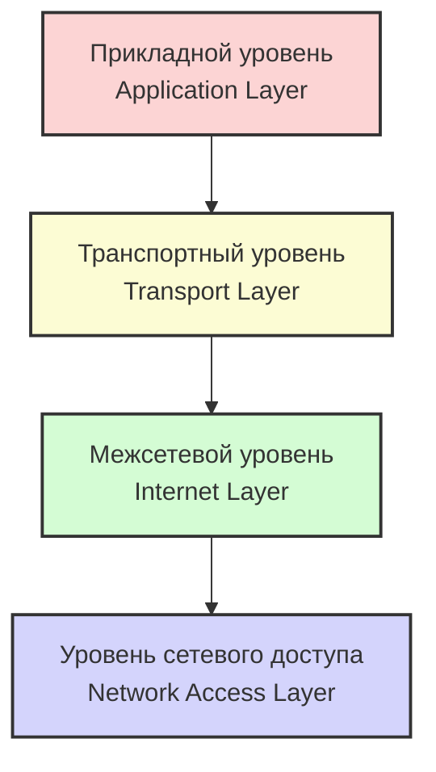
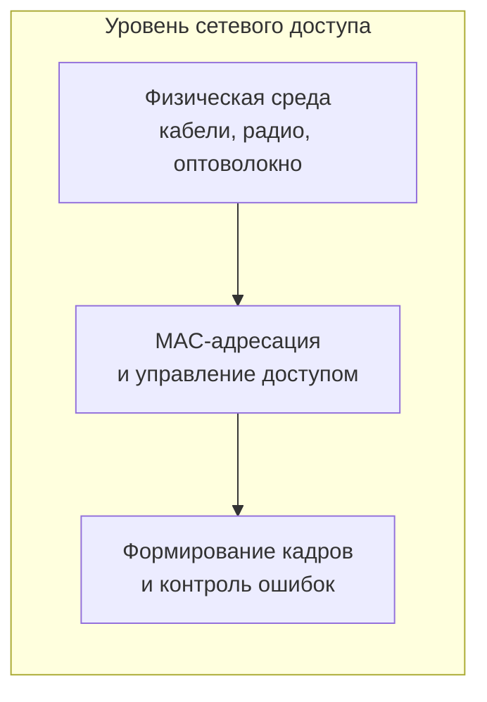
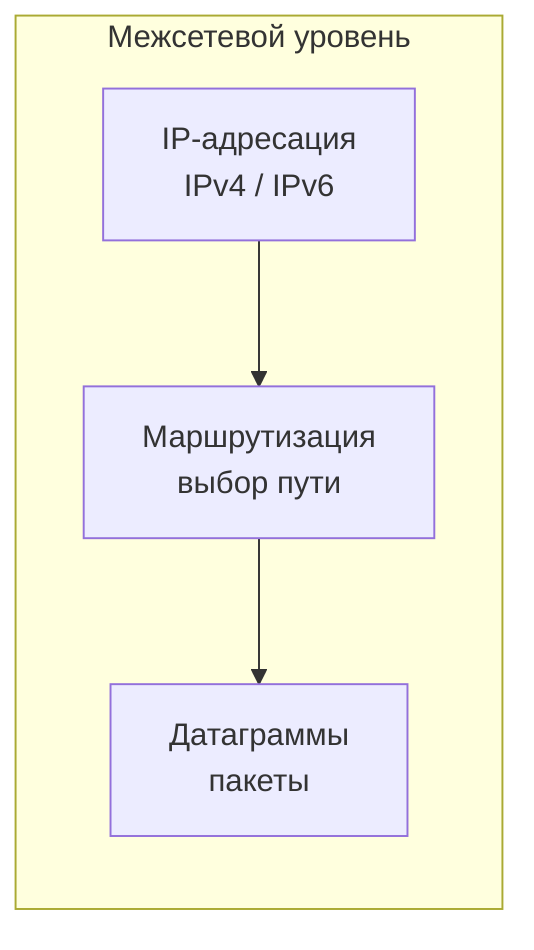
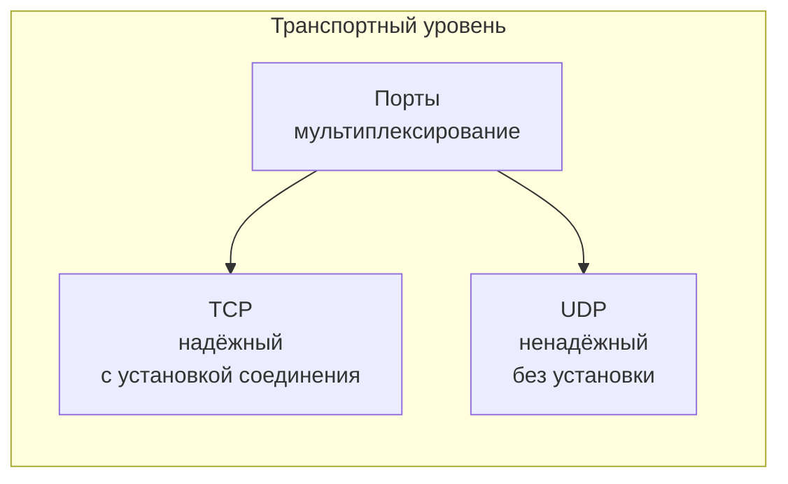
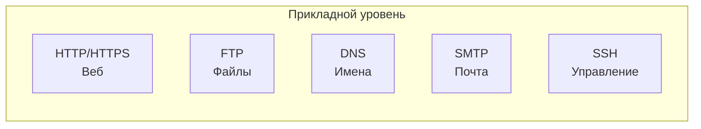
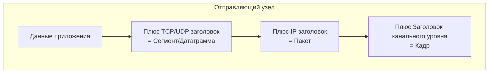

#введение #эталонные_модели_взаимодействия #TCP/IP #прикладной_уровень #транспортный_уровень #межсетевой_уровень #уровень_сетевого_доступа
___
## Введение

**Модель TCP/IP** (Transmission Control Protocol/Internet Protocol) - это сетевая модель передачи данных, представленных в цифровом виде. Она описывает способ передачи информации от источника к получателю и является основой для Интернета и подобных ему сетей. Название происходит от двух важнейших протоколов семейства - TCP и IP, которые были первыми разработаны и описаны в данном стандарте

Модель TCP/IP также известна как **модель DoD** (Department of Defense) в связи с историческим происхождением от сети ARPANET 1970-х годов, находившейся под управлением DARPA. Иногда её называют **интернет-моделью** (Internet Model)

В отличие от модели OSI, которая является концептуальным, протокольно-независимым стандартом, TCP/IP - это **практическая модель**, основанная на стандартных протоколах, вокруг которых развился Интернет. Модель TCP/IP представляет собой набор общих проектных принципов и реализаций конкретных сетевых протоколов, позволяющих компьютерам обмениваться данными по сети

Важно понимать: **модель TCP/IP - это не просто теория, а архитектура реально работающего Интернета**. В отличие от OSI, которая описывает _идеальное_ устройство сетей, TCP/IP описывает _фактическое_ устройство глобальной сети

---

## Исторический контекст: от ARPANET к TCP/IP

### Предпосылки создания

В конце 1960-х годов агентство DARPA (США) финансировало создание экспериментальной сети ARPANET для соединения университетских и исследовательских центров. Изначально ARPANET использовала протокол **NCP** (Network Control Protocol), который позволял устанавливать соединения между узлами, но имел серьёзные ограничения:
- Не мог работать с разнородными сетями (был привязан к одной физической сети)
- Не поддерживал эффективную маршрутизацию при отказах
- Плохо масштабировался

### Рождение TCP/IP

В 1972 году группа разработчиков под руководством **Винтона Серфа** начала работу над новым стеком протоколов. Вместе с **Бобом Каном** они разработали архитектуру, которая разделила функции:
- **TCP** (Transmission Control Protocol) - отвечает за надёжную доставку потока данных между приложениями
- **IP** (Internet Protocol) - отвечает за адресацию и маршрутизацию отдельных пакетов между сетями

Ключевым новшеством было разделение протокола на две части, что позволило:
- Соединять разнородные сети (интернет-работа)
- Обеспечивать надёжность даже при отказах отдельных узлов
- Масштабироваться до глобальных размеров

В январе 1980 года были опубликованы финальные версии TCP и IP. В 1983 году ARPANET перешла на TCP/IP, и этот год считается рождением современного Интернета. Сегодня стек протоколов TCP/IP поддерживается **IETF** (Internet Engineering Task Force)

---

## Четыре уровня модели TCP/IP

Модель TCP/IP организует все связанные протоколы в **четыре абстрактных уровня**. Каждый уровень решает свой круг задач и взаимодействует с соседними уровнями. От самого нижнего к самому верхнему:

> **Примечание:** В некоторых источниках (например, RFC 1122) выделяют **пять уровней**, разделяя уровень сетевого доступа на канальный (Data Link) и физический (Physical). Однако классическая четырёхуровневая модель является наиболее распространённой

---

## 1. Уровень сетевого доступа (Network Access Layer)

### Определение

**Уровень сетевого доступа** (также называемый _link layer_, _network interface layer_ или _physical layer_) - самый нижний уровень модели TCP/IP. Он отвечает за передачу данных по физической среде в пределах одного сегмента сети (локальной сети)

Этот уровень объединяет функции физического и канального уровней модели OSI

### Основные функции

- **Физическая передача битов**: Преобразование цифровых данных в электрические, оптические или радиосигналы
- **Формирование кадров (framing)**: Упаковка данных в кадры с добавлением заголовков и трейлеров
- **Управление доступом к среде (MAC)**: Определение того, как устройства разделяют общую среду передачи
- **Обнаружение ошибок**: Проверка целостности кадров (например, с помощью CRC)
- **Аппаратная адресация**: Использование MAC-адресов для идентификации устройств в локальной сети

### Примеры протоколов и технологий

- **Ethernet (IEEE 802.3)** - наиболее распространённая технология локальных сетей
- **Wi-Fi (IEEE 802.11)** - беспроводная технология
- **PPP** (Point-to-Point Protocol) - для соединения двух узлов напрямую
- **Token Ring, FDDI** - исторические технологии

### Схематическое представление

---

## 2. Межсетевой уровень (Internet Layer)

### Определение

**Межсетевой уровень** (также называемый _network layer_ или _IP layer_) - второй уровень модели TCP/IP. Он отвечает за **межсетевое взаимодействие** (internetworking) - соединение независимых сетей в единую глобальную сеть

Этот уровень соответствует сетевому уровню (уровень 3) модели OSI

### Основные функции

- **Логическая адресация**: Присвоение каждому устройству уникального IP-адреса
- **Маршрутизация**: Определение пути, по которому пакет должен следовать от источника к получателю
- **Фрагментация и сборка**: Разбиение больших пакетов на более мелкие для передачи через сети с разным MTU (Maximum Transmission Unit)
- **Формирование датаграмм**: Упаковка данных в единицы, называемые датаграммами (IP-пакетами)

### Ключевые протоколы

- **IP** (Internet Protocol) - основной протокол уровня. Существует в двух версиях: IPv4 и IPv6
- **ARP** (Address Resolution Protocol) - преобразует IP-адреса в MAC-адреса
- **ICMP** (Internet Control Message Protocol) - используется для диагностики и сообщений об ошибках (например, ping)
- **IGMP** (Internet Group Management Protocol) - управляет многоадресной рассылкой

### Особенности межсетевого уровня

Межсетевой уровень **не гарантирует доставку** пакетов. Он работает по принципу **best-effort** (максимальное усилие) - пакеты могут теряться, дублироваться или приходить в неправильном порядке. Ответственность за надёжность возлагается на вышележащий (транспортный) уровень

### Схематическое представление

---

## 3. Транспортный уровень (Transport Layer)

### Определение

**Транспортный уровень** - третий уровень модели TCP/IP. Он обеспечивает **сквозную (end-to-end) доставку данных** между приложениями на разных узлах. Транспортный уровень создаёт виртуальный поток данных между отправляющим и принимающим приложениями, дифференцируемый по номеру транспортного порта

Этот уровень соответствует транспортному уровню (уровень 4) модели OSI

### Основные функции

- **Мультиплексирование/демультиплексирование**: Использование портов для направления данных конкретному приложению
- **Сегментация**: Разбиение потока данных на сегменты (для TCP) или датаграммы (для UDP)
- **Управление потоком**: Регулирование скорости передачи, чтобы не перегружать получателя (только TCP)
- **Контроль перегрузок**: Предотвращение перегрузок в сети (только TCP)
- **Обнаружение ошибок**: Проверка целостности сегментов с помощью контрольных сумм

### Два основных протокола

#### TCP (Transmission Control Protocol)

- **Тип**: С установлением соединения (connection-oriented)
- **Надёжность**: Гарантирует доставку всех данных в правильном порядке
- **Особенности**: Управление потоком, контроль перегрузок, повторные передачи при потерях
- **Применение**: Веб-серфинг (HTTP/HTTPS), электронная почта (SMTP), передача файлов (FTP)

#### UDP (User Datagram Protocol)

- **Тип**: Без установления соединения (connectionless)
- **Надёжность**: Не гарантирует доставку, порядок или целостность (best-effort)
- **Особенности**: Минимальные накладные расходы, высокая скорость
- **Применение**: Потоковое видео/аудио, VoIP, DNS, онлайн-игры

Кроме TCP и UDP, на транспортном уровне также используется **SCTP** (Stream Control Transmission Protocol)

### Схематическое представление

---

## 4. Прикладной уровень (Application Layer)

### Определение

**Прикладной уровень** - самый верхний уровень модели TCP/IP. Он объединяет функции трёх верхних уровней модели OSI: **прикладного**, **представления** и **сеансового**. Именно на этом уровне работают приложения, с которыми взаимодействует пользователь

### Основные функции

- **Предоставление сетевых сервисов приложениям**: Интерфейс для отправки и получения данных
- **Преобразование данных**: Кодирование, шифрование, сжатие (функции уровня представления OSI)
- **Управление сессиями**: Установка, поддержание и завершение сеансов связи (функции сеансового уровня OSI)

### Примеры протоколов

|Протокол|Назначение|Порт|
|---|---|---|
|**HTTP/HTTPS**|Веб-серфинг|80/443|
|**FTP**|Передача файлов|20, 21|
|**SMTP**|Отправка электронной почты|25|
|**POP3/IMAP**|Получение электронной почты|110/143|
|**DNS**|Преобразование доменных имён в IP-адреса|53|
|**SSH**|Безопасное удалённое управление|22|
|**Telnet**|Удалённое управление (незащищённое)|23|
|**NFS**|Сетевая файловая система|2049|
|**SNMP**|Управление сетью|161|
|**DHCP**|Автоматическая настройка IP-адресов|67, 68|

### Схематическое представление

---

## Инкапсуляция в модели TCP/IP

Как и в модели OSI, в TCP/IP данные проходят процесс **инкапсуляции** при передаче и **декапсуляции** при приёме

### Процесс инкапсуляции (отправка)

1. **Прикладной уровень**: Пользовательские данные (например, веб-страница)
2. **Транспортный уровень**: Добавляется TCP- или UDP-заголовок (с портами). Получается **сегмент** (TCP) или **датаграмма** (UDP)
3. **Межсетевой уровень**: Добавляется IP-заголовок (с IP-адресами). Получается **IP-пакет** (датаграмма)
4. **Уровень сетевого доступа**: Добавляется заголовок канального уровня (с MAC-адресами) и, возможно, трейлер. Получается **кадр (frame)**

### Процесс декапсуляции (приём)

На принимающей стороне процесс выполняется в обратном порядке: каждый уровень удаляет свой заголовок и передаёт данные вышележащему уровню.

### Схема инкапсуляции

---

## Сравнение TCP/IP и OSI

Модель TCP/IP часто сравнивают с моделью OSI. Вот ключевые различия:

| Характеристика            | **Модель OSI**                          | **Модель TCP/IP**                                 |
| ------------------------- | --------------------------------------- | ------------------------------------------------- |
| **Количество уровней**    | 7                                       | 4 (или 5)                                         |
| **Тип модели**            | Концептуальная, протокольно-независимая | Практическая, основанная на конкретных протоколах |
| **Уровень представления** | Выделен отдельно                        | Объединён с прикладным                            |
| **Сеансовый уровень**     | Выделен отдельно                        | Объединён с прикладным                            |
| **Транспортный уровень**  | Только с установкой соединения          | И с установкой, и без (TCP/UDP)                   |
| **Сетевой уровень**       | И с установкой, и без                   | Только без установки (connectionless)             |
| **Гарантия доставки**     | Транспортный уровень гарантирует        | Не гарантируется (best-effort)                    |
| **Назначение**            | Эталон для понимания и проектирования   | Реализация работающего Интернета                  |

> **Важно**: TCP/IP появился **раньше** модели OSI и не создавался как её реализация. Это независимая архитектура, которая оказалась более практичной и жизнеспособной

---

## Наследие и значение модели TCP/IP

Модель TCP/IP - это **архитектура реально работающего Интернета**. Её значение трудно переоценить:

### 1. Практическая основа Интернета

Все устройства, подключённые к Интернету, используют стек протоколов TCP/IP. Без этой модели глобальная сеть не могла бы существовать в современном виде

### 2. Гибкость и масштабируемость

Архитектура TCP/IP позволяет:
- Подключать новые сети без изменения существующих
- Добавлять новые протоколы на прикладном уровне (например, HTTP/3)
- Модернизировать базовые протоколы (переход с IPv4 на IPv6)

### 3. Принцип "end-to-end"

TCP/IP построен на принципе сквозной (end-to-end) передачи: вся интеллектуальность сосредоточена на конечных узлах, а сеть остаётся максимально простой (просто передаёт пакеты). Этот принцип позволил Интернету развиваться без централизованного управления

### 4. Открытость и стандартизация

Все протоколы TCP/IP являются открытыми стандартами, опубликованными в виде **RFC** (Request for Comments). Любой может реализовать их без лицензионных отчислений

---

## Заключение

Модель TCP/IP - это не просто абстрактная теория, а **работающая архитектура**, на которой построен современный Интернет. Она решает практические задачи соединения разнородных сетей в единое целое, используя минималистичный и гибкий подход

В отличие от "идеальной" модели OSI, TCP/IP:
- **Объединяет** несколько функций в одном уровне (особенно на прикладном уровне)
- **Не гарантирует** надёжность на всех уровнях, оставляя это на усмотрение приложений
- **Развивается эволюционно**, а не по заранее разработанному плану

Понимание модели TCP/IP необходимо для любого, кто хочет глубоко разобраться в том, как работает Интернет. В следующих заметках мы подробно рассмотрим каждый протокол стека TCP/IP, начиная с IP-адресации и заканчивая прикладными протоколами