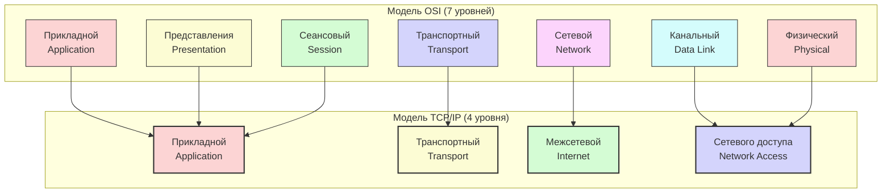
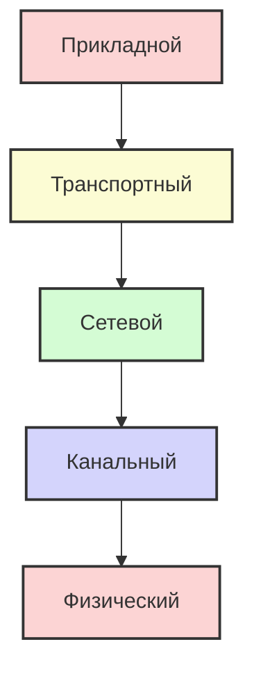
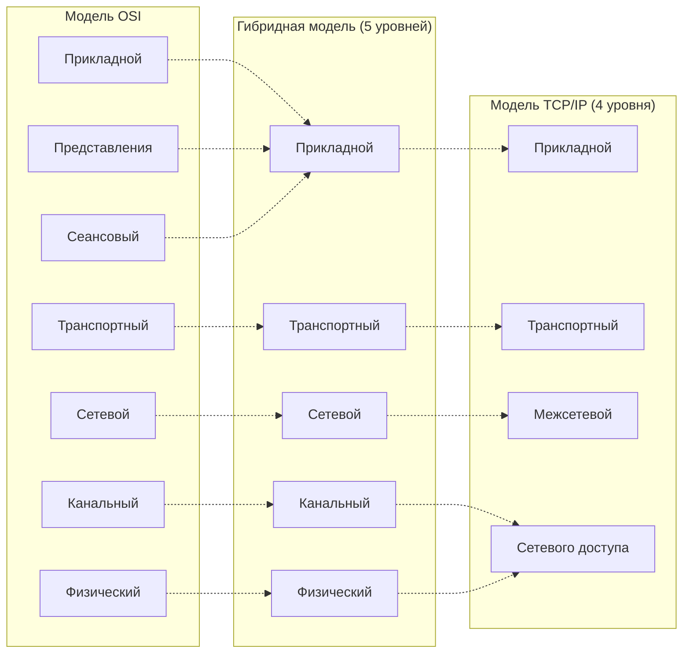

#введение #эталонные_модели_взаимодействия #OSI #TCP/IP #гибридная_модель #физический_уровень #канальный_уровень #сетевой_уровень #транспортный_уровень #сеансовый_уровень #уровень_представления #прикладной_уровень #межсетевой_уровень #уровень_сетевого_доступа
___
## Введение

Модель OSI (эталонная модель взаимодействия открытых систем) и модель TCP/IP (архитектура Интернета) - две наиболее известные сетевые модели, описывающие процесс передачи данных. Несмотря на то, что обе модели используют многоуровневый подход, они имеют фундаментальные различия в философии, количестве уровней, подходах к надёжности и практической применимости

Понимание этих различий критически важно для:
- Правильной интерпретации сетевой терминологии
- Понимания того, почему некоторые протоколы работают так, а не иначе
- Эффективной диагностики сетевых проблем (знание, на каком уровне искать причину)
- Выбора правильной модели при проектировании сетевых приложений

Важно сразу отметить: **модель OSI - это идеальный эталон, созданный до появления доминирующих протоколов**, а **TCP/IP - это практическая реализация, которая развивалась эволюционно и стала стандартом де-факто**. Они не являются двумя вариантами одного и того же - это разные парадигмы, которые лишь частично пересекаются

---

## Уровневое сравнение

### Сопоставление уровней

Наиболее распространённый способ сравнения - это наложение уровней одной модели на другую. Принято считать, что:

### Подробное сопоставление уровней

| Уровни OSI                                  | Уровни TCP/IP                                    | Основное соответствие                                                                                            |
| ------------------------------------------- | ------------------------------------------------ | ---------------------------------------------------------------------------------------------------------------- |
| **7. Прикладной** (Application)             | **4. Прикладной** (Application)                  | Интерфейс с пользовательскими приложениями (HTTP, FTP, SMTP)                                                     |
| **6. Уровень представления** (Presentation) | → (включён в прикладной)                         | Преобразование данных, шифрование, сжатие - реализуется приложениями или отдельными библиотеками (например, TLS) |
| **5. Сеансовый** (Session)                  | → (включён в прикладной)                         | Управление сессиями - часто реализуется на уровне приложений (например, cookies в HTTP)                          |
| **4. Транспортный** (Transport)             | **3. Транспортный** (Transport)                  | Сквозная доставка, порты, надёжность (TCP, UDP)                                                                  |
| **3. Сетевой** (Network)                    | **2. Межсетевой** (Internet)                     | Логическая адресация, маршрутизация (IP)                                                                         |
| **2. Канальный** (Data Link)                | **1. Уровень сетевого доступа** (Network Access) | Физическая адресация (MAC), формирование кадров, доступ к среде                                                  |
| **1. Физический** (Physical)                | → (включён в уровень сетевого доступа)           | Передача битов по физической среде                                                                               |

---

## Ключевые различия

### Количество уровней

- **OSI**: 7 уровней. Жёсткое разделение функций, каждый уровень выполняет строго определённую задачу
- **TCP/IP**: 4 уровня (или 5 в расширенной версии). Некоторые функции OSI объединены (например, сеансовый и представления - в прикладной уровень)

**Почему это важно**: OSI стремится к максимальной модульности, что упрощает замену одного протокола на другой без влияния на соседние уровни. TCP/IP жертвует чистотой архитектуры ради практичности и эффективности, объединяя функции, которые в реальности редко разделяются

### Философия создания

| Критерий            | **OSI**                                                                             | **TCP/IP**                                                                     |
| ------------------- | ----------------------------------------------------------------------------------- | ------------------------------------------------------------------------------ |
| **Время появления** | Разработана в 1970-х, опубликована в 1984                                           | Создана в 1970-х, реализована раньше OSI                                       |
| **Подход**          | "Сверху вниз" (top-down) - сначала определили уровни, потом разрабатывали протоколы | "Снизу вверх" (bottom-up) - сначала создали протоколы, потом обобщили в модель |
| **Цель**            | Стандартизация и унификация всех сетей                                              | Соединение разнородных сетей в единую сеть                                     |
| **Характер**        | Теоретический эталон, протокольно-независимый                                       | Практическая архитектура, основанная на конкретных протоколах                  |

### Подход к установлению соединения

- **OSI**: Транспортный уровень поддерживает **только** сервисы с установлением соединения (connection-oriented). Сетевой уровень поддерживает как соединение, так и без (в подуровнях)
- **TCP/IP**: Транспортный уровень поддерживает **оба** типа: TCP (с установлением) и UDP (без установления). Сетевой уровень (IP) работает **только** без установления соединения (connectionless)

Это важное различие: в OSI надёжность закладывается на транспортном уровне и выше, а в TCP/IP IP-уровень вообще не гарантирует доставку, и приложения могут выбирать (TCP или UDP) в зависимости от потребностей

### Гарантия доставки

- **OSI**: Транспортный уровень гарантирует доставку (как в теории, так и на практике, если используется соответствующий протокол)
- **TCP/IP**: Нижние уровни (сетевой и ниже) не гарантируют доставку. Гарантии предоставляются только на транспортном уровне (TCP) или не предоставляются вовсе (UDP). Это отражает философию **"best-effort"** - сеть делает всё возможное, но не обещает

### Сложность и практичность

- **OSI**: Более сложная, требует точного соблюдения всех уровней. На практике многие уровни (сеансовый, представления) редко используются в чистом виде
- **TCP/IP**: Проще, легче реализуется, быстрее работает. Протоколы реально работают в Интернете

### Стандартизация

- **OSI**: Официальный международный стандарт (ISO/IEC 7498). Однако его протоколы (OSI protocol suite) не получили широкого распространения
- **TCP/IP**: Стандарт де-факто, поддерживается IETF через документы RFC (Request for Comments). Не является официальным международным стандартом, но является основой Интернета

---

## Гибридная модель (5 уровней)

В современной литературе и на практике часто используется **гибридная модель**, объединяющая лучшие аспекты OSI и TCP/IP. Она состоит из 5 уровней:

**Почему 5 уровней?**
- **Прикладной** - объединяет OSI 5, 6, 7
- **Транспортный** - соответствует OSI 4 и TCP/IP 3
- **Сетевой** - соответствует OSI 3 и TCP/IP 2
- **Канальный** - часть TCP/IP уровня сетевого доступа, соответствует OSI 2
- **Физический** - часть TCP/IP уровня сетевого доступа, соответствует OSI 1

Эта модель широко используется в университетских курсах (например, Kurose & Ross "Computer Networking: A Top-Down Approach"), так как она достаточно детализирована, но при этом ближе к реальности, чем OSI, и яснее, чем 4-уровневая TCP/IP

---

## Почему TCP/IP стал доминирующим, а OSI - нет?

### Исторические причины

- **Время**: TCP/IP был готов и работал в ARPANET уже в конце 1970-х — начале 1980-х. OSI была опубликована в 1984 году, когда TCP/IP уже имел значительную инсталляционную базу
- **Финансирование**: DARPA активно финансировала разработку и внедрение TCP/IP. OSI не имела такого мощного спонсора
- **Простота**: TCP/IP был проще в реализации, что ускорило его принятие

### Технические причины

- **Гибкость**: TCP/IP легко адаптируется к новым технологиям. Например, добавление новых прикладных протоколов (HTTP/3) не требует изменения базовых уровней
- **Масштабируемость**: TCP/IP изначально проектировался для глобальных сетей, а OSI - для сетей любого размера, но без учёта экстремальной масштабируемости
- **Открытость**: Все протоколы TCP/IP были открыты и доступны для всех, что способствовало их быстрому распространению

### Политические причины

- OSI была поддержана европейскими и некоторыми американскими телекоммуникационными компаниями (например, правительство США требовало использования OSI в государственных сетях). Однако коммерческий сектор и интернет-сообщество выбрали TCP/IP, и в итоге рыночные силы победили

---

## Общие черты

Несмотря на различия, у моделей есть и общие принципы:
- **Многоуровневость**: Обе модели используют иерархическую структуру для упрощения сложной задачи
- **Инкапсуляция**: В обеих моделях данные проходят процесс добавления заголовков на каждом уровне
- **Разделение ответственности**: Каждый уровень отвечает за определённый аспект передачи данных
- **Стандартные интерфейсы**: Уровни взаимодействуют через чётко определённые интерфейсы

---

## Схематическое сравнение "бок о бок"

---

## Сводная таблица сравнения

| Характеристика           | **OSI**                                           | **TCP/IP**                                 |
| ------------------------ | ------------------------------------------------- | ------------------------------------------ |
| **Количество уровней**   | 7                                                 | 4 (или 5)                                  |
| **Тип модели**           | Эталонная, теоретическая                          | Практическая, реализованная                |
| **Год публикации**       | 1984                                              | Начало 1980-х (RFC 791, 793)               |
| **Создатель**            | ISO (Международная организация по стандартизации) | DARPA (Агентство Министерства обороны США) |
| **Философия**            | Разделение функций, строгая иерархия              | Минимализм, гибкость, end-to-end           |
| **Протоколы**            | Разрабатывались под модель                        | Модель обобщала уже существующие протоколы |
| **Стандарт**             | Официальный международный                         | Де-факто, RFC                              |
| **Установка соединения** | На всех уровнях (транспорт - только с установкой) | IP - без установки; TCP/UDP - оба варианта |
| **Гарантия доставки**    | Обеспечивается на нескольких уровнях              | Обеспечивается только TCP (опционально)    |
| **Применение**           | Обучение, терминология, диагностика               | Реальный Интернет, все современные сети    |
| **Актуальность**         | Теоретическая основа                              | Практическая основа                        |

---

## Практическое значение для разработчика

Для программиста, пишущего сетевые приложения, знание обеих моделей даёт:
1. **Понимание абстракций**: Знание того, какой уровень OSI соответствует какому аспекту разработки (например, работа с сокетами - это транспортный уровень; работа с HTTP - прикладной)
2. **Диагностика проблем**: Если приложение работает медленно, знание модели помогает определить, проблема на уровне сети (потери пакетов), на транспортном уровне (перегрузка TCP) или на прикладном уровне (медленный сервер)
3. **Выбор протокола**: Когда использовать TCP (надёжность, порядок) против UDP (скорость, низкие накладные расходы)
4. **Понимание инкапсуляции**: При отправке данных через сокеты вы не заботитесь о заголовках - это делают нижние уровни, но знание процесса помогает отлаживать перехват пакетов (Wireshark)

---

## Заключение

Модель OSI и модель TCP/IP - это две разные парадигмы, которые, однако, дополняют друг друга:
- **OSI** даёт нам идеальную, логически стройную картину того, _как должна быть устроена_ сеть. Она - основа для изучения, общая терминология и каркас для понимания
- **TCP/IP** - это реальная, работающая архитектура, которая _на самом деле_ управляет передачей данных в Интернете. Она прагматична, гибка и проверена временем

Большинство современных специалистов используют **гибридную 5-уровневую модель** в повседневной работе и обучении, так как она объединяет строгость OSI и практичность TCP/IP

При диагностике сети полезно помнить:
- **Уровни 1-2 (Физический, Канальный)** - проблемы с кабелями, оборудованием, MAC-адресами
- **Уровень 3 (Сетевой)** - проблемы с IP-адресацией, маршрутизацией
- **Уровень 4 (Транспортный)** - проблемы с портами, перегрузками, таймаутами
- **Уровень 5+ (Прикладной)** - проблемы с протоколами приложений (HTTP, DNS и т.д.)

Это знание является фундаментом для дальнейшего глубокого изучения каждого уровня в отдельности