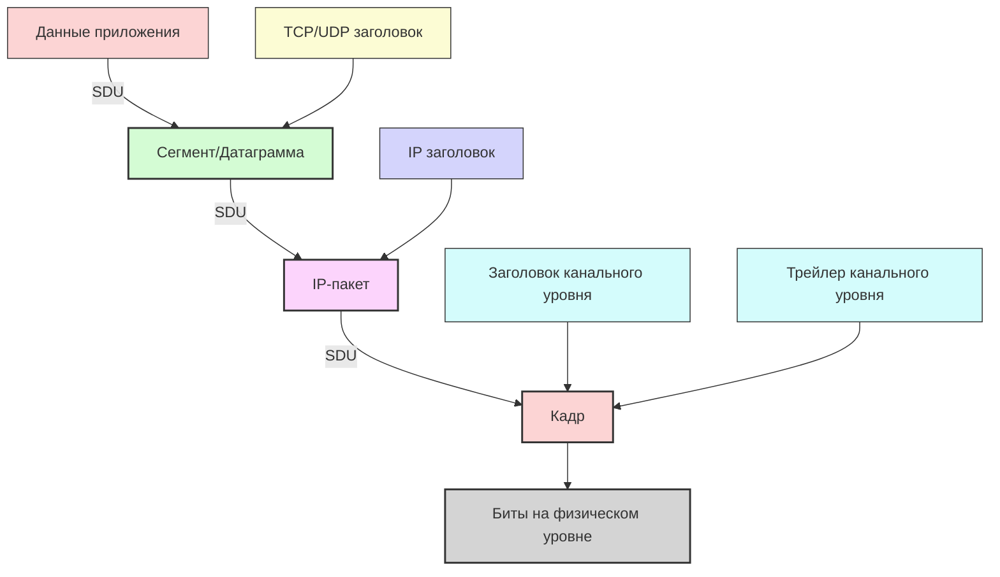
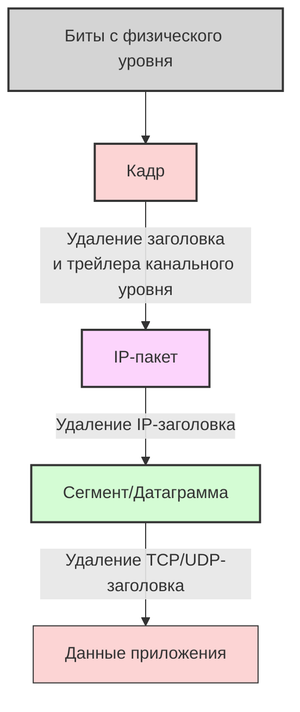
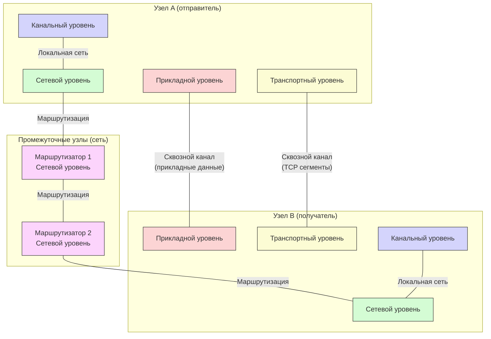
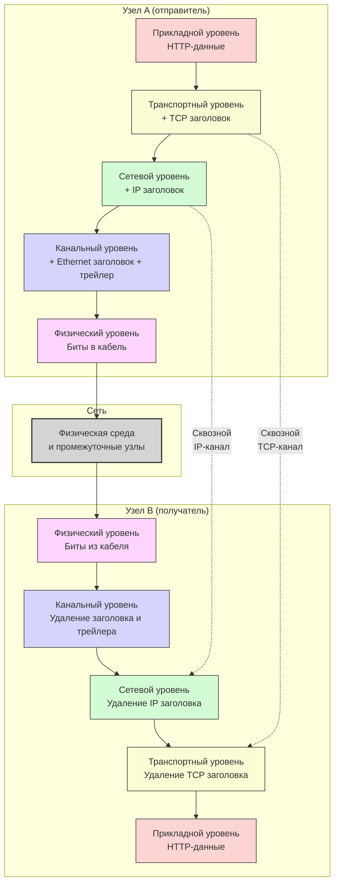

#введение #эталонные_модели_взаимодействия #инкапсуляция #декапсуляция #PDU #SDU
___
## Введение

Если модель OSI или TCP/IP - это **архитектура** сетевого взаимодействия, то инкапсуляция и декапсуляция - это **механизм**, который делает эту архитектуру работающей. Это тот самый процесс, который связывает все уровни в единое целое и обеспечивает сквозную передачу данных от приложения на одном узле к приложению на другом

Инкапсуляция и декапсуляция - это две стороны одного процесса:
- **Инкапсуляция** происходит на стороне отправителя: данные "обрастают" заголовками (и иногда трейлерами) по мере движения сверху вниз по уровням модели
- **Декапсуляция** происходит на стороне получателя: заголовки последовательно удаляются по мере движения данных снизу вверх

Этот механизм является **сквозным принципом** (end-to-end principle) работы сетей: каждый уровень добавляет свою служебную информацию, которая нужна только одноуровневому модулю на другой стороне, и удаляется при получении

> **Ключевая идея**: Инкапсуляция - это "упаковка" данных на каждом уровне в контейнер, понятный одноуровневому протоколу на другом узле. Декапсуляция - это последовательное "распаковывание" этих контейнеров

---

## Основные понятия

### PDU (Protocol Data Unit)

**PDU (Protocol Data Unit)** - это единица данных, которой оперирует определённый уровень протокола. Каждый уровень имеет своё название для PDU:

|Уровень (OSI)|Название PDU|Пример|
|---|---|---|
|7. Прикладной|Данные (Data)|HTTP-запрос, SMTP-письмо|
|6. Представления|Данные (Data)|Зашифрованные или сжатые данные|
|5. Сеансовый|Данные (Data)|Данные с управляющей информацией сессии|
|4. Транспортный|Сегмент (TCP) / Датаграмма (UDP)|TCP-сегмент с портами и контрольной суммой|
|3. Сетевой|Пакет (Packet) / Датаграмма (Datagram)|IP-пакет с IP-адресами|
|2. Канальный|Кадр (Frame)|Ethernet-кадр с MAC-адресами и CRC|
|1. Физический|Биты (Bits)|Последовательность электрических/оптических сигналов|

В модели TCP/IP названия аналогичны, но уровней меньше:
- **Прикладной уровень**: Данные (Data)
- **Транспортный уровень**: Сегмент (TCP) или Датаграмма (UDP)
- **Межсетевой уровень**: Пакет (IP-пакет)
- **Уровень сетевого доступа**: Кадр (Frame) → Биты (Bits)

### SDU (Service Data Unit)

**SDU (Service Data Unit)** - это данные, которые передаются от вышележащего уровня нижележащему для инкапсуляции. SDU - это "полезная нагрузка" (payload) для данного уровня, которая становится PDU после добавления заголовка

Пример: Данные прикладного уровня являются SDU для транспортного уровня. После добавления TCP-заголовка получается TCP-сегмент (PDU транспортного уровня), который, в свою очередь, является SDU для сетевого уровня

### Заголовки и трейлеры

- **Заголовок (Header)** - служебная информация, добавляемая в начало PDU. Содержит управляющие поля: адреса, номера портов, порядковые номера, контрольные суммы и т.д.
- **Трейлер (Trailer)** - служебная информация, добавляемая в конец PDU (в основном на канальном уровне для контроля ошибок, например CRC)

---

## Процесс инкапсуляции (отправка)

На стороне отправителя процесс инкапсуляции происходит **сверху вниз** - от прикладного уровня к физическому

### Шаг 1: Прикладной уровень

- **Что происходит**: Пользовательское приложение (например, веб-браузер) генерирует данные (HTTP-запрос)
- **Результат**: Данные прикладного уровня (Data)

### Шаг 2: Транспортный уровень (TCP/UDP)

- **Что происходит**: Данные разбиваются на сегменты (TCP) или датаграммы (UDP). Добавляется заголовок транспортного уровня: порты источника и назначения, порядковый номер (TCP), контрольная сумма и др.
- **Результат**: Сегмент TCP или датаграмма UDP (PDU транспортного уровня)

### Шаг 3: Сетевой уровень (IP)

- **Что происходит**: К сегменту/датаграмме добавляется IP-заголовок: IP-адреса источника и получателя, TTL, идентификатор фрагментации и др.
- **Результат**: IP-пакет (PDU сетевого уровня)

### Шаг 4: Канальный уровень (Ethernet, PPP)

- **Что происходит**: К IP-пакету добавляется заголовок канального уровня: MAC-адреса источника и получателя, тип протокола. Также может добавляться трейлер с контрольной суммой (CRC)
- **Результат**: Кадр (Frame)

### Шаг 5: Физический уровень

- **Что происходит**: Кадр преобразуется в последовательность битов и передаётся по физической среде (электрические сигналы, световые импульсы, радиоволны)
- **Результат**: Биты, передаваемые по сети

### Схема инкапсуляции

---

## Процесс декапсуляции (приём)

На стороне получателя процесс происходит **снизу вверх** - от физического уровня к прикладному

### Шаг 1: Физический уровень

- **Что происходит**: Принимает биты из физической среды и преобразует их обратно в кадр
- **Результат**: Кадр передаётся канальному уровню

### Шаг 2: Канальный уровень

- **Что происходит**: Проверяет целостность кадра (CRC), удаляет заголовок и трейлер канального уровня. Извлекает IP-пакет
- **Результат**: IP-пакет передаётся сетевому уровню

### Шаг 3: Сетевой уровень

- **Что происходит**: Проверяет IP-заголовок, удаляет его. Если пакет был фрагментирован, собирает фрагменты. Извлекает сегмент/датаграмму
- **Результат**: Сегмент/датаграмма передаётся транспортному уровню

### Шаг 4: Транспортный уровень

- **Что происходит**: Проверяет контрольную сумму, удаляет TCP/UDP-заголовок. Для TCP: собирает сегменты в правильном порядке, подтверждает получение
- **Результат**: Данные прикладного уровня передаются приложению

### Шаг 5: Прикладной уровень

- **Что происходит**: Приложение получает данные и обрабатывает их (например, отображает веб-страницу)

### Схема декапсуляции

---

## Сквозной принцип (End-to-End Principle)

**Сквозной принцип** - это один из ключевых архитектурных принципов Интернета, тесно связанный с инкапсуляцией и декапсуляцией. Он гласит: **интеллектуальность (логика) должна быть сконцентрирована на конечных узлах (endpoints), а сеть должна оставаться максимально простой и заниматься только пересылкой пакетов**

### Как это работает

1. **Одноуровневое взаимодействие**: Протоколы одного уровня на разных узлах "общаются" друг с другом так, как будто между ними существует прямой сквозной канал. Например:
    - TCP на отправителе "думает", что взаимодействует напрямую с TCP на получателе
    - IP на отправителе "думает", что взаимодействует напрямую с IP на получателе
2. **Промежуточные узлы не знают о верхних уровнях**: Маршрутизаторы (сетевой уровень) не знают о TCP-портах или HTTP-запросах. Они просто продвигают IP-пакеты. Коммутаторы (канальный уровень) не знают об IP-адресах. Это делает сеть простой и быстрой
3. **Граница ответственности**: Каждый уровень отвечает только за свои функции:
    - Канальный уровень - за доставку кадра в пределах локальной сети
    - Сетевой уровень - за доставку пакета до узла назначения (best-effort)
    - Транспортный уровень - за сквозную надёжность (TCP) или быструю доставку (UDP)
    - Прикладной уровень - за логику приложения

### Схема сквозного взаимодействия

---

## Роль заголовков

Каждый заголовок содержит информацию, необходимую для работы протокола **на соответствующем уровне**

### Пример: TCP-заголовок

- **Порты источника и назначения**: Для мультиплексирования/демультиплексирования
- **Порядковый номер**: Для сборки сегментов в правильном порядке
- **Номер подтверждения**: Для подтверждения получения
- **Контрольная сумма**: Для проверки целостности
- **Флаги (SYN, ACK, FIN и др.)**: Для управления соединением

### Пример: IP-заголовок

- **IP-адреса источника и назначения**: Для маршрутизации
- **TTL (Time To Live)**: Чтобы пакеты не зацикливались
- **Идентификатор фрагмента**: Для сборки фрагментированных пакетов
- **Протокол транспортного уровня**: Чтобы знать, какой протокол дальше (TCP или UDP)

### Пример: Ethernet-заголовок

- **MAC-адреса источника и назначения**: Для доставки в локальной сети
- **Тип протокола (EtherType)**: Чтобы знать, какой протокол дальше (IPv4, IPv6, ARP)
- **CRC (трейлер)**: Для обнаружения ошибок

---

## Инкапсуляция в действии: пример с веб-серфингом

Рассмотрим, что происходит, когда вы открываете веб-страницу:
1. **Браузер (прикладной уровень)** генерирует HTTP GET-запрос:  
    `GET /index.html HTTP/1.1`
2. **Транспортный уровень (TCP)**:
    - Разбивает запрос на сегменты (если он большой)
    - Добавляет TCP-заголовок с портами: `source port = 49152 (случайный), dest port = 80 (HTTP)`
    - Получается TCP-сегмент
3. **Сетевой уровень (IP)**:
    - Добавляет IP-заголовок: `source IP = 192.168.1.10, dest IP = 142.250.185.78`
    - Получается IP-пакет
4. **Канальный уровень (Ethernet)**:
    - Добавляет Ethernet-заголовок: `source MAC = AA:BB:CC:DD:EE:FF, dest MAC = MAC-адрес маршрутизатора`
    - Добавляет CRC-трейлер
    - Получается Ethernet-кадр
5. **Физический уровень**: Кадр преобразуется в биты и отправляется по сети

На пути к серверу:
- **Коммутатор** (канальный уровень) видит только Ethernet-кадр, читает dest MAC и пересылает его
- **Маршрутизатор** (сетевой уровень) удаляет Ethernet-заголовок, читает dest IP, определяет следующий hop, добавляет новый Ethernet-заголовок (с новыми MAC-адресами) и отправляет дальше
- На сервере процесс идёт в обратном порядке: Ethernet → IP → TCP → HTTP

---

## Важность инкапсуляции и декапсуляции

### Для разработчика

- **Абстракция**: При написании сетевого приложения вы работаете только с сокетами (интерфейс между прикладным и транспортным уровнями). Всё остальное делает ОС и стек протоколов
- **Отладка**: Понимание инкапсуляции помогает читать дампы трафика (Wireshark) и понимать, на каком уровне возникает проблема
- **Проектирование протоколов**: Если вы разрабатываете свой протокол, вы должны понимать, где его разместить (например, поверх UDP или TCP)

### Для системного администратора

- **Диагностика**: Знание уровней помогает быстро локализовать проблему:
    - Канальный уровень: ошибки в MAC-адресах, коллизии (редко в современных сетях)
    - Сетевой уровень: неправильная маршрутизация, проблемы с IP-адресами
    - Транспортный уровень: блокировка портов, сброс TCP-соединений
    - Прикладной уровень: ошибки в конфигурации сервисов (DNS, HTTP и т.д.)

### Для сети в целом

- **Масштабируемость**: Промежуточные узлы не хранят информацию о состоянии приложений, что позволяет Интернету обслуживать миллиарды устройств
- **Гибкость**: Можно менять протоколы на одном уровне, не затрагивая другие (например, заменить IPv4 на IPv6, Ethernet на Wi-Fi)

---

## Схема полного цикла инкапсуляции и декапсуляции

---

## Связь с другими концепциями

- **Протокол и интерфейс**: Инкапсуляция - это механизм, использующий интерфейсы между уровнями для передачи SDU
- **Сервис и прозрачность**: Инкапсуляция скрывает реализацию каждого уровня, обеспечивая прозрачность
- **Модели OSI и TCP/IP**: Инкапсуляция работает одинаково в обеих моделях, с той разницей, что в TCP/IP меньше уровней
- **Метрики производительности**: Инкапсуляция добавляет накладные расходы (заголовки), которые снижают полезную пропускную способность (throughput) и увеличивают задержку

---

## Заключение

Инкапсуляция и декапсуляция - это **сердце сетевого взаимодействия**. Без этого механизма многоуровневая архитектура была бы невозможна

**Ключевые идеи:**
1. **Инкапсуляция** - добавление заголовков (и трейлеров) к данным при движении сверху вниз
2. **Декапсуляция** - удаление заголовков при движении снизу вверх
3. **Сквозной принцип** - каждый уровень "общается" только со своим одноуровневым модулем на другом узле, не заботясь о том, что происходит на промежуточных уровнях
4. **PDU (Protocol Data Unit)** - единица данных на каждом уровне имеет своё название: данные, сегмент/датаграмма, пакет, кадр, биты
5. **Заголовки** содержат служебную информацию, необходимую для работы протокола (адреса, порядковые номера, контрольные суммы и т.д.)

Понимание этого механизма критически важно для:
- **Разработки**: знать, что происходит под капотом при вызове `send()` или `recv()`
- **Диагностики**: читать дампы трафика и понимать, на каком уровне проблема
- **Проектирования**: выбирать правильные протоколы для своих приложений

В следующих заметках мы будем углубляться в каждый уровень по отдельности, и принцип инкапсуляции будет постоянно всплывать как связующий механизм