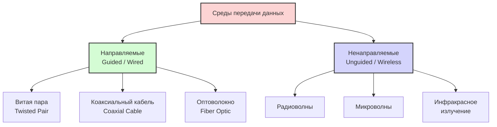
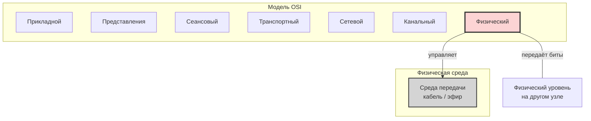

#физический_уровень #среда_передачи_данных #направляемая_среда #ненаправляемая_среда #пропускная_способность #полезная_пропускная_способность #затухание #помехоустойчивость #EMI #RFI #коаксиальный_кабель #витая_пара #оптоволокно #радиоволны #микроволны #инфракрасное_излучение
___
## Введение

Физический уровень (Physical Layer) - это самый нижний уровень модели OSI. Если вся сетевая модель - это архитектура здания, то физический уровень - это его фундамент и инженерные коммуникации. Без него никакая передача данных невозможна в принципе

**Основная задача физического уровня** - передача потока битов (единиц и нулей) от одного устройства к другому через физическую среду. При этом уровень **не анализирует и не вникает** в смысл передаваемой информации - его забота исключительно в том, чтобы доставить биты в целости

Физический уровень описывает **способы передачи бит**, параметры сигналов (амплитуда, частота, фаза), используемую модуляцию, синхронизацию, скорость передачи данных и характеристики самой среды. Он также определяет аппаратные характеристики: напряжения/токи, разъёмы, типы кабелей

В модели TCP/IP физический и канальный уровни объединены в один - **уровень сетевого доступа (Network Access Layer)**

Физический уровень, вместе с канальным и сетевым, относится к **сетезависимым** уровням - их реализация напрямую зависит от конкретных сетевых технологий и физической среды

---

## Что такое среда передачи данных?

**Среда передачи данных (transmission medium)** - это физический канал, по которому сигнал (электрический, оптический или радиоволновой) распространяется от отправителя к получателю

В широком смысле средой может быть:
- **Кабель** - набор проводов, изоляционных и защитных оболочек, разъёмов
- **Свободное пространство** - атмосфера или космос, через которые распространяются электромагнитные волны

Среду передачи часто называют **«нулевым уровнем»** (layer zero) модели OSI, поскольку она находится ниже физического уровня, но именно физический уровень управляет работой с ней

---

## Классификация сред передачи

Все среды передачи делятся на две большие категории:

### 1. Направляемые среды (Guided Media)

Это **проводные** среды, в которых сигнал распространяется внутри физического проводника (кондуита), направляющего его от источника к приёмнику

К направляемым средам относятся:
- **Витая пара** (Twisted Pair) - UTP и STP
- **Коаксиальный кабель** (Coaxial Cable)
- **Оптоволоконный кабель** (Fiber Optic)

Сигнал в направляемых средах ограничен физическими пределами среды и не распространяется за её пределы (за исключением небольших наводок)

### 2. Ненаправляемые среды (Unguided Media)

Это **беспроводные** среды, в которых электромагнитные волны распространяются в свободном пространстве (через воздух, вакуум) без направляющего физического проводника

К ненаправляемым средам относятся:
- **Радиоволны** (Radio Waves)
- **Микроволны** (Microwaves) - наземные и спутниковые
- **Инфракрасное излучение** (Infrared)

Сигнал в ненаправленных средах доступен любому устройству, способному его принимать, что создаёт дополнительные вопросы безопасности

---

## Основные параметры сравнения сред

При выборе среды передачи данных инженеры оценивают несколько ключевых характеристик

### 1. Пропускная способность (Bandwidth / Throughput)

**Пропускная способность** (bandwidth) - это максимально возможная скорость передачи данных по линии связи, измеряемая в битах в секунду (бит/с, Кбит/с, Мбит/с, Гбит/с)

**Полезная пропускная способность** (throughput) - это реальная скорость передачи полезных данных, которая всегда ниже теоретической из-за накладных расходов (заголовки, повторные передачи, задержки в очередях)

Связь между пропускной способностью и полосой пропускания описывается **формулой Шеннона**:

> C = F · log₂(1 + P_c / P_ш)

где C - максимальная пропускная способность, F - ширина полосы пропускания, P_c - мощность сигнала, P_ш - мощность шума

### 2. Затухание (Attenuation)

**Затухание** - это относительное уменьшение амплитуды сигнала при передаче по линии связи. Измеряется в децибелах (дБ)

Чем длиннее кабель, тем сильнее затухает сигнал. На определённом расстоянии сигнал становится настолько слабым, что приёмник не может его корректно распознать. Поэтому для каждой среды определено **максимальное расстояние** передачи без использования усилителей (повторителей)

### 3. Помехоустойчивость (Noise Immunity)

**Помехоустойчивость** - это способность среды сохранять целостность сигнала при воздействии внешних электромагнитных помех (EMI - Electromagnetic Interference) и радиочастотных помех (RFI)

Также важным параметром являются **перекрёстные наводки** (crosstalk) - взаимное влияние сигналов в соседних проводах или кабелях

### Сравнительная таблица сред

| Параметр               | Витая пара (UTP)       | Коаксиал | Оптоволокно                  | Беспроводная среда  |
| ---------------------- | ---------------------- | -------- | ---------------------------- | ------------------- |
| **Скорость**           | Средняя (до 10 Гбит/с) | Средняя  | Очень высокая (сотни Гбит/с) | Низкая/Средняя      |
| **Дальность**          | До 100 м               | До 500 м | Десятки км                   | Зависит от мощности |
| **Помехоустойчивость** | Низкая/Средняя         | Средняя  | Очень высокая                | Низкая              |
| **Стоимость**          | Низкая                 | Средняя  | Высокая                      | Средняя/Высокая     |
| **Сложность монтажа**  | Простой                | Средний  | Сложный                      | Простой             |

Оптоволоконные кабели обеспечивают **наибольшую скорость и дальность** передачи, имеют минимальное влияние электромагнитных и радиочастотных помех, а также отсутствие перекрёстных помех между соседними волокнами. Беспроводная среда, напротив, характеризуется **сравнительно малой скоростью и дальностью** передачи

---

## Место физического уровня в модели OSI

Физический уровень **непосредственно управляет** средой передачи. Он:
- Преобразует кадры, полученные от канального уровня, в поток битов
- Определяет, как именно эти биты будут представлены в виде сигналов (электрических, оптических или радиоволн)
- Управляет такими параметрами, как скорость передачи, синхронизация, модуляция

Важно понимать: физический уровень **не отвечает за качество, сохранность и целостность данных** в плане их смысловой интерпретации. Его задача - обеспечить саму возможность передачи битов. Контроль целостности и исправление ошибок - это уже задача канального уровня (уровень 2)

---

## Аппаратные средства физического уровня

К аппаратным средствам физического уровня относятся:
- **Кабели и разъёмы** (медные, оптоволоконные)
- **Беспроводные приёмопередатчики** (антенны, радиомодули)
- **Повторители сигналов (Repeater)** - усиливают сигнал для передачи на большие расстояния
- **Концентраторы (Hub)** - многопортовые повторители
- **Преобразователи среды (Transceiver)** - например, преобразователи электрических сигналов в оптические и обратно
- **Сетевые карты (NIC)** - их функционирование охватывает как канальный, так и физический уровни

---

## Заключение

Физический уровень - это фундамент всей сетевой архитектуры. Он определяет, какие именно среды передачи данных доступны, с какой скоростью и на какое расстояние можно передавать информацию, и насколько надёжной будет эта передача

Понимание свойств различных сред критически важно:
- **Витая пара** - дешёвое и простое решение для локальных сетей на небольшие расстояния
- **Коаксиальный кабель** - исторически важный, но сейчас вытесняется витой парой и оптоволокном
- **Оптоволокно** - выбор для магистралей, где нужны огромные скорости и расстояния
- **Беспроводные среды** - дают мобильность, но требуют компромиссов по скорости и помехоустойчивости

В следующих заметках мы подробно разберём каждый тип среды: устройство, принципы работы, стандарты и области применения