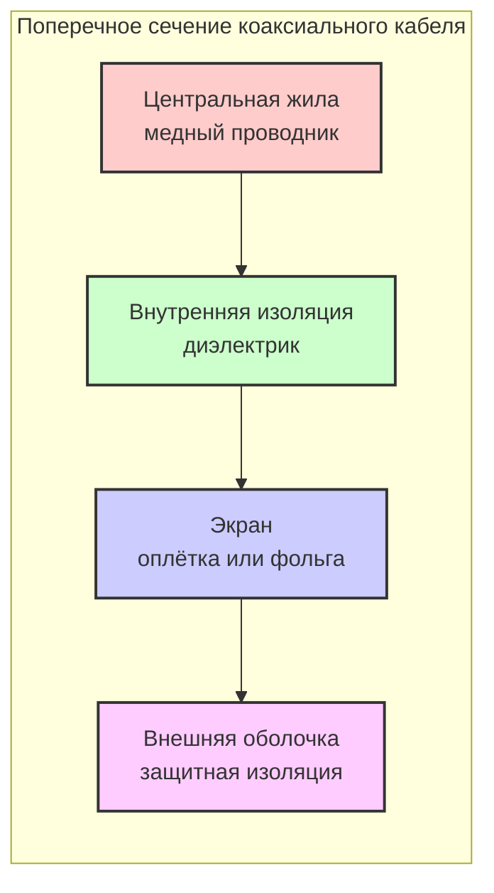
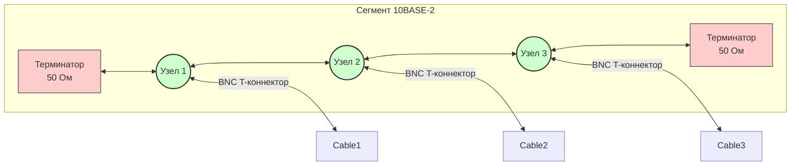

#физический_уровень #среда_передачи_данных #коаксиальный_кабель #волновое_сопротивление #толстый_коаксиал #тонкий_коаксиал #разъёмы_для_коаксиального_кабеля
___
## Введение

**Коаксиальный кабель** (coaxial cable) - один из первых типов кабелей, использовавшихся в компьютерных сетях. Он был основой для ранних реализаций Ethernet (10BASE-5 и 10BASE-2) и до сих пор применяется в некоторых специализированных областях, хотя в локальных сетях его вытеснили витая пара и оптоволокно

Название «коаксиальный» происходит от латинского *co-* (вместе) и _axis_ (ось), что отражает конструкцию: два проводника имеют общую геометрическую ось. Коаксиальный кабель обеспечивает хорошую помехозащищённость и может передавать сигналы на большие расстояния, но имеет более высокую стоимость и сложность монтажа по сравнению с витой парой

---

## Устройство коаксиального кабеля

Коаксиальный кабель состоит из четырёх основных слоёв (от центра к периферии):

### 1. Центральная жила (Core)

- **Материал**: Твёрдая медь или многожильный медный провод
- **Назначение**: Передача сигнала (электрического тока)
- **Диаметр**: Варьируется в зависимости от типа кабеля и его волнового сопротивления (обычно 50 или 75 Ом)

### 2. Внутренняя изоляция (Dielectric Insulation)

- **Материал**: Полиэтилен, тефлон, пенополиэтилен или другой диэлектрик
- **Назначение**: Изолирует центральную жилу от экрана, предотвращая короткое замыкание и сохраняя постоянное расстояние между проводниками
- **Особенность**: Для высокочастотных кабелей используют вспененные диэлектрики (с воздушными пустотами) для снижения затухания

### 3. Экран (Shield / Braid)

- **Материал**: Медная оплётка, фольга или их комбинация (медная фольга + оплётка для двойного экранирования)
- **Назначение**: Защищает центральную жилу от внешних электромагнитных помех (EMI/RFI) и одновременно служит обратным проводником для сигнала
- **Эффективность**: Чем плотнее оплётка (выше процент покрытия), тем лучше защита

### 4. Внешняя оболочка (Outer Jacket)

- **Материал**: ПВХ, полиэтилен, тефлон (для высоких температур)
- **Назначение**: Защита кабеля от механических повреждений, влаги, химического воздействия
- **Цвет**: Часто чёрный или серый, но бывают цветовые маркировки для разных применений

---

## Волновое сопротивление (Impedance)

**Волновое сопротивление** (characteristic impedance) - это отношение напряжения к току в бегущей волне в кабеле. Оно определяется геометрией кабеля (диаметром жилы, диаметром экрана, типом диэлектрика) и является критическим параметром, который должен соответствовать нагрузке (приёмнику) для минимизации отражений сигнала

Для компьютерных сетей используются два основных значения:

|Волновое сопротивление|Применение|
|---|---|
|**50 Ом**|Ethernet (10BASE-2, 10BASE-5), радиотехника, антенные фидеры|
|**75 Ом**|Телевидение, видео, спутниковые системы, кабельное телевидение|

> **Важно**: Использование кабеля с неправильным сопротивлением вызывает отражения сигнала, что приводит к битовым ошибкам и снижению дальности передачи

---

## Типы коаксиального кабеля в сетях Ethernet

В истории локальных сетей использовались два основных типа коаксиального кабеля для Ethernet:

### Толстый коаксиал (Thicknet, 10BASE-5)

- **Характеристики**: Диаметр ~ 10 мм, волновое сопротивление 50 Ом
- **Максимальная длина сегмента**: 500 метров
- **Скорость**: 10 Мбит/с
- **Подключение устройств**: Через специальные трансиверы (AUI-порт) с использованием "вампирных" зажимов, которые прокалывали изоляцию для контакта с центральной жилой
- **Применение**: В 1980-х годах для построения магистралей (толстый кабель укладывался вдоль здания)
- **Недостатки**: Сложность монтажа, высокая стоимость, негибкость

### Тонкий коаксиал (Thinnet, 10BASE-2)

- **Характеристики**: Диаметр ~ 5 мм, волновое сопротивление 50 Ом
- **Максимальная длина сегмента**: 185 метров (фактически 200 м, но с учётом затухания — 185 м)
- **Скорость**: 10 Мбит/с
- **Подключение устройств**: Через BNC-разъёмы и Т-коннекторы (BNC T-connector). Каждый компьютер подключался последовательно (в шину), а на концах сегмента устанавливались терминаторы (согласующие нагрузки) для поглощения сигнала и предотвращения отражений
- **Применение**: Широко использовался в 1990-х годах для небольших офисных сетей (до 30 узлов на сегмент)
- **Недостатки**: Обрыв кабеля или отказ терминатора парализовывал весь сегмент; сложность добавления новых узлов (требовалось перекрывать сеть)

---

## Разъёмы для коаксиального кабеля

Для коаксиального кабеля используются различные разъёмы, наиболее известные в сетевых технологиях:

### BNC (Bayonet Neill-Concelman)

- **Применение**: 10BASE-2 (тонкий Ethernet), видео, измерительная техника
- **Типы**: BNC-разъём для кабеля, BNC T-коннектор (для подключения устройств в шину), BNC-терминатор (50 Ом для Ethernet)
- **Особенность**: Байонетное соединение (поворот на четверть оборота) обеспечивает быстрое подключение/отключение

### AUI (Attachment Unit Interface)

- **Применение**: 10BASE-5 (толстый Ethernet)
- **Описание**: 15-контактный D-образный разъём для подключения трансивера к сетевой карте
- **Особенность**: Использовался только в толстом коаксиале

### F-разъём (F-Type)

- **Применение**: Телевидение, кабельное ТВ, спутниковое телевидение (75 Ом)
- **Особенность**: Резьбовое соединение, используется для передачи высокочастотных сигналов

### SMA, N, TNC

- **Применение**: Профессиональная радиотехника, измерительное оборудование, антенные системы
- **Особенность**: Обеспечивают более надёжное соединение и работают на высоких частотах

---

## Преимущества и недостатки коаксиального кабеля

### Преимущества

- **Хорошая помехозащищённость**: Благодаря экрану коаксиальный кабель устойчив к внешним электромагнитным помехам
- **Более высокая пропускная способность по сравнению с витой парой** на больших расстояниях (в ранних сетях)
- **Простота топологии "общая шина"**: Не требуется активного оборудования (коммутаторов) для объединения нескольких компьютеров
- **Дальность передачи**: До 500 м для толстого коаксиала, что было существенным преимуществом до появления оптоволокна

### Недостатки

- **Высокая стоимость** по сравнению с витой парой
- **Сложность монтажа**: Требуются специальные инструменты для обжима разъёмов, правильное согласование сопротивления
- **Низкая гибкость**: Толстый коаксиал сложно прокладывать в кабельных каналах
- **Уязвимость к обрывам**: При использовании шинной топологии обрыв кабеля или отказ терминатора приводит к падению всего сегмента
- **Низкая скорость по современным меркам**: Максимум 10 Мбит/с для Ethernet на коаксиале (хотя для телевидения скорости выше)
- **Отсутствие поддержки полнодуплексного режима**: Шинная топология работает только в полудуплексе
- **Затруднённое масштабирование**: Добавление нового узла требует разрыва сети

---

## Применение коаксиального кабеля сегодня

В локальных сетях коаксиальный кабель практически полностью вытеснен **витой парой** (для Ethernet) и **оптоволокном** (для магистралей). Однако он остаётся востребованным в других областях:
- **Кабельное телевидение (CATV)**: Передача телевизионных сигналов, интернет по технологии DOCSIS
- **Спутниковое телевидение**: Подключение спутниковых антенн (F-разъём, 75 Ом)
- **Системы видеонаблюдения**: Передача аналогового или цифрового видео (CCTV) на большие расстояния
- **Радиотехника**: Антенные фидеры, соединительные кабели для радиопередатчиков
- **Измерительное оборудование**: Высокочастотные измерительные тракты

В современных сетях Ethernet коаксиал иногда используется для **EoC (Ethernet over Coax)** - технология, позволяющая передавать Ethernet по существующим коаксиальным сетям (например, в многоквартирных домах с уже проложенным телевизионным кабелем). Это позволяет использовать старую инфраструктуру без перекладки кабелей

---

## Схема топологии 10BASE-2 на коаксиальном кабеле

_Каждый узел подключается в разрыв кабеля через T-коннектор. Терминаторы на концах поглощают сигнал, предотвращая отражения. Длина сегмента не более 185 м, количество узлов - до 30_

---

## Сравнение коаксиального кабеля с другими средами

|Характеристика|Коаксиал (10BASE-2)|Витая пара (Cat5e)|Оптоволокно|
|---|---|---|---|
|**Макс. скорость**|10 Мбит/с|1 Гбит/с (до 10 Гбит/с)|100 Гбит/с и выше|
|**Макс. длина сегмента**|185 м|100 м|Десятки км|
|**Помехозащищённость**|Хорошая|Средняя (UTP) / Хорошая (STP)|Очень высокая|
|**Стоимость**|Средняя|Низкая|Высокая|
|**Топология**|Шина (общая)|Звезда (коммутатор)|Звезда / Кольцо|
|**Дуплекс**|Полудуплекс|Полнодуплекс|Полнодуплекс|
|**Сложность монтажа**|Средняя|Простая|Сложная|

---

## Заключение

Коаксиальный кабель сыграл ключевую роль в становлении локальных сетей. Он был первым стандартизированным решением для Ethernet и позволил объединять компьютеры в простую и недорогую (по тем временам) сеть с топологией «шина». Его высокая помехозащищённость и возможность передачи на расстояние до 500 м были значительными преимуществами

Однако с развитием технологий коаксиал уступил место витой паре и оптоволокну:
- **Витая пара** оказалась дешевле, проще в монтаже и поддерживает более высокие скорости при работе в режиме «точка-точка» (через коммутаторы)
- **Оптоволокно** обеспечило несоизмеримо более высокие скорости и дальность, свободные от электромагнитных помех

Тем не менее, коаксиал остаётся востребованным в специализированных областях (ТВ, видеонаблюдение, радиотехника), где его характеристики оптимальны для конкретных задач. Понимание его устройства и истории помогает глубже осознать эволюцию сетевых технологий