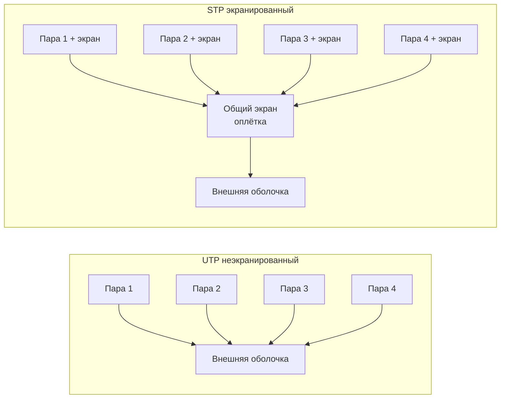
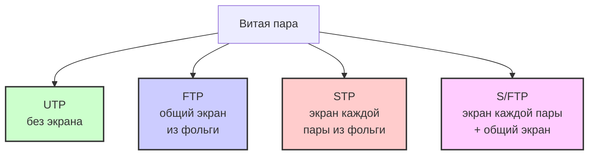

#физический_уровень #среда_передачи_данных #витая_пара #тип_витой_пары #категории_витой_пары
___
## Введение

**Витая пара** (twisted pair) - это вид кабеля, представляющий собой одну или несколько пар изолированных проводников, скрученных между собой с небольшим числом витков на единицу длины. Скручивание проводов выполняется для уменьшения взаимных наводок при передаче сигнала и защиты от внешних электромагнитных помех

Витая пара является **самым распространённым типом кабеля** для построения локальных сетей (LAN) благодаря своей дешевизне, лёгкости в установке и достаточной для большинства задач производительности. Она пришла на смену коаксиальному кабелю в 1990-х годах и стала основным стандартом для Ethernet

Кабель подключается к сетевым устройствам при помощи соединителя **RJ-45**, который немного больше телефонного разъёма RJ-11. Стандартная длина сегмента для витой пары ограничена **100 метрами** - на больших расстояниях сигнал из-за затухания становится нечитаемым

---

## Принцип работы: дифференциальная передача сигнала

Витая пара использует принцип **дифференциальной (балансной) передачи сигнала**:
- В двух проводах пары передаются **одни и те же уровни сигнала** (по отношению к земле), но **разной полярности** (противофаза)
- На приёмной стороне воспринимается **разность сигналов** (парафазный сигнал)
- Внешние помехи, наводимые на оба провода, появляются **в одной и той же фазе** (синфазные помехи) и при вычитании **самокомпенсируются**

Таким образом, скручивание проводов и дифференциальная передача обеспечивают высокую помехоустойчивость без использования дорогостоящих экранов

**Дополнительный механизм**: в кабелях категории 5 и выше жилы каждой пары свиваются с **разным шагом** (количеством витков на единицу длины). Это делается для уменьшения помех от витых пар друг на друга (перекрёстных наводок)

---

## Типы витой пары по экранированию

В зависимости от наличия защиты - электрически заземлённой медной сетки или алюминиевой фольги вокруг скрученных пар - различают несколько разновидностей

### 1. UTP (Unshielded Twisted Pair) - неэкранированная витая пара

- **Конструкция**: отсутствует защитный экран
- **Особенности**: самый распространённый и дешёвый тип кабеля для домашних и офисных сетей
- **Применение**: Ethernet-сети, телефонные линии
- **Преимущества**: низкая стоимость, простота монтажа, гибкость
- **Недостатки**: чувствительность к внешним электромагнитным помехам (EMI) и радиочастотным помехам (RFI)

### 2. STP (Shielded Twisted Pair) - экранированная витая пара

- **Конструкция**: каждая пара проводников имеет **индивидуальный экран из фольги** (U/FTP по стандарту ISO/IEC)
- **Особенности**: обеспечивает лучшую защиту от электромагнитных наводок как внешних, так и внутренних, а также улучшает защиту от перехвата информации
- **Применение**: среды с высоким уровнем помех, промышленные сети
- **Преимущества**: высокая помехозащищённость, стабильность сигнала
- **Недостатки**: более высокая стоимость, обязательное заземление экрана для эффективной работы

### 3. FTP (Foiled Twisted Pair) - фольгированная витая пара

- **Конструкция**: **общий экран из фольги** для всех пар (F/UTP)
- **Особенности**: занимает промежуточное положение между UTP и STP
- **Применение**: офисные сети с умеренным уровнем помех

### 4. S/FTP (Screened Foiled Twisted Pair) - комбинированное экранирование

- **Конструкция**: каждая пара имеет экран из фольги + общий внешний экран из проволочной оплётки (S/FTP)
- **Особенности**: максимальный уровень защиты от помех
- **Применение**: центры обработки данных (ЦОД), высокоскоростные сети 10 Гбит/с и выше

### Система маркировки экранирования (ISO/IEC 11801)

Стандарт ISO/IEC 11801 определяет формальную систему маркировки **XX/YZZ**, где:
- **XX** - общий экран кабеля (U - отсутствует, F - фольга, S - оплётка)
- **Y** - экран каждой пары (U - отсутствует, F - фольга)
- **ZZ** - тип скрутки проводов (TP - витая пара)

| Распространённое название | Маркировка по стандарту | Конструкция                                    |
| ------------------------- | ----------------------- | ---------------------------------------------- |
| UTP                       | U/UTP                   | Экранирование отсутствует                      |
| FTP, STP, ScTP            | F/UTP                   | Общий экран из фольги                          |
| STP, ScTP                 | S/UTP                   | Общий экран из оплётки                         |
| STP, ScTP                 | U/FTP                   | Каждая пара имеет экран из фольги              |
| S‑FTP, SFTP, STP          | SF/UTP                  | Общий экран: фольга + оплётка                  |
| SSTP, SFTP, STP           | S/FTP                   | Каждая пара из фольги + общий экран из оплётки |

---

## Категории витой пары

Кабели витой пары классифицируются по **категориям** (CAT), которые определяют их частотный диапазон и максимальную скорость передачи данных. Стандарты определены в документах **ANSI/TIA-568** и **ISO/IEC 11801**

### Основные категории

| Категория | Полоса частот    | Макс. скорость                           | Применение                                                |
| --------- | ---------------- | ---------------------------------------- | --------------------------------------------------------- |
| **CAT1**  | 100 кГц          | до 56 Кбит/с                             | Телефонные линии, голос                                   |
| **CAT2**  | 1 МГц            | до 4 Мбит/с                              | Устаревшие сети (LocalTalk)                               |
| **CAT3**  | 16 МГц           | до 10 Мбит/с                             | 10BASE‑T Ethernet                                         |
| **CAT4**  | 20 МГц           | до 16 Мбит/с                             | Token Ring (редко используется)                           |
| **CAT5**  | 100 МГц          | до 100 Мбит/с (2 пары)                   | 100BASE‑TX Ethernet                                       |
| **CAT5e** | 125 МГц          | до 1 Гбит/с (4 пары)                     | Гигабитный Ethernet (1000BASE‑T)                          |
| **CAT6**  | 250 МГц          | до 1 Гбит/с (100 м), до 10 Гбит/с (55 м) | Гигабитные сети, ЦОД                                      |
| **CAT6a** | 500 МГц          | до 10 Гбит/с (100 м)                     | 10‑гигабитный Ethernet                                    |
| **CAT7**  | 600 МГц          | до 10 Гбит/с                             | Экранированный кабель с индивидуальным экранированием пар |
| **CAT8**  | 2000 МГц (2 ГГц) | до 40 Гбит/с (30 м)                      | Дата-центры, высокоскоростные магистрали                  |

> **Важно**: CAT5e - наиболее распространённая категория для домашних и офисных сетей. CAT6 и CAT6a используются для высокоскоростных сетей. CAT7 и CAT8 - для профессиональных дата-центров

---

## Конструктивные особенности

### Количество пар

Стандартные Ethernet-кабели содержат **4 витые пары** (8 проводников). Каждая пара имеет свой цвет для идентификации

### Проводники

Проводники в витой паре могут быть выполнены из:
- **Меди** - наилучшее качество передачи, долговечность, но дороже
- **Алюминия** или **биметалла** (алюминий с медным покрытием) - дешевле, но имеют меньшую проводимость и не подходят для высокоскоростных сетей

### Разъём

Стандартным разъёмом для витой пары является **RJ-45** (8P8C). Существует две основные схемы обжима: **T568A** и **T568B** (последняя используется чаще)

---

## Преимущества и недостатки

### Преимущества

- **Низкая стоимость** - самый дешёвый тип кабеля для сетей
- **Простота монтажа** - легко прокладывать, обжимать и подключать
- **Гибкость** - удобно прокладывать в кабельных каналах и за подвесными потолками
- **Поддержка PoE** - может передавать питание вместе с данными (Power over Ethernet)
- **Широкий ассортимент категорий** - выбор под любые требования по скорости

### Недостатки

- **Ограниченная дальность** - максимум 100 м для высокоскоростной передачи
- **Чувствительность к помехам** - UTP уязвим для электромагнитных и радиочастотных помех
- **Перекрёстные наводки** - возможны помехи между соседними парами в одном кабеле (особенно на высоких частотах)
- **Ограниченная пропускная способность** - уступает оптоволокну на больших расстояниях

---

## Области применения

- **Локальные сети (LAN)** - подключение компьютеров, коммутаторов, маршрутизаторов
- **Телефонные линии** - CAT1, CAT3
- **Системы видеонаблюдения** - передача видеосигнала по IP
- **Промышленные сети** - STP и S/FTP в условиях сильных помех
- **Центры обработки данных** - CAT6a, CAT7, CAT8 для высокоскоростных соединений

---

## Схематическое представление

### Конструкция UTP и STP кабеля

### Иерархия типов экранирования

---

## Сравнение с другими средами

|Характеристика|Витая пара (UTP Cat5e)|Коаксиал|Оптоволокно|
|---|---|---|---|
|**Макс. скорость**|1 Гбит/с (до 10 Гбит/с на Cat6a)|до 10 Мбит/с (Ethernet)|100 Гбит/с и выше|
|**Макс. длина сегмента**|100 м|до 500 м|Десятки км|
|**Помехозащищённость**|Низкая/Средняя|Хорошая|Очень высокая|
|**Стоимость**|Низкая|Средняя|Высокая|
|**Сложность монтажа**|Простая|Средняя|Сложная|
|**Поддержка PoE**|Да|Ограниченно|Нет|

---

## Заключение

Витая пара - это **основной и наиболее распространённый тип кабеля** для построения локальных сетей. Благодаря сочетанию низкой стоимости, простоты монтажа и достаточной производительности, она вытеснила коаксиальный кабель и стала стандартом де-факто для Ethernet

**Ключевые моменты для запоминания:**
1. **Скручивание** проводов в паре и **дифференциальная передача** сигнала обеспечивают подавление помех
2. **UTP** - самый дешёвый и распространённый вариант для дома и офиса
3. **STP / FTP / S‑FTP** - экранированные версии для сред с высоким уровнем помех
4. **Категории (CAT)** определяют частотный диапазон и максимальную скорость: от CAT1 (телефон) до CAT8 (40 Гбит/с)
5. **Стандартная длина сегмента** - 100 метров; на больших расстояниях требуется повторитель
6. **Разъём RJ‑45** и схемы обжима T568A/T568B являются стандартом для подключения

Выбор конкретного типа и категории кабеля зависит от требуемой скорости, длины линии и уровня электромагнитных помех в месте прокладки