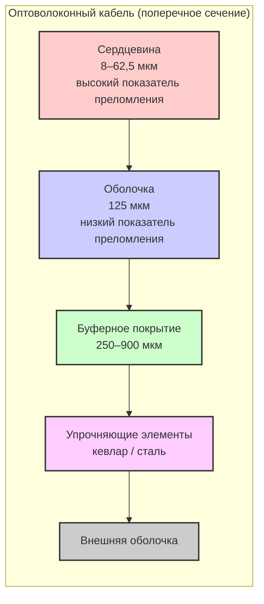
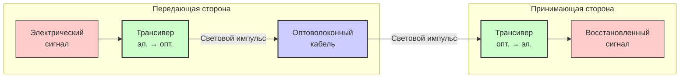

#введение #среда_передачи_данных #оптоволоконный_кабель #тип_оптоволоконного_кабеля #вспомогательное_оборудование_для_оптоволоконного_кабеля
___
## Введение

**Оптоволоконный кабель** (fiber-optic cable) - это кабель, в котором для передачи данных используются световые импульсы, а не электрические сигналы. В отличие от медных кабелей (витая пара, коаксиал), где информация передаётся с помощью движения электронов, в оптоволокне сигнал распространяется в виде фотонов - частиц света

Оптоволокно является **наиболее совершенной физической средой** для передачи информации. Оно обеспечивает беспрецедентную пропускную способность, минимальное затухание, полную невосприимчивость к электромагнитным помехам и высочайшую степень защиты от несанкционированного доступа. Именно оптоволокно является основой магистральных сетей Интернета, трансконтинентальных и подводных линий связи

---

## Принцип работы: полное внутреннее отражение

В основе работы оптоволокна лежит явление **полного внутреннего отражения** (total internal reflection). Оптическое волокно состоит из двух слоёв кварцевого стекла с разными показателями преломления:
- **Сердцевина (core)** - центральная часть волокна с **более высоким** показателем преломления
- **Оболочка (cladding)** - внешний слой с **более низким** показателем преломления

Когда световой луч попадает в сердцевину под определённым углом (больше критического угла), он полностью отражается от границы раздела сердцевины и оболочки и продолжает распространяться внутри сердцевины, не выходя за её пределы. Этот процесс повторяется на каждом участке волокна, позволяя свету "путешествовать" на огромные расстояния с минимальными потерями

---

## Конструкция оптоволоконного кабеля

Оптоволоконный кабель имеет многослойную конструкцию, каждый элемент которой выполняет свою функцию

### 1. Сердцевина (Core)

- **Материал**: Высокочистый кварц (диоксид кремния - SiO₂) с добавками, изменяющими показатель преломления
- **Диаметр**: Определяет тип волокна - 8–10 мкм для одномодового, 50 или 62,5 мкм для многомодового
- **Назначение**: Непосредственная среда распространения светового сигнала

### 2. Оболочка (Cladding)

- **Материал**: Кварц с более низким показателем преломления или полимер)
- **Диаметр**: Стандартно 125 мкм для большинства типов волокон
- **Назначение**: Обеспечивает условие полного внутреннего отражения, удерживая свет в сердцевине

### 3. Буферное покрытие (Buffer Coating)

- **Материал**: Акрилат или другой полимер
- **Диаметр**: 250 или 900 мкм
- **Назначение**: Защищает хрупкое стеклянное волокно от механических повреждений и микроизгибов

### 4. Упрочняющие элементы (Strength Members)

- **Материал**: Кевлар, стальные тросы или стеклопластиковые стержни
- **Назначение**: Обеспечивают механическую прочность кабеля, защищают от растяжения и раздавливания

### 5. Внешняя оболочка (Outer Jacket)

- **Материал**: ПВХ, полиэтилен, тефлон
- **Назначение**: Защита от внешних воздействий (влага, температура, химикаты, грызуны)

### Схема поперечного сечения

---

## Типы оптического волокна

Существует два основных типа оптического волокна, различающихся по диаметру сердцевины, количеству распространяемых мод и областям применения

### 1. Многомодовое волокно (Multimode Fiber, MMF)

- **Диаметр сердцевины**: 50 или 62,5 мкм
- **Диаметр оболочки**: 125 мкм
- **Количество мод**: Множество (десятки и сотни)
- **Источник света**: Светодиоды (LED) с длиной волны 850 нм или 1300 нм
- **Затухание**: Относительно высокое - 3–4 дБ/км
- **Дальность**: До 300–2000 м (в зависимости от скорости)
- **Стоимость**: Кабель дешевле, трансиверы значительно дешевле
- **Монтаж**: Проще, допуски при соединении больше
- **Применение**: Локальные сети (LAN), центры обработки данных на коротких расстояниях

**Почему "многомодовое"?** Из-за большого диаметра сердцевины световые лучи могут распространяться по множеству различных траекторий (мод). Одни лучи идут прямо по центру, другие - отражаются под разными углами. Это приводит к тому, что лучи приходят к получателю в разное время, вызывая **модовую дисперсию**, которая ограничивает максимальную скорость и дальность передачи

### 2. Одномодовое волокно (Single-Mode Fiber, SMF)

- **Диаметр сердцевины**: 8–10 мкм (обычно 9 мкм)
- **Диаметр оболочки**: 125 мкм
- **Количество мод**: Только одна (основная мода)
- **Источник света**: Лазерные диоды с длиной волны 1310 нм или 1550 нм
- **Затухание**: Очень низкое - 0,2–0,3 дБ/км на 1550 нм
- **Дальность**: Десятки и сотни километров без регенерации
- **Стоимость**: Кабель дороже, но трансиверы существенно дороже
- **Монтаж**: Сложнее, требуется высокая точность
- **Применение**: Магистральные сети, городские сети, трансконтинентальные линии

**Почему "одномодовое"?** Малый диаметр сердцевины позволяет распространяться только одной моде света, которая идёт строго по центру волокна. Это полностью устраняет модовую дисперсию, обеспечивая высочайшую пропускную способность на огромных расстояниях

### Сравнительная таблица

|Характеристика|Многомодовое (MMF)|Одномодовое (SMF)|
|---|---|---|
|**Диаметр сердцевины**|50 или 62,5 мкм|8–10 мкм (9 мкм)|
|**Диаметр оболочки**|125 мкм|125 мкм|
|**Количество мод**|Множество|Одна|
|**Источник света**|LED (850/1300 нм)|Лазер (1310/1550 нм)|
|**Затухание**|3–4 дБ/км|0,2–0,3 дБ/км|
|**Макс. дальность**|До 2 км|До 100+ км|
|**Стоимость кабеля**|Низкая|Средняя|
|**Стоимость трансиверов**|Низкая|Высокая|
|**Сложность монтажа**|Простая|Сложная|
|**Применение**|ЛВС, ЦОД|Магистрали, WAN|

---

## Затухание и дисперсия

Два ключевых параметра, ограничивающих производительность оптоволоконных линий, - это **затухание** и **дисперсия**

### Затухание (Attenuation)

**Затухание** - это уменьшение мощности оптического сигнала при распространении по волокну. Измеряется в децибелах на километр (дБ/км)

Причины затухания:
- **Поглощение света** материалом волокна (примеси, молекулы воды)
- **Рассеяние света** на неоднородностях структуры волокна (рэлеевское рассеяние)
- **Потери на соединениях** (сращивания, коннекторы)

Затухание сильно зависит от длины волны света. Для кварцевого волокна существуют три **окна прозрачности** - диапазоны длин волн с минимальным затуханием:

|Длина волны|Затухание (типичное)|Применение|
|---|---|---|
|**850 нм**|3–4 дБ/км|Многомодовые сети (короткие дистанции)|
|**1310 нм**|0,4–0,5 дБ/км|Одномодовые сети (средние дистанции)|
|**1550 нм**|0,2–0,3 дБ/км|Одномодовые магистрали (дальние дистанции)|

Современные одномодовые волокна на длине волны 1550 нм имеют затухание **0,2–0,3 дБ/км**, что позволяет строить линии связи длиной **до 100 км и более** без регенераторов

### Дисперсия (Dispersion)

**Дисперсия** - это уширение световых импульсов при распространении по волокну. Если импульсы расширяются настолько, что начинают перекрывать друг друга, приёмник не может корректно восстановить переданные данные

Существует два основных типа дисперсии:
1. **Модовая дисперсия (Modal Dispersion)**: Возникает в многомодовом волокне из-за того, что разные моды (лучи) проходят разные пути и приходят к получателю в разное время. Именно модовая дисперсия ограничивает дальность и скорость многомодовых систем
2. **Хроматическая дисперсия (Chromatic Dispersion)**: Возникает из-за того, что свет с разными длинами волн (даже в пределах одного импульса) распространяется с разной скоростью. Это проявляется как в одномодовых, так и в многомодовых волокнах, но особенно критично для одномодовых на высоких скоростях и больших расстояниях

---

## Коннекторы и трансиверы

### Оптоволоконные коннекторы

Для соединения оптоволоконных кабелей с оборудованием используются специальные коннекторы. Они должны обеспечивать прецизионное (с микронной точностью) совмещение сердцевин волокон

Наиболее распространённые типы коннекторов:

| Тип                           | Описание                                  | Особенности                                                              |
| ----------------------------- | ----------------------------------------- | ------------------------------------------------------------------------ |
| **SC (Subscriber Connector)** | Прямоугольный, с фиксацией "push-pull"    | Наиболее распространённый, используется с X2-оптикой                     |
| **LC (Lucent Connector)**     | Уменьшенная версия SC (малый форм-фактор) | Высокая плотность, используется с SFP-модулями                           |
| **ST (Straight Tip)**         | Круглый, с байонетным замком              | Второй по популярности, используется в военной и аэрокосмической технике |
| **FC (Ferrule Connector)**    | Круглый, с резьбовым замком               | Надёжное, но менее удобное соединение                                    |
| **MTP/MPO**                   | Многоволоконный коннектор                 | До 12–32 волокон в одном разъёме, для высокой плотности                  |

> **Примечание**: В современном сетевом оборудовании коннекторы FC и ST считаются устаревшими. Наиболее часто используются **SC** (для X2-оптики) и **LC** (для SFP-трансиверов)

### Трансиверы (Transceivers)

**Трансивер** - это устройство, которое преобразует электрические сигналы в оптические (при передаче) и обратно (при приёме)

Основные типы трансиверов для оптоволокна:
- **SFP (Small Form-factor Pluggable)**: 1 Гбит/с, компактный, с LC-коннектором
- **SFP+**: 10 Гбит/с, совместим с SFP
- **X2 / XENPAK**: 10 Гбит/с, более крупные, с SC-коннектором
- **QSFP / QSFP+**: 40–100 Гбит/с, с MPO-коннекторами для высокой плотности

Трансиверы для многомодового волокна (850 нм, LED) значительно дешевле, чем для одномодового (1310/1550 нм, лазер)

---

## Преимущества оптоволокна

1. **Огромная пропускная способность**: Несущая частота ~10¹⁴ Гц, теоретический предел - терабиты в секунду
2. **Малое затухание**: 0,2–0,3 дБ/км на 1550 нм - линии до 100 км без регенерации
3. **Полная помехозащищённость**: Невосприимчив к электромагнитным и радиочастотным помехам
4. **Защита от перехвата**: Сигнал не излучается наружу; прослушивание требует физического доступа к волокну
5. **Гальваническая развязка**: Нет электрического контакта между узлами - защита от заземления и перенапряжений
6. **Малый вес и размер**: Значительно легче и тоньше медных кабелей
7. **Долговечность**: Срок службы > 25 лет
8. **Возможность наращивания пропускной способности**: Можно менять только оконечное оборудование (трансиверы), не заменяя кабель

---

## Недостатки оптоволокна

1. **Высокая стоимость**: Кабель дороже медного, трансиверы дороже
2. **Сложность монтажа**: Требуется прецизионное оборудование для сращивания (сварка) и оконцевания
3. **Хрупкость**: Стеклянное волокно чувствительно к механическим нагрузкам (изгибы, растяжение)
4. **Сложность ремонта**: Восстановление повреждённого кабеля требует специального оборудования и высокой квалификации
5. **Требовательность к чистоте**: Даже микроскопические частицы пыли на коннекторах вызывают значительные потери сигнала

---

## Области применения

- **Магистральные сети провайдеров** (трансконтинентальные и подводные кабели)
- **Городские сети (MAN)** и региональные сети
- **Центры обработки данных (ЦОД)** - для соединения серверов и коммутаторов
- **Структурированные кабельные системы предприятий**
- **Технологии FTTx** (FTTH, FTTB) - оптоволокно до квартиры или офиса
- **Системы видеонаблюдения** на большие расстояния
- **Подводные линии связи** (трансатлантические, транстихоокеанские кабели)

---

## Схема передачи данных по оптоволокну

---

## Заключение

Оптоволоконный кабель - это **наиболее совершенная среда передачи данных**, доступная современным технологиям. Он обеспечивает:
- **Наивысшую пропускную способность** среди всех физических сред
- **Минимальное затухание**, позволяющее передавать сигналы на сотни километров без регенерации
- **Полную невосприимчивость** к электромагнитным помехам
- **Высочайшую защиту** от несанкционированного доступа

Выбор между многомодовым и одномодовым волокном определяется требованиями к дальности и скорости:
- **Многомодовое** - для локальных сетей и ЦОД на коротких расстояниях (дешевле в развёртывании)
- **Одномодовое** - для магистралей, городских и региональных сетей, где требуются огромные расстояния и скорости

Несмотря на высокую стоимость и сложность монтажа, оптоволокно является **единственным выбором** для построения современных высокоскоростных и надёжных сетей связи. Именно на нём держится вся глобальная инфраструктура Интернета