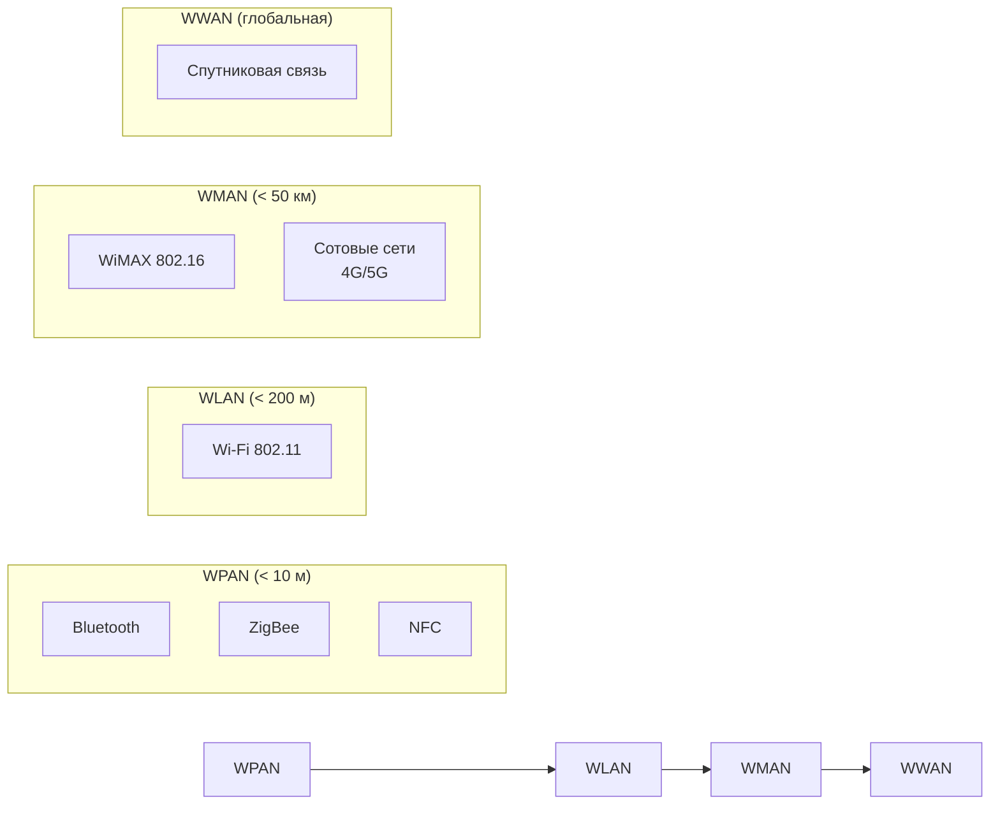

#физический_уровень #среда_передачи_данных #беспроводная_среда #диапазоны_беспроводной_передачи #физические_принципы_распространения #множественный_доступ #беспроводные_стандарты
___
## Введение

**Беспроводная среда передачи** (wireless transmission medium) - это среда, в которой сигнал распространяется в свободном пространстве (воздух, вакуум) в виде электромагнитных волн без использования направляющих физических проводников. Передатчик излучает электромагнитную энергию, а приёмник улавливает её и преобразует обратно в электрические сигналы

Беспроводные технологии обеспечивают **мобильность**, **быстрое развёртывание** и **гибкость**, которые недоступны проводным сетям. Они являются неотъемлемой частью современных коммуникаций: от домашних сетей Wi-Fi до глобальных сотовых систем 4G/5G и спутниковой связи

Однако беспроводная среда имеет физические ограничения: меньшая пропускная способность, большая задержка, подверженность помехам, ограниченная дальность и проблемы безопасности из-за открытости сигнала

---

## Электромагнитный спектр и беспроводная связь

Для беспроводной передачи используются различные диапазоны электромагнитных волн, различающиеся по частоте, длине волны, свойствам распространения и доступности для коммерческого использования

### Диапазоны, используемые для связи

|Диапазон|Частоты|Длина волны|Применение|
|---|---|---|---|
|**Радиоволны (Radio)**|3 Гц – 300 ГГц|100 000 км – 1 мм|Широковещание, сотовая связь, Wi-Fi, Bluetooth, спутниковая связь|
|**Микроволны (Microwave)**|300 МГц – 300 ГГц|1 м – 1 мм|Наземные и спутниковые линии связи, радиолокация|
|**Инфракрасное излучение (IR)**|300 ГГц – 400 ТГц|1 мм – 750 нм|Управление бытовой техникой (пульты ДУ), короткие линии связи|
|**Видимый свет (Visible)**|400–790 ТГц|750–380 нм|Оптические беспроводные системы (Li-Fi)|

На практике для компьютерных сетей используются в основном **радиоволны** (от нескольких МГц до десятков ГГц) и **инфракрасное излучение** (для коротких дистанций)

### Лицензируемые и нелицензируемые диапазоны

- **Лицензируемые диапазоны** - используются операторами сотовой связи, телевидением, военными; требуют получения разрешения (лицензии) от регулятора (в России - ГКРЧ). Обеспечивают защиту от помех, но доступ ограничен
- **Нелицензируемые (ISM - Industrial, Scientific and Medical) диапазоны** - доступны для всех без лицензии, но при этом не гарантируется защита от помех. Основные нелицензируемые диапазоны:
    - **2,4 ГГц** (2400–2483,5 МГц) - используется Wi-Fi (802.11b/g/n/ax), Bluetooth, ZigBee, микроволновые печи
    - **5 ГГц** (5150–5850 МГц) - Wi-Fi (802.11a/h/j/n/ac/ax)
    - **6 ГГц** (5925–7125 МГц) - недавно выделен для Wi-Fi 6E
    - **60 ГГц** (57–64 ГГц) - для сверхвысокоскоростных коротких линий (WiGig, 802.11ad)

---

## Физические принципы распространения радиоволн

Радиоволны распространяются в пространстве, взаимодействуя с препятствиями. Основные механизмы распространения:

### 1. Прямая волна (Line-of-Sight, LOS)

- Прямолинейное распространение между передатчиком и приёмником без препятствий
- Требуется для высоких частот (выше 10 ГГц), где дифракция мала
- Используется в спутниковой и микроволновой связи

### 2. Отражение (Reflection)

- Волна отражается от поверхностей, размер которых значительно больше длины волны (здания, земля, вода)
- Приводит к многолучевому распространению

### 3. Дифракция (Diffraction)

- Огибание волной препятствий (кромки зданий, холмы)
- Позволяет принимать сигнал за пределами прямой видимости на низких частотах

### 4. Рассеяние (Scattering)

- Отражение от неровных поверхностей, мелких объектов (листья, столбы)
- Приводит к переотражению сигнала во многих направлениях

### Многолучевое распространение (Multipath)

Из-за отражений, дифракции и рассеяния в приёмник приходит множество копий сигнала, прошедших разное расстояние и имеющих разные фазы. Это вызывает:
- **Интерференционные замирания** (fading) - сигнал может ослабляться или усиливаться в зависимости от фазового сложения волн
- **Межсимвольную интерференцию** (ISI) - задержанные копии сигнала накладываются на последующие символы, искажая их

Для борьбы с многолучевостью используются методы **OFDM** (Orthogonal Frequency-Division Multiplexing) и **MIMO** (Multiple-Input Multiple-Output), применяемые в стандартах Wi-Fi и 4G/5G

### Затухание в свободном пространстве (Free-Space Path Loss)

Основное физическое ограничение для беспроводной связи - затухание сигнала с расстоянием. Для изотропного излучателя мощность принимаемого сигнала убывает пропорционально квадрату расстояния:

```text
L = (4πd / λ)²
```

где d - расстояние, λ - длина волны. Чем выше частота (меньше λ), тем сильнее затухание. Поэтому высокочастотные системы (например, 60 ГГц) работают только на коротких расстояниях

---

## Методы множественного доступа

В беспроводных сетях множество устройств должны совместно использовать общий эфир. Для этого применяются различные методы мультиплексирования и множественного доступа:

| Метод                                                                | Принцип                                                                                                        | Примеры                                      |
| -------------------------------------------------------------------- | -------------------------------------------------------------------------------------------------------------- | -------------------------------------------- |
| **FDMA** (Frequency Division Multiple Access)                        | Разделение по частоте - каждому устройству выделяется свой поддиапазон                                         | Аналоговые сотовые сети, спутниковые системы |
| **TDMA** (Time Division Multiple Access)                             | Разделение по времени - каждое устройство передаёт в своём временном слоте                                     | GSM, некоторые спутниковые системы           |
| **CDMA** (Code Division Multiple Access)                             | Разделение по коду - все устройства передают одновременно на одной частоте, различаясь псевдослучайными кодами | 3G (WCDMA), спутниковая связь                |
| **OFDMA** (Orthogonal FDMA)                                          | Комбинация FDMA и TDMA с ортогональными поднесущими                                                            | Wi-Fi (802.11ax), 4G LTE, 5G                 |
| **CSMA/CA** (Carrier Sense Multiple Access with Collision Avoidance) | Конкурентный доступ с прослушиванием несущей и избеганием коллизий                                             | Wi-Fi (802.11) на канальном уровне           |

> **CSMA/CA** не является методом физического уровня, но тесно связан с физической средой, так как управляет доступом к общему эфиру. Он будет подробно рассмотрен на канальном уровне

---

## Классификация беспроводных сетей по дальности

Беспроводные технологии охватывают широкий спектр радиусов действия - от нескольких сантиметров до тысяч километров

|Тип|Дальность|Примеры|Стандарты|
|---|---|---|---|
|**WPAN** (Wireless Personal Area Network)|До 10 м|Bluetooth, ZigBee, NFC, IrDA|IEEE 802.15|
|**WLAN** (Wireless Local Area Network)|До 100–200 м|Wi-Fi (802.11)|IEEE 802.11|
|**WMAN** (Wireless Metropolitan Area Network)|До 50 км|WiMAX, сотовые сети|IEEE 802.16, 3G/4G/5G|
|**WWAN** (Wireless Wide Area Network)|Глобальная|Сотовые сети (4G/5G), спутниковая связь|3GPP, спутниковые стандарты|

---

## Основные беспроводные стандарты

### 1. IEEE 802.11 (Wi-Fi)

Семейство стандартов для беспроводных локальных сетей (WLAN). Основные версии:

|Стандарт|Год|Частота|Макс. скорость|Примечание|
|---|---|---|---|---|
|802.11a|1999|5 ГГц|54 Мбит/с|Первая версия на 5 ГГц|
|802.11b|1999|2,4 ГГц|11 Мбит/с|Широко распространена|
|802.11g|2003|2,4 ГГц|54 Мбит/с|Совместима с b|
|802.11n (Wi-Fi 4)|2009|2,4/5 ГГц|до 600 Мбит/с|Внедрены MIMO и OFDM|
|802.11ac (Wi-Fi 5)|2013|5 ГГц|до 6,9 Гбит/с|MU-MIMO, шире каналы|
|802.11ax (Wi-Fi 6/6E)|2019|2,4/5/6 ГГц|до 9,6 Гбит/с|Улучшена работа в плотных сетях, OFDMA|
|802.11ad (WiGig)|2012|60 ГГц|до 7 Гбит/с|Сверхвысокая скорость, очень малая дальность|

Wi-Fi использует метод множественного доступа **CSMA/CA** и физическую модуляцию **OFDM** (начиная с 802.11a), что обеспечивает устойчивость к многолучевости

### 2. IEEE 802.15 (Bluetooth, ZigBee)

- **Bluetooth (802.15.1)**: Работает в диапазоне 2,4 ГГц, использует метод FHSS (Frequency-Hopping Spread Spectrum) для устойчивости к помехам. Дальность до 10–100 м. Версии от 1.0 до 5.2; в последних повышена скорость и дальность (до 400 м при малой скорости)
- **ZigBee (802.15.4)**: Низкоскоростная (до 250 кбит/с), низкопотребляющая сеть для сенсоров и IoT. Работает на 2,4 ГГц (а также 868/915 МГц). Использует CSMA/CA

### 3. IEEE 802.16 (WiMAX)

- Стандарт для беспроводных сетей городского масштаба (WMAN)
- Обеспечивает скорости до 1 Гбит/с на дальности до 50 км (при прямой видимости)
- Использует OFDM. Сейчас в значительной степени вытеснен сотовыми сетями 4G/5G

### 4. Сотовые сети (3GPP)

- **GSM (2G)**: TDMA, 900/1800 МГц, скорости до 384 кбит/с (EDGE)
- **UMTS (3G)**: WCDMA, скорости до 42 Мбит/с (HSPA+)
- **LTE (4G)**: OFDMA, MIMO, скорости до 1 Гбит/с (LTE-A)
- **5G (NR)**: OFDMA, работа на частотах до 100 ГГц (включая миллиметровые волны), скорости до 20 Гбит/с

Сотовые сети не являются частью модели локальных сетей, но составляют основу глобальной беспроводной связи

### 5. Инфракрасная связь (IrDA)

- Использует инфракрасное излучение (ближний ИК-диапазон) для коротких (до 1 м) соединений с высокой скоростью (до 16 Мбит/с)
- Требует прямой видимости, не проникает через стены
- Раньше использовалась для связи между ноутбуками, КПК, телефонами. Сейчас почти вытеснена Bluetooth и Wi-Fi

### 6. Li-Fi (Light Fidelity)

- Беспроводная технология на основе видимого света (LED-лампы)
- Обеспечивает очень высокие скорости (до 224 Гбит/с в лаборатории), но требует прямой видимости и не работает при выключенном свете
- Рассматривается как дополнение к Wi-Fi в местах с высокой плотностью пользователей

---

## Преимущества и недостатки беспроводной среды

### Преимущества

- **Мобильность**: устройства могут свободно перемещаться в зоне покрытия
- **Быстрое развёртывание**: не требуется прокладка кабелей, установка занимает минуты
- **Гибкость**: легко добавлять новые устройства, изменять конфигурацию
- **Доступность в труднодоступных местах**: туда, где прокладка кабеля невозможна или запрещена
- **Масштабируемость**: можно покрывать большие территории с помощью множества точек доступа

### Недостатки

- **Меньшая пропускная способность** по сравнению с проводными средами (особенно с оптоволокном)
- **Зависимость от внешних помех**: электромагнитные наводки, погодные условия (дождь, туман), многолучевое затухание
- **Ограниченная дальность** - требует множества базовых станций для больших территорий
- **Проблемы безопасности**: сигнал доступен для перехвата и подслушивания; требуются шифрование и аутентификация (WPA2/WPA3)
- **Нестабильность**: колебания уровня сигнала, замирания
- **Лицензирование**: для некоторых диапазонов требуется получение разрешений, что усложняет развёртывание

---

## Сравнение с проводными средами

|Характеристика|Беспроводная среда|Витая пара (UTP)|Оптоволокно|
|---|---|---|---|
|**Скорость**|До 10 Гбит/с (Wi-Fi 6)|до 10 Гбит/с (Cat6a)|до 100 Гбит/с и выше|
|**Дальность**|десятки–сотни метров (до км с ретрансляторами)|100 м|десятки км|
|**Помехоустойчивость**|Низкая–Средняя|Средняя|Очень высокая|
|**Мобильность**|Высокая|Отсутствует|Отсутствует|
|**Стоимость развёртывания**|Низкая (без кабелей)|Низкая (кабель недорогой)|Высокая|
|**Безопасность**|Низкая (перехват)|Средняя (физический доступ)|Высокая (сложно перехватить)|
|**Задержка**|Переменная (джиттер)|Низкая, стабильная|Низкая, стабильная|

---

## Схематическое представление

### Классификация беспроводных технологий по дальности



### Принцип многолучевого распространения


---

## Заключение

Беспроводная среда передачи - это важнейшая составляющая современных телекоммуникаций, обеспечивающая мобильность и гибкость, недостижимые для проводных систем. Она основана на распространении электромагнитных волн в свободном пространстве и использует различные диапазоны частот (радио, микроволны, инфракрасный, видимый свет)

Ключевые особенности беспроводной среды:
- **Ограниченная пропускная способность** и **зависимость от помех** требуют применения сложных методов модуляции (OFDM) и множественного доступа (CSMA/CA, OFDMA)
- **Многолучевое распространение** - источник замираний, с которыми борются с помощью MIMO и адаптивных антенн
- **Безопасность** - критическая проблема, решаемая с помощью шифрования и аутентификации на канальном и прикладном уровнях

Выбор между проводной и беспроводной средой определяется требованиями к скорости, надёжности, мобильности и стоимости. Для стационарных высоконагруженных магистралей предпочтительно оптоволокно; для мобильных пользователей и быстрого развёртывания - беспроводные технологии. В большинстве современных сетей они дополняют друг друга: оптоволокно на магистралях, а Wi-Fi и сотовые сети на последней миле