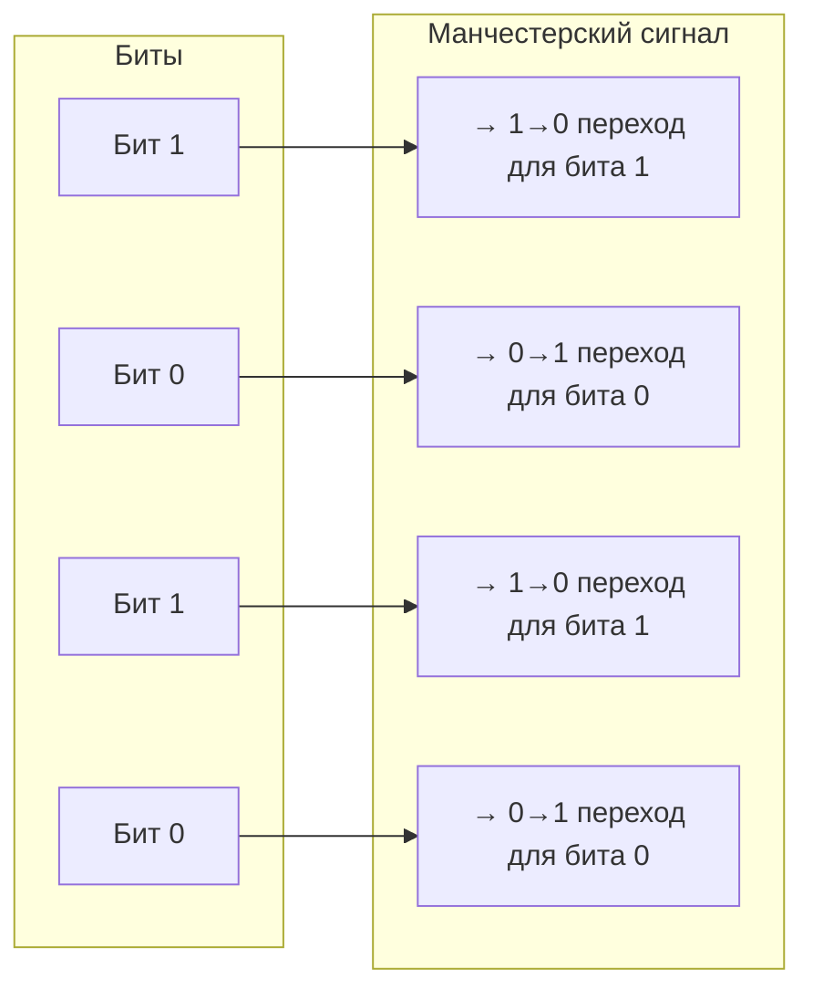
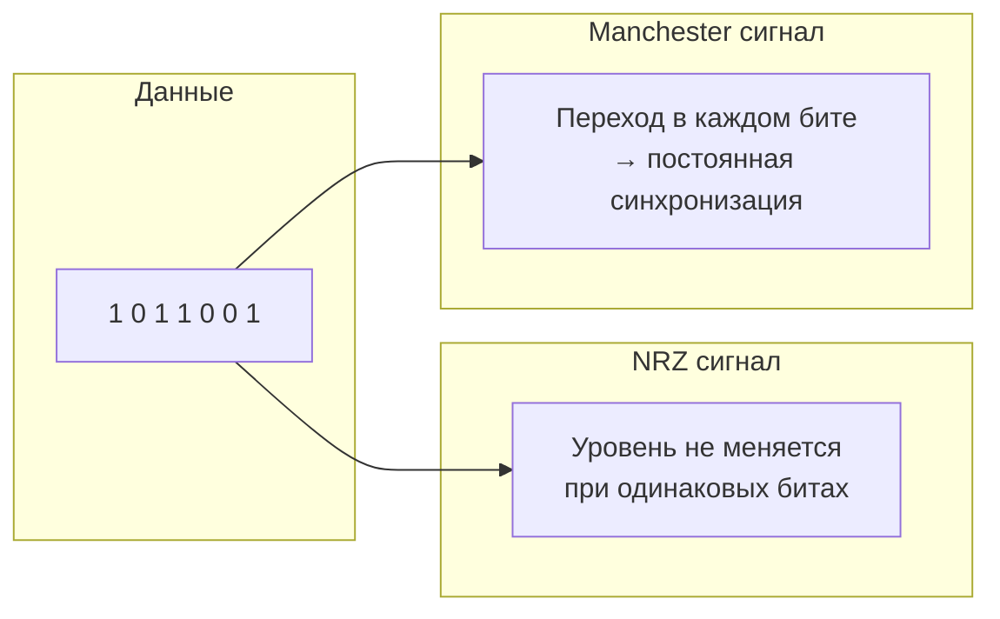
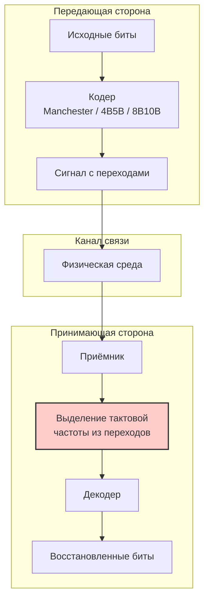

#физический_уровень #представление_данных #манчестерское_кодирование #дифференциальное_манчестерское_кодирование #4в_5в_кодирование #8в_10в_кодирование #64в_66в_кодирование #скремблирование #джиттер #дрейф_частоты #baseline_wander
___
## Введение

Передача цифровых данных по физической среде - это не просто отправка последовательности битов. Для того чтобы приёмник мог корректно интерпретировать сигнал, он должен точно знать моменты времени, когда начинается и заканчивается каждый бит. Эта задача решается с помощью **синхронизации** - согласования тактовых частот передатчика и приёмника

Проблема синхронизации является одной из ключевых на физическом уровне. Без неё даже самый мощный сигнал будет бесполезен - приёмник не сможет отличить один бит от другого, и данные будут потеряны

В этой заметке мы подробно рассмотрим, почему синхронизация необходима, какие проблемы возникают при её отсутствии и как специальные **самосинхронизирующиеся коды** решают эти проблемы, позволяя приёмнику извлекать тактовую частоту непосредственно из принимаемого сигнала

---

## Что такое синхронизация?

**Синхронизация** - это процесс согласования тактовых частот передатчика и приёмника таким образом, чтобы приёмник мог точно определить границы каждого бита в потоке данных

Синхронизация решает две основные задачи:
1. **Битовая синхронизация (Bit Synchronization)**: Определение момента, когда начинается и заканчивается каждый бит
2. **Кадровая синхронизация (Frame Synchronization)**: Определение границ между группами битов (кадрами, пакетами)

На физическом уровне основное внимание уделяется **битовой синхронизации**. Кадровая синхронизация обычно решается на канальном уровне с помощью специальных маркеров (преамбул, стартовых флагов)

---

## Почему синхронизация необходима?

### Передатчик и приёмник имеют независимые тактовые генераторы

Передатчик и приёмник - это два независимых устройства, каждое со своим тактовым генератором. Даже если оба генератора имеют одинаковую номинальную частоту (например, 100 МГц), из-за температурных колебаний, старения компонентов и производственных допусков их частоты никогда не будут совпадать в точности

Разница в частотах (обычно до 100 ppm - частей на миллион) приводит к **дрейфу фазы** (phase drift): со временем моменты переключения сигнала на передатчике и моменты стробирования на приёмнике будут расходиться

Если приёмник не имеет возможности подстраивать свою тактовую частоту под частоту передатчика, то через некоторое время он начнёт считывать биты в неправильные моменты, что приведёт к битовым ошибкам

### Длинные последовательности одинаковых битов

Простейшие схемы кодирования (например, NRZ - Non-Return-to-Zero) не меняют уровень сигнала при передаче одинаковых битов. Если передаётся длинная последовательность нулей (00000000) или единиц (11111111), сигнал остаётся постоянным в течение длительного времени

В такой ситуации приёмник не имеет **никакой информации о тактовой частоте** передатчика. Он видит только постоянный уровень напряжения и не может определить, сколько битов уже прошло. Это приводит к **потере синхронизации** (loss of synchronization)

---

## Проблема самосинхронизации

### Определение

**Самосинхронизация** (self-synchronization) - это свойство кода, позволяющее приёмнику восстанавливать тактовую частоту непосредственно из принимаемого сигнала без использования отдельного тактового канала

Код обладает свойством самосинхронизации, если в нём **гарантируется достаточное количество переходов сигнала** (переключений уровня) на единицу времени, чтобы приёмник мог определить тактовую частоту и подстроить свой генератор

**Примечание**: В некоторых источниках (например, в русскоязычной литературе) самосинхронизацию называют **«самотактовым кодированием»** или **«кодами с самосинхронизацией»**

### Почему самосинхронизация важна?

Если код не обладает самосинхронизацией, необходимо использовать **отдельный тактовый канал** для передачи тактовой частоты. Это требует дополнительной линии связи (что удорожает кабель) и усложняет систему

В реальных сетях (Ethernet, USB, PCI Express) всегда используются самосинхронизирующиеся коды, чтобы избежать необходимости в отдельном тактовом сигнале

---

## Методы достижения самосинхронизации

Существует несколько подходов к обеспечению самосинхронизации

### 1. Частая смена уровня сигнала

Самый простой способ - сделать так, чтобы уровень сигнала менялся **в каждом бите** или достаточно часто. Это гарантирует, что приёмник всегда будет получать информацию о тактовой частоте

#### Манчестерское кодирование (Manchester Coding)

- **Принцип**: Каждый бит кодируется **двумя** уровнями сигнала. Переход в середине бита определяет его значение:
    - Логическая 1 → переход от низкого уровня к высокому (0→1)
    - Логический 0 → переход от высокого уровня к низкому (1→0)
- **Самосинхронизация**: Переход в середине каждого бита гарантирует **постоянное наличие тактовой информации**. Приёмник может синхронизироваться по этим переходам
- **Эффективность**: **50%** (для передачи одного бита требуется два состояния сигнала, т.е. требуется вдвое большая полоса пропускания по сравнению с NRZ)
- **Применение**: 10Base-T (ранний Ethernet), некоторые системы синхронной передачи

#### Дифференциальное манчестерское кодирование (Differential Manchester)

- **Принцип**: Значение бита определяется наличием или отсутствием перехода **в начале** бита; переход в середине бита присутствует всегда для синхронизации
    - Логическая 1 → нет перехода в начале бита
    - Логический 0 → есть переход в начале бита
- **Самосинхронизация**: Как и в манчестерском кодировании, переход в середине каждого бита обеспечивает синхронизацию
- **Эффективность**: **50%**
- **Применение**: Token Ring, некоторые промышленные сети

### 2. Ограничение длины последовательности одинаковых битов

Если невозможно или нежелательно гарантировать переход в каждом бите, можно ограничить максимальную длину последовательности одинаковых битов. Это делается с помощью **блочного кодирования**

#### 4B/5B кодирование

- **Принцип**: 4 бита данных заменяются на 5 бит кода. Из 32 возможных 5-битовых кодовых слов выбираются только те, в которых:
    - **Не более трёх нулей подряд** (ограничение длины последовательности нулей)
    - Количество нулей и единиц примерно сбалансировано
- **Самосинхронизация**: Обеспечивается за счёт гарантированного максимального числа нулей подряд (3), что создаёт достаточно переходов для поддержания синхронизации
- **Эффективность**: **80%** (4/5 = 80%)
- **Применение**: 100Base-FX (Fast Ethernet по оптоволокну), FDDI

#### 8B/10B кодирование

- **Принцип**: 8 бит данных заменяются на 10 бит кода. Из 1024 возможных 10-битовых слов выбираются только те, в которых:
    - Количество нулей и единиц отличается не более чем на 2 (баланс постоянной составляющей)
    - Максимальная длина последовательности одинаковых битов ограничена (обычно 5)
- **Самосинхронизация**: Обеспечивается частыми переходами благодаря балансу нулей и единиц
- **Эффективность**: **80%**
- **Применение**: Gigabit Ethernet, Fibre Channel, SATA, PCI Express

#### 64B/66B кодирование

- **Принцип**: 64 бита данных → 66 бит кода. Используется в высокоскоростных последовательных интерфейсах
- **Самосинхронизация**: Гарантирует достаточную плотность переходов за счёт специальных синхронизирующих слов
- **Эффективность**: **~97%** (64/66)
- **Применение**: 10 Gigabit Ethernet, InfiniBand

### 3. Скремблирование (Scrambling)

**Скремблирование** - это процесс псевдослучайного перемешивания битов данных перед передачей с целью предотвращения длинных последовательностей одинаковых битов. На приёмной стороне выполняется обратный процесс - **дескремблирование**:
- **Принцип**: Данные XOR-ятся с псевдослучайной последовательностью (PRBS — Pseudo-Random Binary Sequence). Это гарантирует, что даже если исходные данные содержат длинную последовательность нулей, на выходе скремблера получится сбалансированная последовательность с частыми переходами
- **Самосинхронизация**: Обеспечивается за счёт псевдослучайного характера сигнала
- **Эффективность**: **100%** (накладных расходов нет)
- **Применение**: 1000Base-T, 10GBase-T, SATA, PCIe (часто используется вместе с блочным кодированием)

---

## Сравнение подходов

|Метод|Самосинхронизация|Эффективность|Сложность|Примеры|
|---|---|---|---|---|
|**Manchester**|Полная (переход в каждом бите)|50%|Низкая|10Base-T|
|**Differential Manchester**|Полная (переход в каждом бите)|50%|Средняя|Token Ring|
|**4B/5B + NRZI**|Частичная (ограничение нулей)|80%|Средняя|100Base-FX|
|**8B/10B**|Частичная (баланс нулей/единиц)|80%|Высокая|Gigabit Ethernet, SATA|
|**64B/66B**|Частичная (синхрослова)|~97%|Высокая|10 Gigabit Ethernet|
|**Скремблирование**|Частичная (псевдослучайная последовательность)|100%|Средняя|1000Base-T, SATA|

---

## Проблемы, связанные с синхронизацией

### 1. Джиттер (Jitter)

**Джиттер** - это отклонение моментов переключения сигнала от их идеального положения во времени. Джиттер может быть вызван:
- Шумами в канале
- Неточностью тактовых генераторов
- Влиянием помех

Если джиттер превышает допустимый уровень, приёмник может неправильно определить границы битов, что приведёт к ошибкам

### 2. Дрейф частоты (Frequency Drift)

Разница в тактовых частотах передатчика и приёмника приводит к **дрейфу фазы** (phase drift). Без регулярных переходов сигнала (например, в длинной последовательности нулей) приёмник теряет возможность подстраивать свою частоту, и ошибки накапливаются

### 3. Baseline Wander

**Baseline Wander** - это смещение уровня сигнала (базовой линии) из-за постоянной составляющей в сигнале. Если сигнал имеет DC-составляющую, приёмник может "дрейфовать" относительно правильного порога принятия решения

Самосинхронизирующиеся коды обычно сбалансированы (нет DC-составляющей), что решает эту проблему

---

## Схемы для визуализации

### Манчестерское кодирование: каждый бит содержит переход

### Сравнение NRZ и Manchester

### Обобщённая схема синхронизации

---

## Заключение

Синхронизация - это один из ключевых механизмов физического уровня, без которого невозможна корректная передача данных

**Ключевые выводы:**
1. **Приёмнику необходимо знать границы битов**, чтобы правильно их интерпретировать. Это требует синхронизации тактовых частот передатчика и приёмника
2. **Проблема самосинхронизации** возникает, когда сигнал не содержит достаточного количества переходов (переключений уровня) для восстановления тактовой частоты
3. **Самосинхронизирующиеся коды** решают эту проблему, гарантируя определённую плотность переходов в сигнале:
    - **Манчестерское кодирование** - переход в каждом бите (эффективность 50%)
    - **4B/5B, 8B/10B, 64B/66B** - ограничение длины последовательности одинаковых битов и балансировка (эффективность 80–97%)
    - **Скремблирование** - псевдослучайное перемешивание данных (эффективность 100%)
4. **Компромисс эффективности и сложности**: Самосинхронизация всегда требует затрат полосы пропускания (эффективность < 100%) или усложнения логики (кодирование, скремблирование)
5. **Выбор схемы** зависит от требуемой скорости, характеристик канала и стоимости оборудования. В современных высокоскоростных интерфейсах обычно используются комбинации блочного кодирования и скремблирования (например, 64B/66B в 10 Gigabit Ethernet)

Понимание принципов синхронизации и самосинхронизирующихся кодов критически важно для осознания того, как Ethernet и другие сетевые технологии достигают высокой скорости и надёжности передачи