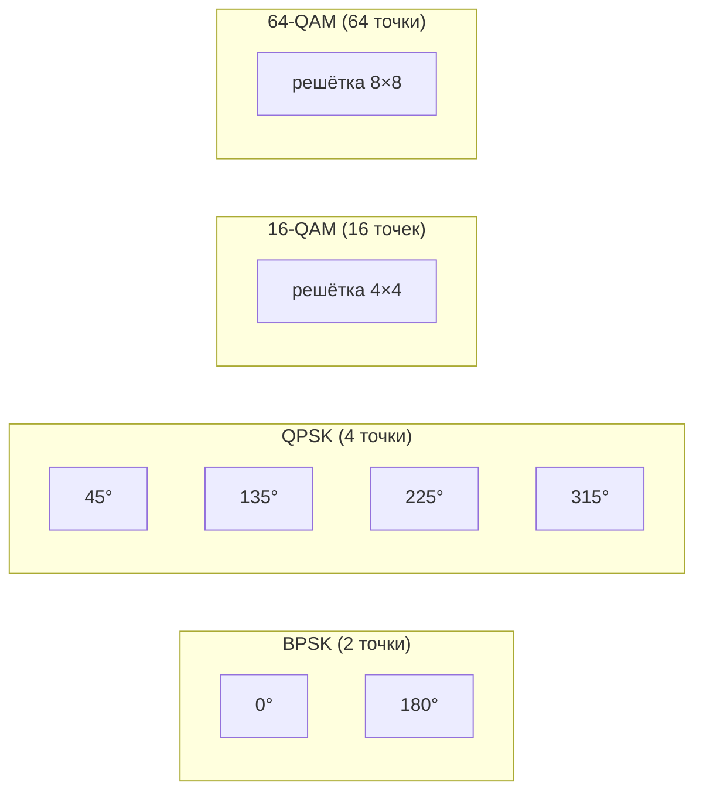
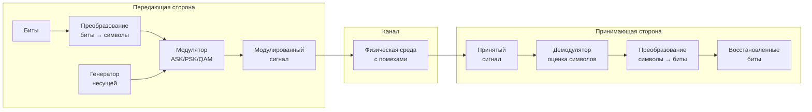

#физический_уровень #представление_данных #модуляция #несущий_сигнал #информационный_сигнал #демодуляция #виды_модуляции #цифровая_модуляция
___
## Введение

В предыдущих заметках мы рассматривали **линейное кодирование** - способ представления битов в виде сигналов с двумя или более уровнями напряжения, которые непосредственно передаются по каналу. Однако такой подход (базовая полоса, baseband) работает хорошо только на коротких расстояниях и в средах с низким затуханием. Для передачи на большие расстояния, по радиоканалам или через телефонные линии, необходимо использовать **модуляцию**

**Модуляция** - это процесс изменения одного или нескольких параметров несущего сигнала (обычно синусоидальной формы) в соответствии с передаваемым информационным сигналом. Модуляция позволяет:
- **Перенести сигнал в нужный частотный диапазон**, подходящий для данной среды передачи
- **Увеличить дальность передачи** за счёт использования несущей частоты с меньшим затуханием
- **Разделять каналы** (частотное мультиплексирование) - передавать несколько сигналов одновременно на разных частотах
- **Улучшить помехоустойчивость** путём выбора оптимального вида модуляции
- **Увеличить скорость передачи данных** за счёт передачи нескольких бит в одном символе

В компьютерных сетях модуляция широко используется в **беспроводных технологиях** (Wi-Fi, Bluetooth, сотовые сети), в **DSL-модемах** (передача по телефонным линиям), в **спутниковой связи** и в некоторых высокоскоростных проводных интерфейсах (например, 1000Base-T использует PAM-5 - разновидность модуляции)

---

## Основные понятия модуляции

### Несущий сигнал (Carrier)

**Несущий сигнал** (carrier) - это высокочастотный синусоидальный сигнал, который модулируется информационным сигналом. Несущая характеризуется тремя основными параметрами:
- **Амплитуда (A)** - высота сигнала
- **Частота (f)** - число колебаний в секунду
- **Фаза (φ)** - начальное смещение колебания относительно некоторой точки

Математически синусоидальный сигнал можно записать как:

```text
s(t) = A · sin(2πft + φ)
```

Модуляция заключается в изменении одного или нескольких из этих параметров в зависимости от передаваемых данных

### Информационный сигнал (Modulating signal)

**Информационный сигнал** - это сигнал, содержащий данные, которые нужно передать. В цифровых системах это последовательность битов, преобразованная в электрический сигнал (обычно прямоугольные импульсы)

### Демодуляция (Demodulation)

**Демодуляция** - обратный процесс выделения информационного сигнала из модулированного несущего сигнала на стороне приёмника

---

## Классификация видов модуляции

Модуляция делится на две большие группы:
1. **Аналоговая модуляция** - параметры несущей изменяются непрерывно в соответствии с аналоговым информационным сигналом (голос, музыка). Используется в радиовещании, телевидении, аналоговой телефонии
2. **Цифровая модуляция** - параметры несущей изменяются дискретно в соответствии с цифровым информационным сигналом (битами). Используется в компьютерных сетях, сотовой связи, цифровом телевидении

В компьютерных сетях используется **цифровая модуляция**, поэтому далее мы сосредоточимся на ней

---

## Виды цифровой модуляции

Цифровая модуляция делится на три основных типа в зависимости от того, какой параметр несущей изменяется:

### 1. Амплитудная модуляция (ASK - Amplitude Shift Keying)

- **Принцип**: Амплитуда несущей изменяется в соответствии с передаваемыми битами
    - Логическая 1 → высокая амплитуда
    - Логический 0 → низкая амплитуда (или нулевая)
- **Простота**: Очень простая в реализации
- **Помехоустойчивость**: Низкая, так как амплитуда чувствительна к затуханию и шумам
- **Применение**: Ранние модемы, некоторые беспроводные датчики, RFID
- **Модификация**: **OOK (On-Off Keying)** - частный случай ASK, где 0 - это отсутствие сигнала, 1 - наличие несущей

### 2. Частотная модуляция (FSK - Frequency Shift Keying)

- **Принцип**: Частота несущей изменяется в соответствии с битами
    - Логическая 1 → частота f₁
    - Логический 0 → частота f₂ (обычно f₁ ≠ f₂)
- **Помехоустойчивость**: Выше, чем у ASK, так как информация заключена в частоте, которая менее чувствительна к амплитудным помехам
- **Применение**: Модемы (ITU V.21, V.22), Bluetooth (использует GFSK - Gaussian FSK), ранние беспроводные системы
- **Модификация**: **MSK (Minimum Shift Keying)** и **GMSK (Gaussian MSK)** - используются в GSM сотовой связи

### 3. Фазовая модуляция (PSK - Phase Shift Keying)

- **Принцип**: Фаза несущей изменяется в соответствии с битами
    - Логическая 1 → фаза 0°
    - Логический 0 → фаза 180° (скачок фазы на π)
- **Помехоустойчивость**: Высокая, так как информация заложена в фазе, которая устойчива к амплитудным искажениям
- **Применение**: Широко используется в беспроводных системах, спутниковой связи, Wi-Fi (частично)

#### Виды PSK:

- **BPSK (Binary PSK)**: 2 фазы (0° и 180°) - передаёт 1 бит на символ
- **QPSK (Quadrature PSK)**: 4 фазы (0°, 90°, 180°, 270°) - передаёт 2 бита на символ
- **8-PSK**: 8 фаз - передаёт 3 бита на символ
- **16-PSK**: 16 фаз - передаёт 4 бита на символ (редко используется, так как сильно подвержен шумам)

### 4. Квадратурная амплитудная модуляция (QAM - Quadrature Amplitude Modulation)

QAM - это **комбинация ASK и PSK**. Изменяются одновременно и амплитуда, и фаза несущей, что позволяет передавать несколько бит в одном символе:
- **Принцип**: Сигнал представляется в виде суммы двух квадратурных составляющих (синфазной I и квадратурной Q), модулированных по амплитуде. Каждая точка на сигнальном созвездии (constellation) соответствует определённой комбинации бит
- **Эффективность**: Чем больше точек в созвездии, тем больше бит передаётся за один символ. Однако с ростом числа точек падает помехоустойчивость, так как точки становятся ближе друг к другу

#### Распространённые виды QAM:

|Тип|Число точек|Бит/символ|Применение|
|---|---|---|---|
|**4-QAM** (QPSK)|4|2|Спутниковая связь, DVB-S|
|**16-QAM**|16|4|DSL, Wi-Fi (802.11a/g), DVB-T|
|**64-QAM**|64|6|Wi-Fi (802.11ac), DVB-T2, кабельное ТВ|
|**256-QAM**|256|8|Wi-Fi 6 (802.11ax), DOCSIS 3.1|
|**1024-QAM**|1024|10|Wi-Fi 7 (802.11be), некоторые DSL-модемы|

---

## Сигнальное созвездие (Constellation Diagram)

**Сигнальное созвездие** - это графическое представление модулированного сигнала на комплексной плоскости, где по оси X откладывается синфазная (I) составляющая, по оси Y - квадратурная (Q) составляющая. Каждая точка на созвездии соответствует определённому символу и соответствующей комбинации бит

Например, для **QPSK** (4 точки) созвездие выглядит как четыре точки, расположенные под углом 45°, 135°, 225°, 315° на окружности радиуса A. Для **16-QAM** точки образуют квадратную решётку 4×4

### Схема созвездий различных видов модуляции



---

## Скорость передачи: бит/с vs бод (символ/с)

Важно различать две величины:
- **Битовая скорость (Bit Rate)** - количество передаваемых бит в секунду (бит/с)
- **Символьная скорость (Symbol Rate)** - количество передаваемых символов в секунду (бод). Один символ может нести несколько бит

Соотношение:

```text
Битовая_скорость = Символьная_скорость × log₂(M)
```

где M - число различных состояний сигнала (точек в созвездии)

Например, при **16-QAM** (M=16) каждый символ несёт 4 бита. Если символьная скорость равна 1000 бод, битовая скорость составит 4000 бит/с

Это позволяет увеличить скорость передачи без увеличения символьной скорости, используя более плотные созвездия, но за это приходится платить снижением помехоустойчивости

---

## Модуляция и пропускная способность: предел Шеннона

Теоретический предел скорости передачи данных по каналу с заданной шириной полосы и соотношением сигнал/шум описывается **формулой Шеннона**:

```text
C = F · log₂(1 + SNR)
```

где:
- C - максимальная скорость передачи (бит/с)
- F - ширина полосы канала (Гц)
- SNR - отношение сигнал/шум (в разах, а не в дБ)

Эта формула показывает, что для достижения высокой скорости нужно либо увеличивать полосу, либо повышать SNR. Модуляция позволяет эффективно использовать доступную полосу, приближаясь к теоретическому пределу

---

## Модуляция в современных сетях

### OFDM (Orthogonal Frequency Division Multiplexing)

**OFDM** - это метод модуляции, используемый в Wi-Fi (802.11a/g/n/ac/ax), 4G/LTE, 5G, DVB-T (цифровое телевидение) и ADSL:
- **Принцип**: Широкий канал делится на множество узких поднесущих (субканалов), каждая из которых модулируется независимо (обычно QPSK, 16-QAM, 64-QAM). Поднесущие ортогональны, что позволяет разместить их очень плотно без взаимных помех
- **Преимущества**:
    - Устойчивость к многолучевому распространению (за счёт длительных символов на каждой поднесущей)
    - Гибкость: на каждой поднесущей можно использовать разную модуляцию в зависимости от качества канала
    - Простота реализации с помощью БПФ (FFT)
- **Недостатки**: Высокий пик-фактор (отношение пиковой мощности к средней), чувствительность к частотным сдвигам

### Модуляция в стандартах Wi-Fi

|Стандарт|Модуляция|Макс. скорость|
|---|---|---|
|802.11a/g|OFDM с BPSK, QPSK, 16-QAM, 64-QAM|54 Мбит/с|
|802.11n (Wi-Fi 4)|OFDM с до 64-QAM, MIMO|до 600 Мбит/с|
|802.11ac (Wi-Fi 5)|OFDM с до 256-QAM, MU-MIMO|до 6,9 Гбит/с|
|802.11ax (Wi-Fi 6)|OFDMA с до 1024-QAM|до 9,6 Гбит/с|
|802.11be (Wi-Fi 7)|OFDMA с до 4096-QAM|до 30 Гбит/с|

---

## Модуляция и демодуляция: схема



---

## Преимущества и недостатки модуляции

### Преимущества

- **Частотное разделение каналов**: Позволяет одновременно передавать несколько сигналов в одном канале (FDM, OFDM)
- **Увеличение дальности**: Перенос сигнала на высокую частоту снижает влияние низкочастотных шумов и позволяет использовать антенны
- **Увеличение скорости**: Передача нескольких бит на символ (QAM, PSK) повышает битовую скорость в той же полосе
- **Адаптивность**: Можно выбирать схему модуляции в зависимости от качества канала (адаптивная модуляция)

### Недостатки

- **Сложность**: Требует более сложных трансиверов и алгоритмов обработки сигнала
- **Помехоустойчивость**: Высокоплотные созвездия (256-QAM и выше) сильно чувствительны к шумам и искажениям
- **Пик-фактор**: OFDM имеет высокий пик-фактор, что требует более мощных усилителей

---

## Заключение

Модуляция - это ключевой механизм, позволяющий адаптировать цифровые данные для передачи по различным физическим средам. В отличие от линейного кодирования (которое работает в базовой полосе), модуляция переносит сигнал в нужный частотный диапазон, открывая возможность для:
- **Дальней передачи** (радио, спутник)
- **Многоканальной передачи** (частотное мультиплексирование)
- **Высокой спектральной эффективности** (за счёт передачи нескольких бит на символ, как в QAM)

**Ключевые выводы:**
1. Модуляция изменяет амплитуду, частоту или фазу несущей в соответствии с битами
2. Основные виды цифровой модуляции: **ASK, FSK, PSK, QAM**
3. **QAM** является наиболее распространённой в высокоскоростных системах благодаря эффективному использованию полосы
4. **OFDM** - современный метод, сочетающий модуляцию и мультиплексирование, используется в Wi-Fi, 4G/5G, цифровом ТВ
5. Выбор схемы модуляции - это компромисс между скоростью и помехоустойчивостью
6. Понимание модуляции необходимо для осознания работы современных беспроводных систем и высокоскоростных проводных интерфейсов (DSL, G.fast)

В следующих заметках мы перейдём к основам передачи данных, где рассмотрим такие фундаментальные концепции, как направление передачи, пропускная способность, задержка и мультиплексирование.