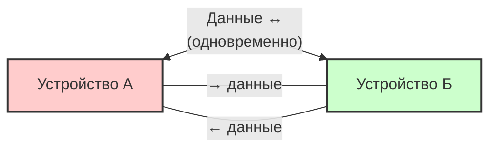

#физический_уровень #основы_передачи_данных #направление_передачи #симплекс #полудуплекс #полный_дуплекс
___
## Введение

В любой системе связи, будь то проводная или беспроводная, важно понимать, как данные перемещаются между двумя взаимодействующими устройствами. Направление передачи данных определяет, может ли информация передаваться только в одну сторону, поочерёдно в обе стороны или одновременно в обоих направлениях

Это фундаментальное понятие физического уровня, которое влияет на конструкцию кабелей, выбор протоколов, методы управления доступом к среде и производительность сети в целом. Современные сети стремятся к **полнодуплексной** передаче, поскольку она обеспечивает максимальную пропускную способность и минимальные задержки, однако в некоторых сценариях (например, беспроводная связь) полудуплексный режим остаётся неизбежным

В этой заметке мы рассмотрим три основных режима направления передачи, их характеристики, примеры применения и влияние на сетевые технологии.

---

## 1. Симплекс (Simplex)

### Определение

**Симплексная передача** (simplex) - это режим, при котором данные передаются **только в одном направлении** - от передатчика к приёмнику. Обратная передача невозможна

Симплексный канал является **однонаправленным**. Одно устройство всегда является передатчиком, другое - только приёмником. Они не могут меняться ролями

### Характеристики

- **Одно направление**: Данные движутся строго от А к Б
- **Отсутствие обратной связи**: Приёмник не может отправить подтверждение или запрос на повторную передачу
- **Простота**: Не требуется управление направлением передачи, коллизии отсутствуют
- **Эффективность**: Полная пропускная способность канала используется для передачи в одном направлении

### Примеры

- **Радио- и телевизионное вещание**: Передатчик (радиостанция, телебашня) отправляет сигнал, а приёмники (радиоприёмники, телевизоры) только принимают
- **Системы оповещения**: Громкоговорители в общественных местах (сигнал только от центра к динамикам)
- **Датчики и сенсоры**: Некоторые датчики только передают данные (например, температура) на центральный контроллер
- **Старые системы печати**: Принтер, подключённый через параллельный порт, в основном принимал данные (хотя в современных интерфейсах есть двусторонняя связь)

### Схема симплексной передачи

---

## 2. Полудуплекс (Half-Duplex)

### Определение

**Полудуплексная передача** (half-duplex) - это режим, при котором данные могут передаваться **в обоих направлениях, но не одновременно**. В любой момент времени передача может идти только в одну сторону - либо от А к Б, либо от Б к А

Полудуплексный канал требует переключения направления передачи. Это переключение управляется либо протоколом, либо сигналом запроса/разрешения

### Характеристики

- **Двунаправленность, но с разделением во времени**: Обе стороны могут передавать, но по очереди
- **Коллизии возможны**: Если обе стороны начнут передачу одновременно, возникает коллизия, которая требует механизмов обнаружения и разрешения (например, CSMA/CD в Ethernet на коаксиале или CSMA/CA в Wi-Fi)
- **Меньшая эффективность**: По сравнению с полным дуплексом, так как канал простаивает в моменты смены направления, а также возможны коллизии и повторные передачи
- **Простота оборудования**: Часто можно использовать одну и ту же физическую линию для обоих направлений (например, одна пара проводов с разделением по времени)

### Примеры

- **Радиосвязь (Walkie-talkie)**: Для перехода от приёма к передаче нужно нажать кнопку. Одновременно говорить и слушать нельзя
- **Ранний Ethernet (10BASE-2, 10BASE-5)**: Использовал коаксиальный кабель с разделяемой средой. Узлы использовали CSMA/CD для обнаружения коллизий и повторной передачи. Сеть работала в полудуплексе
- **Wi-Fi (802.11)**: Беспроводные сети работают в полудуплексе, так как все устройства используют общую среду (эфир) и не могут одновременно передавать и принимать на одной частоте
- **Старые модемы**: Многие модемы в режиме "half-duplex" передавали данные по очереди

### Схема полудуплексной передачи

_Стрелки в обе стороны, но передача происходит поочерёдно._

---

## 3. Полный дуплекс (Full-Duplex)

### Определение

**Полнодуплексная передача** (full-duplex) - это режим, при котором данные могут передаваться **одновременно в обоих направлениях** между двумя устройствами. Каждая сторона может одновременно отправлять и принимать данные

Полнодуплексный канал фактически эквивалентен двум симплексным каналам, работающим в противоположных направлениях, и требует разделения физического канала или использования разных частот/временных слотов, чтобы избежать интерференции

### Характеристики

- **Одновременная двусторонняя передача**: Максимальная эффективность использования канала
- **Отсутствие коллизий**: Так как передача идёт по независимым каналам, коллизии невозможны (при правильной реализации)
- **Высокая пропускная способность**: Суммарная пропускная способность равна сумме скоростей в каждом направлении (например, 1 Гбит/с в обе стороны одновременно)
- **Требует разделения каналов**: Необходимо либо использовать отдельные физические линии (например, отдельные пары проводов в витой паре), либо разные частоты (в беспроводных системах), либо эхокомпенсацию

### Способы реализации полного дуплекса

1. **Разделение по физическим линиям**: В витой паре (например, 100BASE-TX, 1000BASE-T) используются отдельные пары проводов для передачи и приёма. Обычно 4 пары: две для передачи, две для приёма (или все 4 с эхокомпенсацией в 1000BASE-T)
2. **Разделение по частоте (FDD)**: В беспроводных и оптических системах передача и приём ведутся на разных частотах или длинах волн (например, WDM в оптоволокне)
3. **Эхокомпенсация (Echo Cancellation)**: В некоторых технологиях (например, 1000BASE-T) используется одна пара для передачи и приёма одновременно, но с компенсацией собственного сигнала для выделения входящего

### Примеры

- **Современный Ethernet (100BASE-TX, 1000BASE-T, 10GBASE-T)**: Работает в полнодуплексном режиме при подключении к коммутатору
- **Телефонные сети**: В телефонной линии можно одновременно говорить и слушать (благодаря гибридной схеме, разделяющей сигналы)
- **Оптоволоконные линии**: Часто используют две жилы или разные длины волн для одновременной передачи в обе стороны
- **Беспроводные системы с FDD**: Например, сотовые сети 4G/5G, где для передачи (Uplink) и приёма (Downlink) выделены разные частотные диапазоны (FDD) или временные слоты (TDD, но TDD - это полудуплекс)

### Схема полнодуплексной передачи

_Две отдельные линии или канала для каждого направления._

---

## Сравнительная таблица

|Характеристика|**Симплекс**|**Полудуплекс**|**Полный дуплекс**|
|---|---|---|---|
|**Направление передачи**|Только одно (А→Б)|Оба, но поочерёдно|Оба одновременно|
|**Коллизии**|Невозможны|Возможны (требуют управления доступом)|Невозможны|
|**Эффективность использования канала**|100% в одном направлении (но только половина возможностей)|Менее 100% (из-за переключений и коллизий)|100% в обоих направлениях одновременно|
|**Аппаратная сложность**|Простая|Средняя|Более сложная (разделение каналов)|
|**Примеры**|Радиовещание, телевидение|Радиосвязь (walkie-talkie), Wi-Fi, ранний Ethernet|Современный Ethernet (с коммутаторами), телефонные линии, оптоволокно|
|**Типичное применение**|Широковещательные системы|Беспроводные сети, сети с разделяемой средой|Высокоскоростные проводные сети, магистрали|

---

## Влияние на сетевые технологии и оборудование

### Коммутаторы и концентраторы (Hub vs Switch)

- **Концентратор (Hub)** работает на физическом уровне и является **повторителем** сигнала. Все порты концентратора подключены к одной общей среде (внутренней шине). Поэтому при передаче данных от одного устройства к другому сигнал достигает всех портов, и возможны коллизии. Работа с концентратором обычно происходит в **полудуплексном** режиме (или даже симплексном при широковещании). Концентраторы устарели и практически не используются
- **Коммутатор (Switch)** работает на канальном уровне и анализирует MAC-адреса. Он обеспечивает **выделенный канал** между портами: при передаче данных от устройства А к устройству Б сигнал идёт только по этим двум портам, остальные порты не затрагиваются. Таким образом, на каждом порту можно реализовать **полнодуплексный** режим, так как передача и приём независимы. Коммутаторы стали стандартом для современных LAN

### CSMA/CD и CSMA/CA

- **CSMA/CD (Carrier Sense Multiple Access with Collision Detection)** - метод доступа к среде, использовавшийся в полудуплексных сетях Ethernet на коаксиале и концентраторах. Устройства прослушивают среду перед передачей, а если происходит коллизия, обнаруживают её и откладывают повторную попытку. С переходом на коммутаторы и полный дуплекс CSMA/CD перестал использоваться (в современных сетях он практически отключён)
- **CSMA/CA (Carrier Sense Multiple Access with Collision Avoidance)** - метод доступа, используемый в беспроводных сетях Wi-Fi. Поскольку в беспроводной среде сложно обнаружить коллизию (из-за эффекта "скрытой станции"), используется избегание коллизий. Wi-Fi всегда работает в **полудуплексном** режиме (на одной частоте), поэтому CSMA/CA остаётся актуальным

---

## Схема сравнения трёх режимов

---

## Дуплекс и качество обслуживания (QoS)

В полнодуплексных сетях пропускная способность в каждом направлении фиксирована и независима, что упрощает планирование трафика и позволяет применять механизмы QoS (приоритизация) более предсказуемо. В полудуплексных сетях (особенно в Wi-Fi) конкурентный доступ и коллизии создают вариативность задержек, что ухудшает качество для чувствительных приложений (голос, видео)

---

## Современные тенденции

- **Все проводные сети стремятся к полному дуплексу**: Ethernet начиная со 100BASE-TX, все современные оптоволоконные интерфейсы
- **Беспроводные сети (Wi-Fi)**: остаются полудуплексными из-за физических ограничений (работа на одной частоте). Для повышения пропускной способности используются MIMO, OFDMA и другие методы, но фундаментальный полудуплекс сохраняется
- **Сотовые сети (4G/5G)**: используют FDD (Full-Duplex, разные частоты) или TDD (Time-Division Duplex, фактически полудуплекс с быстрым переключением). В 5G также изучаются полнодуплексные схемы с самоподавлением помех (In-Band Full-Duplex), но это пока экспериментально

---

## Заключение

Выбор направления передачи (симплекс, полудуплекс или полный дуплекс) влияет на конструкцию сети, протоколы доступа к среде, производительность и стоимость. Понимание этих режимов необходимо для:
- **Выбора правильного оборудования**: Коммутаторы vs концентраторы, выбор кабельной системы
- **Настройки сетевых интерфейсов**: Настройка дуплекса и скорости на сетевых картах (важно избегать несоответствия - duplex mismatch)
- **Диагностики проблем**: Проблемы с дуплексом часто приводят к коллизиям, ошибкам и низкой производительности (например, если одно устройство работает в полном дуплексе, а другое - в полудуплексе)

**Ключевые выводы:**
1. **Симплекс** - однонаправленная передача (редко используется в компьютерных сетях)
2. **Полудуплекс** - передача в обе стороны, но поочерёдно (используется в Wi-Fi и устаревших проводных сетях)
3. **Полный дуплекс** - одновременная передача в обе стороны (стандарт для современных проводных сетей)

Современные локальные сети Ethernet работают в **полнодуплексном** режиме благодаря коммутаторам, что обеспечивает высокую пропускную способность и отсутствие коллизий. Беспроводные сети вынужденно остаются **полудуплексными** из-за общей среды