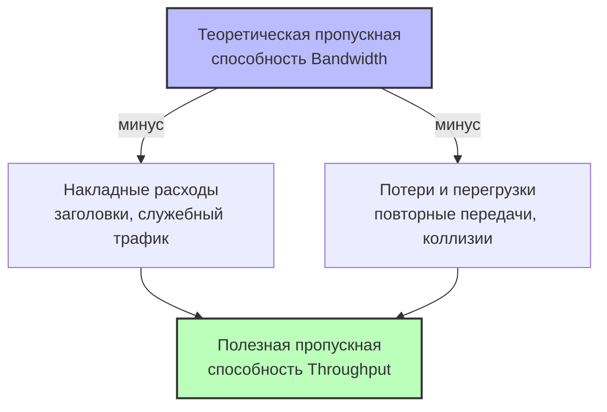

#физический_уровень #основы_передачи_данных #пропускная_способноть_и_полезная_пропускная_способность #пропускная_способность #полезная_пропускная_способность 
___
## Введение

В предыдущих заметках мы рассмотрели физические среды передачи, кодирование сигналов и направление передачи. Теперь мы переходим к одной из самых важных характеристик любого канала связи - его **пропускной способности**. Это понятие является фундаментальным для понимания производительности сети и часто используется в спецификациях оборудования, контрактах провайдеров и обсуждении сетевых технологий

При этом важно понимать, что существует **две разные величины**, которые часто путают: **пропускная способность (bandwidth)** - это теоретический максимум, а **полезная пропускная способность (throughput)** - это реальная скорость передачи полезных данных. Разница между ними обусловлена множеством факторов, начиная от заголовков протоколов и заканчивая перегрузками в сети

В этой заметке мы подробно разберём оба понятия, их взаимосвязь и практическое значение для проектирования сетей

---

## 1. Пропускная способность (Bandwidth)

### Определение

**Пропускная способность** (bandwidth) - это максимальная скорость передачи данных по каналу связи, определяемая его физическими и протокольными характеристиками. Она измеряется в **битах в секунду** (бит/с, Кбит/с, Мбит/с, Гбит/с) и показывает, сколько бит информации может быть передано по каналу за одну секунду в идеальных условиях

Пропускная способность - это **потенциальная возможность** канала. Она определяется такими факторами, как:
- Физические свойства среды (например, максимальная частота сигнала, которую может пропускать кабель)
- Технология кодирования и модуляции (как эффективно используются доступная полоса частот)
- Аппаратные ограничения (максимальная тактовая частота передатчика и приёмника)

Важно отметить, что в телекоммуникациях термин **"bandwidth"** иногда используется в другом смысле - как **ширина полосы пропускания** (в герцах) - диапазон частот, который может быть передан по каналу без значительного затухания. Однако в контексте компьютерных сетей и сетевого оборудования под пропускной способностью чаще понимают именно скорость передачи данных. Эти два понятия связаны формулой Шеннона, но в повседневной практике важно помнить о разнице

### Единицы измерения

|Единица|Значение|
|---|---|
|**бит/с** (bps)|1 бит в секунду|
|**Кбит/с** (Kbps)|1 000 бит/с (или 1 024 бит/с в некоторых контекстах, но в сетевых спецификациях — десятичные)|
|**Мбит/с** (Mbps)|1 000 000 бит/с|
|**Гбит/с** (Gbps)|1 000 000 000 бит/с|
|**Тбит/с** (Tbps)|1 000 000 000 000 бит/с|

> **Важно**: В компьютерных сетях пропускная способность почти всегда указывается в **десятичных** единицах (например, 1 Гбит/с = 1 000 000 000 бит/с), в отличие от объёмов памяти, где используются двоичные единицы (1 Гбайт = 2³⁰ байт ≈ 1,07×10⁹ байт). Также часто используют обозначения с большой буквы "B" для байтов (Б) и с маленькой "b" для битов (б) — например, 1 Гбит/с = 125 Мбайт/с (мегабайт в секунду)

### Примеры пропускной способности сетевых технологий

|Технология|Пропускная способность (Bandwidth)|
|---|---|
|Модем (56K)|56 Кбит/с|
|ADSL (стандартный)|до 24 Мбит/с (вниз)|
|Ethernet 10BASE-T|10 Мбит/с|
|Fast Ethernet 100BASE-TX|100 Мбит/с|
|Gigabit Ethernet 1000BASE-T|1 Гбит/с|
|10 Gigabit Ethernet (10GBASE-T)|10 Гбит/с|
|Wi-Fi 5 (802.11ac)|до 6,9 Гбит/с (теоретический максимум)|
|Wi-Fi 6 (802.11ax)|до 9,6 Гбит/с|
|Оптоволокно (DWDM, современные системы)|сотни Гбит/с на одну длину волны|
|Трансатлантические оптоволоконные кабели|до 100+ Тбит/с на весь кабель|

---

## 2. Полезная пропускная способность (Throughput)

### Определение

**Полезная пропускная способность** (throughput) - это фактическая скорость передачи **полезных данных** (пользовательской информации) по каналу в реальных условиях. Она всегда меньше или равна теоретической пропускной способности и измеряется в тех же единицах (бит/с)

Throughput отражает реальную производительность сети с учётом всех накладных расходов, задержек и потерь

### Причины снижения throughput по сравнению с bandwidth

1. **Накладные расходы протоколов (Protocol Overhead)**:
    - Каждый уровень модели OSI/TCP/IP добавляет заголовки (и иногда трейлеры) к передаваемым данным
    - Например, в Ethernet кадр 1500 байт содержит 14–18 байт заголовка + 4 байта контрольной суммы. При передаче TCP/IP добавляются дополнительные заголовки (20 байт IP + 20 байт TCP). Общая служебная информация может составлять 5–10% от общего объёма трафика
2. **Задержки и повторные передачи (Retransmissions)**:
    - При использовании TCP потерянные или повреждённые пакеты требуют повторной передачи, что снижает полезную скорость
    - В полудуплексных сетях (например, Wi-Fi) коллизии также требуют повторных попыток
3. **Управляющий трафик (Control Traffic)**:
    - Протоколы используют служебные сообщения для управления соединениями (TCP SYN/ACK), обновления таблиц маршрутизации (OSPF, BGP), подтверждения получения (ACK-пакеты). Это также занимает часть пропускной способности
4. **Потери пакетов (Packet Loss)**:
    - Потери могут быть вызваны перегрузками, ошибками в канале, проблемами с оборудованием. TCP реагирует на потери замедлением скорости, что ещё больше снижает throughput
5. **Перегрузки (Congestion)**:
    - Когда трафик превышает возможности узлов сети (например, маршрутизаторов или каналов с меньшей пропускной способностью), пакеты задерживаются в очередях или отбрасываются, снижая эффективную скорость
6. **Аппаратные ограничения**:
    - Процессорная мощность сетевых устройств, объём буферов, быстродействие оперативной памяти - всё это может ограничивать реальную скорость обработки данных даже при высокой пропускной способности канала

### Примеры throughput в реальных условиях

|Сценарий|Bandwidth|Typical Throughput|
|---|---|---|
|Домашний Интернет 100 Мбит/с|100 Мбит/с|85–95 Мбит/с (с учётом накладных расходов)|
|Gigabit Ethernet (1000BASE-T)|1 Гбит/с|940–980 Мбит/с (с учётом overhead TCP/IP)|
|Wi-Fi 5 (соединение с устройством)|до 1,3 Гбит/с (теоретически)|300–600 Мбит/с (в реальных условиях)|
|Спутниковый Интернет (заявленный)|100 Мбит/с|20–50 Мбит/с (из-за задержек и потерь)|

---

## Взаимосвязь пропускной способности и полезной пропускной способности



---

## Теоретический предел: формула Шеннона

Максимальная пропускная способность (bandwidth) канала с ограниченной полосой пропускания и наличием шума определяется **формулой Шеннона**:

```text
C = F · log₂(1 + SNR)
```

где:
- C - максимальная скорость передачи (бит/с)
- F - ширина полосы пропускания канала (Гц)
- SNR - отношение сигнал/шум (в разах, а не в дБ)

Эта формула показывает **теоретический предел**, который нельзя превысить при заданных физических параметрах канала. Например, для стандартной телефонной линии с полосой 3,1 кГц и SNR около 30 дБ (1000:1) максимальная скорость составляет:

```text
C = 3100 · log₂(1 + 1000) ≈ 3100 · 9,97 ≈ 30 900 бит/с ≈ 31 Кбит/с
```

Это близко к скорости старых модемов (28,8–33,6 Кбит/с). Для достижения более высоких скоростей необходимо либо расширять полосу, либо повышать SNR

---

## Пропускная способность и полоса пропускания (Frequency Bandwidth)

Важно различать два значения термина "пропускная способность":
1. **Ширина полосы пропускания (Frequency Bandwidth)** - диапазон частот, который канал может передавать без значительного затухания (измеряется в герцах). Например, для Wi-Fi канал шириной 20 МГц или 40 МГц
2. **Скорость передачи данных (Data Bandwidth)** - количество бит, передаваемое в секунду (измеряется в бит/с). Это понятие мы используем в контексте сетей

Формула Шеннона связывает эти два понятия, показывая, что скорость передачи данных зависит как от полосы пропускания, так и от отношения сигнал/шум.

---

## Измерение пропускной способности

### Инструменты для измерения throughput

- **iperf / iperf3** - утилита для измерения пропускной способности TCP и UDP между двумя узлами
- **Speedtest (Ookla)** - популярный сервис для измерения скорости Интернет-соединения
- **ping / traceroute** - для оценки задержек и потерь, которые влияют на throughput
- **Wireshark** - для анализа трафика и определения накладных расходов

### Пример команды iperf (измерение TCP throughput)

```bash
iperf3 -c 192.168.1.10
```

_Вывод покажет фактическую скорость передачи данных (throughput) между клиентом и сервером_

### Что влияет на результаты измерения

- **Время суток и загрузка сети** (особенно для Интернет-соединений)
- **Расстояние до сервера** (чем дальше, тем выше задержка и ниже скорость)
- **Тип соединения** (проводное vs беспроводное, использование VPN и т.д.)
- **Аппаратные ограничения** (процессор, сетевая карта, маршрутизатор)

---

## Сравнение пропускной способности различных сред

|Среда|Типичная пропускная способность|Ограничения|
|---|---|---|
|**Витая пара (Cat5e)**|до 1 Гбит/с (100 м)|Длина сегмента 100 м, затухание|
|**Витая пара (Cat6a)**|до 10 Гбит/с (100 м)|Длина сегмента 100 м, более высокая стоимость|
|**Оптоволокно (многомодовое)**|до 100 Гбит/с (до 2 км)|Стоимость трансиверов, сложность монтажа|
|**Оптоволокно (одномодовое)**|до 400 Гбит/с (и выше)|Высокая стоимость, сложность монтажа|
|**Wi-Fi 5 (802.11ac)**|до 6,9 Гбит/с (теоретически)|Помехи, затухание, полудуплекс|
|**Wi-Fi 6 (802.11ax)**|до 9,6 Гбит/с (теоретически)|Помехи, затухание, полудуплекс|
|**4G LTE**|до 1 Гбит/с (LTE Advanced)|Зависимость от расстояния до вышки, загрузка сети|
|**5G NR**|до 20 Гбит/с (теоретически)|Ограниченная дальность на высоких частотах|

---

## Пропускная способность в реальных сетях

### Симметричная и асимметричная пропускная способность

- **Симметричная**: Скорость передачи (upstream) и приёма (downstream) равны. Пример: большинство корпоративных Ethernet-сетей, оптоволокно до квартиры (FTTH)
- **Асимметричная**: Скорость в одном направлении значительно выше, чем в другом. Пример: ADSL (до 24 Мбит/с вниз, до 3,5 Мбит/с вверх), DOCSIS (кабельный Интернет)

### Пропускная способность в системах с разделением канала

В технологиях с разделением канала (например, Wi-Fi с разделяемым эфиром) пропускная способность распределяется между всеми активными устройствами. Если одно устройство использует Wi-Fi с максимальной скоростью 300 Мбит/с (теоретически), то при подключении 10 устройств каждое получит примерно 30 Мбит/с (с учётом накладных расходов и конкуренции)

---

## Практическое значение для разработчика и администратора

- **Выбор оборудования**: При покупке сетевого оборудования важно ориентироваться не только на заявленную пропускную способность, но и на возможности реальной обработки трафика (throughput) с учётом нагрузки
- **Планирование пропускной способности**: Для корпоративных сетей необходимо рассчитывать пиковые нагрузки и резервировать пропускную способность. Например, если отдел работает с большими файлами, нужен канал не 100 Мбит/с, а 1 Гбит/с
- **Диагностика проблем**: Если пользователи жалуются на медленный Интернет, нужно проверить не только bandwidth (что обычно соответствует контракту), но и реальный throughput (с помощью тестов). Возможно, проблема в перегрузке маршрутизатора или зашумлённом Wi-Fi-канале
- **Оптимизация протоколов**: При разработке приложений, использующих сеть, стоит учитывать накладные расходы протоколов. Например, использование UDP вместо TCP для потокового видео снижает overhead и может улучшить throughput

---

## Заключение

Пропускная способность - это одна из ключевых характеристик любой сети, определяющая её производительность. Однако важно помнить, что:
1. **Bandwidth** - это теоретическая максимальная скорость канала
2. **Throughput** - это реальная скорость передачи полезных данных, которая всегда ниже bandwidth из-за накладных расходов, потерь, задержек и перегрузок
3. Выбор правильной среды, оборудования и протоколов должен основываться на требованиях к реальному throughput, а не только на заявленном bandwidth
4. Для оценки производительности сети необходимо измерять throughput в различных условиях (разное время суток, различная нагрузка)

Понимание различий между bandwidth и throughput помогает избежать распространённых ошибок при проектировании сетей и диагностике проблем. В следующей заметке мы подробно рассмотрим **задержки передачи** - ещё один критический фактор производительности сетей