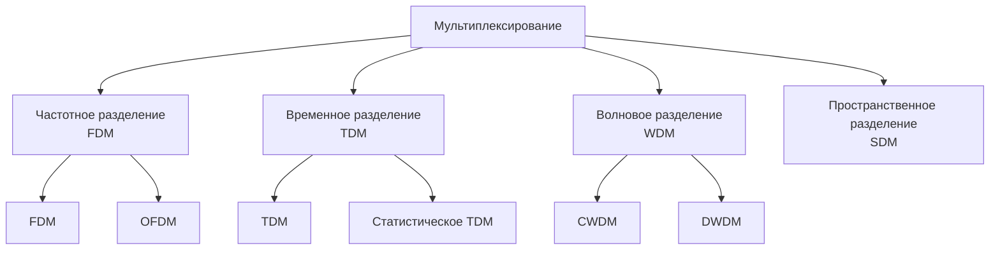
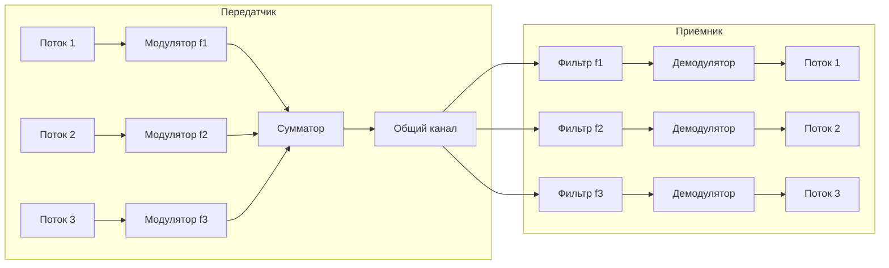
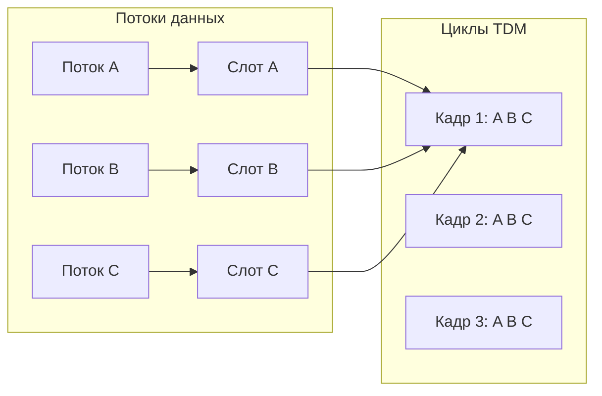
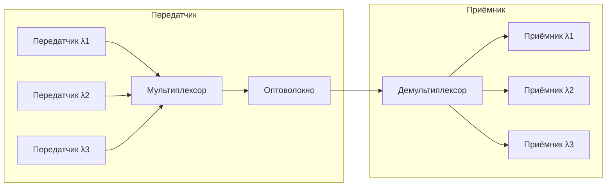
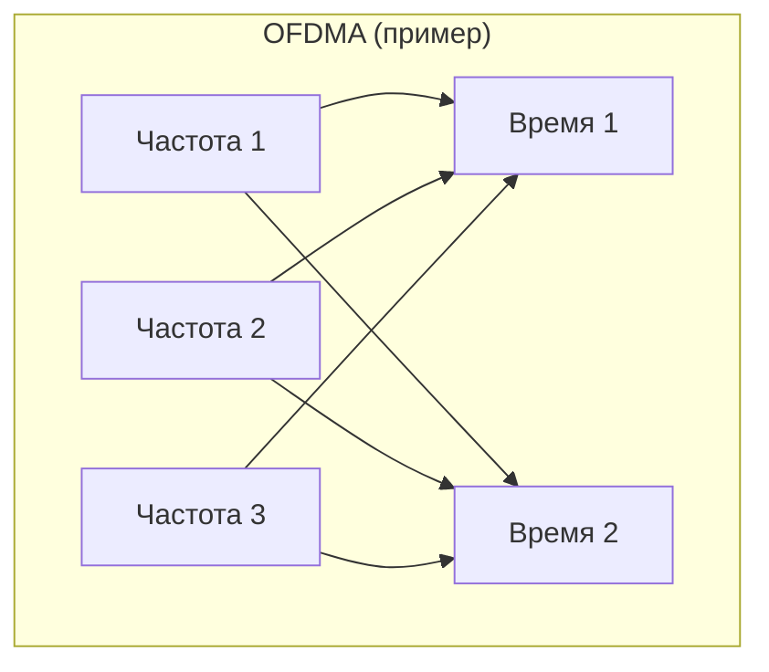

#физический_уровень #основы_передачи_данных #мультиплексирование #частотное_мультиплексирование #временное_мультиплексирование #волновое_мультиплексирование #пространственное_мультиплексирование #комбинированное_мультиплексирование
___
## Введение

В сетях передачи данных ресурсы (каналы связи, частотные диапазоны, временные слоты) часто являются дефицитными и дорогими. Было бы неэффективно выделять отдельный физический канал для каждого соединения - гораздо разумнее организовать **совместное использование** одного канала множеством потоков данных. Именно для этого используется **мультиплексирование**

**Мультиплексирование** - это процесс объединения нескольких независимых потоков данных (сигналов) в один составной сигнал, который передаётся по общему каналу связи, с последующим разделением на приёмной стороне на исходные потоки

Обратный процесс - **демультиплексирование** - выполняется на стороне получателя для восстановления отдельных потоков

Мультиплексирование является фундаментальной концепцией физического и канального уровней, позволяющей эффективно использовать пропускную способность дорогостоящих каналов (например, оптоволоконных магистралей, спутниковых линий). Без мультиплексирования современные сети были бы непозволительно дорогими и не могли бы обслуживать миллиарды пользователей

---

## Зачем нужно мультиплексирование?

1. **Экономия ресурсов**: Один канал высокой пропускной способности заменяет множество низкоскоростных каналов
2. **Снижение стоимости**: Меньше кабелей, меньше оборудования, меньше затрат на прокладку и обслуживание
3. **Упрощение инфраструктуры**: Одна магистраль вместо множества параллельных линий
4. **Гибкость**: Возможность динамически распределять пропускную способность между разными потоками (например, при статистическом мультиплексировании)

---

## Классификация методов мультиплексирования

Все методы мультиплексирования можно разделить на четыре основные группы:

---

## Частотное мультиплексирование (FDM - Frequency Division Multiplexing)

### Принцип

При FDM общая полоса пропускания канала делится на несколько **неперекрывающихся частотных поддиапазонов** (каналов). Каждый поток данных модулируется на свою несущую частоту и передаётся в своём поддиапазоне. Все потоки передаются **одновременно**, но на разных частотах

### Характеристики

- **Одновременная передача**: Все каналы активны в каждый момент времени
- **Фиксированное разделение полосы**: Каждому каналу выделяется строго определённый диапазон частот
- **Защитные интервалы (guard bands)**: Между каналами оставляют небольшие промежутки частот, чтобы избежать взаимных помех
- **Эффективность**: Полоса используется не полностью из-за защитных интервалов и того, что каналы могут простаивать

### Примеры применения

- **Радиовещание**: Разные радиостанции передают на разных частотах в одном эфире
- **Телевидение**: Телевизионные каналы занимают разные частотные диапазоны
- **Кабельное телевидение**: Передача множества телеканалов по одному коаксиальному кабелю
- **ADSL / VDSL**: Разделение частот для передачи данных вверх и вниз, а также для голоса (POTS) - всё по одной телефонной линии
- **Сотовые сети (FDD)**: Передача и приём ведутся на разных частотах (uplink/downlink)

### Схема FDM

### OFDM - Orthogonal Frequency Division Multiplexing

OFDM является частным случаем FDM, но с ортогональными поднесущими, что позволяет размещать их значительно плотнее без защитных интервалов. Используется в Wi-Fi, 4G/5G, DVB-T

---

## Временное мультиплексирование (TDM - Time Division Multiplexing)

### Принцип

При TDM общий канал поочерёдно предоставляется каждому потоку данных на фиксированные **временные интервалы (слоты)**. Каждый поток передаёт свои данные в строго отведённые ему моменты времени, а в остальное время канал используется другими потоками

TDM может быть **синхронным** (каждому потоку выделяется фиксированный слот независимо от наличия данных) или **статистическим** (слоты выделяются только при наличии данных для передачи)

### Синхронное TDM

- **Фиксированные слоты**: Каждый канал получает слот в каждом цикле (кадре) независимо от загрузки
- **Простота**: Не требуется передавать адресную информацию, так как позиция слота известна заранее
- **Неэффективность**: Если у канала нет данных, его слот простаивает (пустой)

### Асинхронное (статистическое) TDM

- **Динамическое выделение**: Слоты выделяются только тем каналам, у которых есть данные для передачи
- **Требуется адресация**: В каждом слоте необходимо указывать, какому каналу принадлежат данные
- **Эффективность**: Более эффективное использование канала, особенно при неравномерном трафике

### Примеры применения

- **Телефонные магистрали (PSTN)**: Используют синхронное TDM (например, T1/E1)
- **ISDN**: Цифровая сеть с интегрированными услугами, использующая TDM
- **Сотовые сети (TDMA)**: В ранних стандартах (GSM) использовалось временное разделение между абонентами в одной частоте
- **Статистическое TDM**: Используется в протоколах с коммутацией пакетов (например, Ethernet, где канал используется по мере необходимости)

### Схема TDM

---

## Волновое мультиплексирование (WDM - Wavelength Division Multiplexing)

### Принцип

WDM - это вариант FDM, но для **оптоволоконных каналов**. Разные потоки данных передаются на разных **длинах волн** (цветах) света, которые затем объединяются в один оптоволоконный кабель. На приёмной стороне эти длины волн разделяются и направляются на соответствующие приёмники

WDM позволяет использовать огромную пропускную способность оптоволокна (теоретически до тысяч терабит в секунду) путём параллельной передачи множества потоков

### Типы WDM

- **CWDM (Coarse WDM)**: Использует широкий шаг между длинами волн (обычно 20 нм). Поддерживает до 18 каналов, дальность до 80–100 км. Дешевле, но менее ёмкостный
- **DWDM (Dense WDM)**: Использует очень плотное размещение каналов (шаг 0,8 нм и менее). Поддерживает более 80 каналов, дальность до сотен и тысяч километров (с усилителями). Применяется в магистралях

### Применение

- **Магистральные оптоволоконные сети провайдеров**
- **Подводные кабели** (трансатлантические, транстихоокеанские)
- **Центры обработки данных** для соединения серверов и коммутаторов
- **Городские сети (MAN)**

### Схема WDM

---

## Пространственное мультиплексирование (SDM - Space Division Multiplexing)

**SDM** - это использование нескольких физически разделённых каналов (например, отдельных оптоволоконных жил, различных трасс в беспроводной связи) для увеличения общей пропускной способности. По сути, это параллельная передача по нескольким кабелям или по нескольким пространственным путям (MIMO в беспроводных системах - множественный вход/множественный выход)

Примеры:
- **MIMO** в Wi-Fi и сотовых сетях: использование нескольких антенн для одновременной передачи нескольких потоков данных в одном частотном канале
- **Многожильные оптоволоконные кабели**: несколько волокон в одном кабеле

---

## Статистическое мультиплексирование (Statistical Multiplexing)

**Статистическое мультиплексирование** - это метод, при котором общий канал динамически распределяется между потоками данных в зависимости от их текущей потребности. В отличие от синхронного TDM, где каждый поток получает фиксированный слот, статистическое мультиплексирование выделяет ресурсы только активным потокам

Этот подход используется в сетях с **коммутацией пакетов** (например, Ethernet, IP-сети). Он позволяет достичь более высокой утилизации канала, так как большинство приложений имеют пульсирующий трафик (bursty traffic) - периоды активности чередуются с паузами

### Особенности

- **Адаптивность**: Пропускная способность распределяется по требованию
- **Накладные расходы**: Требуется идентификация потоков (адреса, метки), так как порядок данных может меняться
- **Возможность перегрузок**: При превышении суммарной нагрузки над ёмкостью канала возникает перегрузка, приводящая к задержкам и потерям

### Примеры

- **Ethernet**: Все устройства в сети используют общий канал (или коммутатор) для передачи, но только когда есть данные
- **IP-сети**: Маршрутизаторы принимают пакеты от многих потоков и перенаправляют их по выходным интерфейсам, используя статистическое мультиплексирование
- **Wi-Fi**: Абоненты конкурируют за эфирное время, используя CSMA/CA

---

## Сравнительная таблица методов мультиплексирования

|Метод|Разделение по|Одновременность|Накладные расходы|Применение|
|---|---|---|---|---|
|**FDM**|Частота|Да|Минимальные (защитные интервалы)|Радио, ТВ, ADSL, сотовая связь|
|**TDM (синхронный)**|Время|Нет (по очереди)|Нет (позиция слота фиксирована)|T1/E1, ISDN, GSM (TDMA)|
|**TDM (статистический)**|Время (по требованию)|Нет|Требуется адресация|IP-сети, Ethernet, Wi-Fi|
|**WDM**|Длина волны|Да|Минимальные|Оптоволоконные магистрали|
|**SDM**|Пространство|Да|Минимальные|MIMO, многожильные кабели|

---

## Влияние мультиплексирования на производительность

- **Повышение эффективности**: Совместное использование канала снижает стоимость и увеличивает утилизацию
- **Задержки**: В TDM статистическом мультиплексировании возможны очереди и, соответственно, вариация задержек (джиттер). В FDM/WDM задержка минимальна и постоянна
- **Надёжность**: В статистическом мультиплексировании перегрузки могут приводить к потерям пакетов, в то время как в FDM/TDM каналы изолированы (но при отказе канала все потоки страдают)

---

## Мультиплексирование в современных сетях

- **Ethernet**: Использует статистическое мультиплексирование на канальном уровне (CSMA/CD в прошлом, сейчас коммутация с выделенными каналами, но по сути - разделение времени)
- **Wi-Fi**: Полудуплексная среда, где множество устройств используют статистическое мультиплексирование (конкурируют за эфир) с помощью CSMA/CA
- **Сотовые сети**: Комбинация FDM (разные частоты для операторов и для uplink/downlink) и TDM (TDMA в GSM, OFDMA в LTE/5G - по сути, частотно-временное мультиплексирование)
- **Оптоволокно**: WDM - основной метод увеличения пропускной способности без прокладки новых кабелей

---

## Схема комбинированного мультиплексирования (FDM + TDM)

В сложных системах часто используют комбинацию методов. Например, в сотовых сетях 4G/5G используется **OFDMA** - это частотно-временное мультиплексирование, где ресурсный блок (time-frequency resource) выделяется каждому пользователю:

---

## Заключение

Мультиплексирование - это ключевая технология, обеспечивающая эффективное использование дорогостоящих каналов связи. Без него невозможно было бы построить современные сети, обслуживающие миллиарды пользователей и передающие огромные объёмы данных

**Ключевые выводы:**
1. **FDM / WDM** - разделение по частоте/длине волны, потоки передаются одновременно, подходит для аналоговых и оптических систем
2. **TDM** - разделение по времени, потоки передаются по очереди, используется в цифровых системах (телефония, сотовые сети)
3. **Статистическое мультиплексирование** - динамическое распределение ресурсов, основа сетей с коммутацией пакетов (Интернет)
4. **Современные системы** часто комбинируют методы (OFDMA, FDD+TDD и т.д.) для достижения максимальной эффективности

Понимание принципов мультиплексирования помогает правильно проектировать сетевую инфраструктуру, выбирать оборудование и диагностировать проблемы производительности