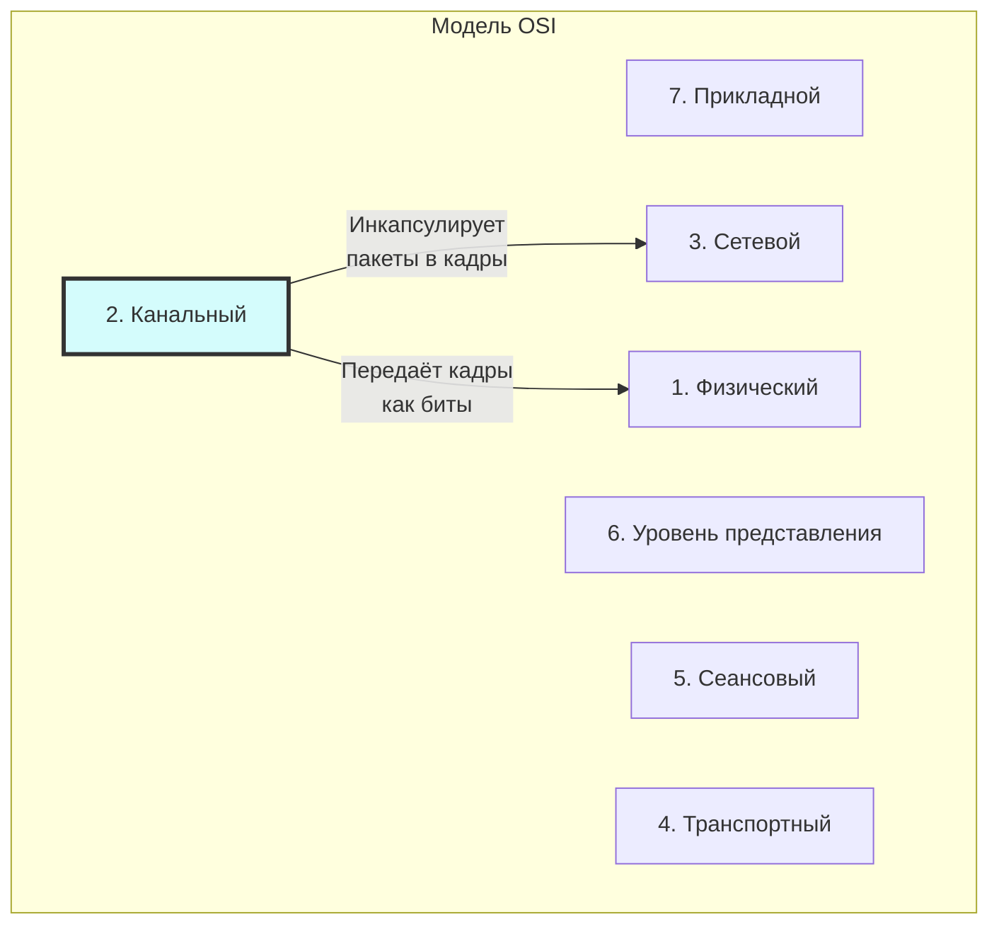
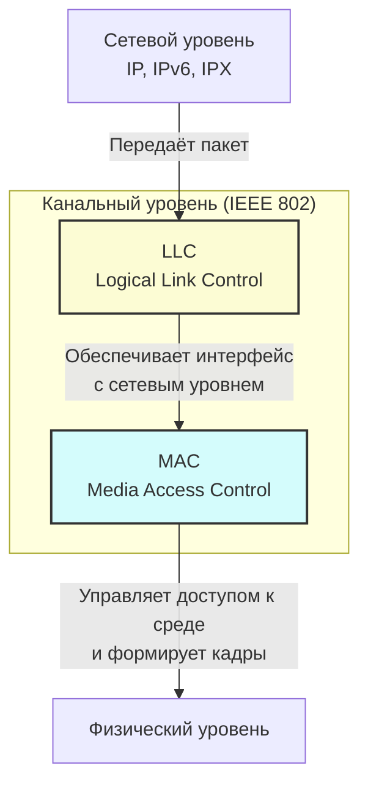
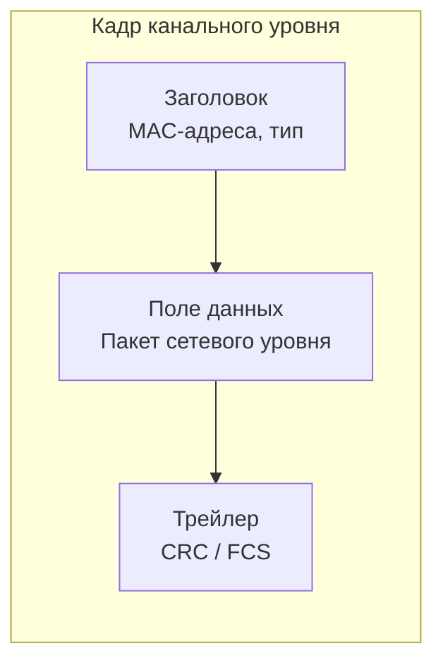

#канальный_уровень #функции_и_принципы #задачи_и_функции #обрамление #MAC #LLC
___
## Введение

Канальный уровень (Data Link Layer) - это второй уровень модели OSI, который служит мостом между физической средой передачи (биты) и сетевым уровнем (пакеты). Если физический уровень отвечает за передачу сырых битов из точки А в точку Б, то канальный уровень берёт на себя ответственность за то, чтобы эта передача была **надёжной** в пределах одного логического сегмента сети (например, в пределах одной локальной сети или одного физического канала)

Основная задача канального уровня - превратить ненадёжную, подверженную ошибкам физическую среду в канал, который вышележащий (сетевой) уровень может считать относительно надёжным. Для этого канальный уровень выполняет несколько критически важных функций: группирует биты в кадры, управляет доступом к общей среде, обнаруживает и исправляет ошибки, а также регулирует скорость передачи данных между быстрым отправителем и медленным получателем

Канальный уровень является **сетезависимым** - его реализация напрямую зависит от конкретной технологии (Ethernet, Wi-Fi, PPP). Однако общие принципы, которые мы рассмотрим в этой заметке, являются универсальными для всех этих технологий

---

## Место канального уровня в модели OSI

Канальный уровень принимает **пакеты** (PDU сетевого уровня) от вышележащего уровня, добавляет к ним свой заголовок и, возможно, трейлер, образуя **кадры** (frames), и передаёт их физическому уровню в виде потока битов. На принимающей стороне процесс обратный: физический уровень передаёт биты, канальный уровень собирает их в кадры, проверяет целостность, извлекает пакет и передаёт его сетевому уровню

---

## Основные функции канального уровня

Канальный уровень решает пять основных задач, которые делают возможной надёжную передачу данных по физической среде

### 1. Обрамление (Framing)

Физический уровень передаёт данные в виде непрерывного потока битов, не разделяя их на логические единицы. Задача канального уровня - выделить из этого потока границы отдельных сообщений (кадров) и передать их выше

- **Суть**: Добавление к данным специальных маркеров начала и конца кадра (флагов), а также служебных полей с информацией о длине кадра
- **Проблема**: Как отличить данные от управляющих маркеров? Для этого используются специальные методы, такие как **байтовое заполнение (byte stuffing)** и **битовое заполнение (bit stuffing)**
- **Результат**: Кадр - это логическая единица данных, которой оперирует канальный уровень. Кадр обычно состоит из заголовка (содержит адреса, тип протокола), поля данных (полезная нагрузка) и трейлера (контрольная сумма)

### 2. Физическая адресация (MAC-адресация)

В сетях с множеством устройств (например, Ethernet) необходимо точно указывать, кому именно предназначен кадр. Для этого канальный уровень использует **MAC-адреса** (Media Access Control address)

- **Формат**: MAC-адрес - это 48-битный (6-байтовый) идентификатор, уникальный для каждого сетевого интерфейса в мире. Первые 3 байта - это идентификатор производителя (OUI), последние 3 - уникальный номер устройства (NIC)
- **Назначение**: MAC-адрес используется для адресации в пределах одной локальной сети (broadcast domain). Коммутаторы используют MAC-адреса для принятия решений о том, на какой порт переслать кадр
- **Типы адресов**:
    - **Уникальный (Unicast)**: Адрес конкретного устройства
    - **Широковещательный (Broadcast)**: FF:FF:FF:FF:FF:FF - кадр доставляется всем устройствам в сети
    - **Многоадресный (Multicast)**: Кадр доставляется группе устройств, подписанных на этот адрес

### 3. Управление доступом к среде (Media Access Control — MAC)

Когда несколько устройств подключены к одной общей физической среде (например, витая пара в топологии «шина» или Wi-Fi-эфир), возникает проблема: кто и когда может передавать данные, чтобы не было коллизий? Эту задачу решает подуровень **MAC**

- **Методы доступа**: Существуют различные подходы:
    - **Случайный доступ** (Random Access): Устройства конкурируют за среду; при возникновении коллизий пытаются повторно передать данные. _Примеры: CSMA/CD (старый Ethernet), CSMA/CA (Wi-Fi)_
    - **Доступ с передачей маркера** (Token Passing): Специальный маркер циркулирует по кольцу; только владелец маркера имеет право на передачу. _Примеры: Token Ring, FDDI_
    - **С резервированием** (Reservation): Временные слоты заранее резервируются для каждого устройства. _Примеры: TDM в телефонных сетях_

### 4. Обнаружение и коррекция ошибок (Error Control)

Физическая среда подвержена помехам, наводкам и затуханию, которые могут исказить передаваемые биты (0 превращается в 1, и наоборот). Канальный уровень должен обеспечить целостность данных

- **Обнаружение ошибок**: Передатчик вычисляет контрольную сумму для данных кадра и помещает её в трейлер. Получатель пересчитывает контрольную сумму и сравнивает её с переданной. Если они не совпадают - кадр повреждён
    - _Наиболее распространённый метод_: **CRC (Cyclic Redundancy Check)** - очень надёжный математический алгоритм обнаружения ошибок
- **Коррекция ошибок**: В некоторых случаях канальный уровень может не только обнаружить, но и исправить ошибку, используя коды с коррекцией (например, **коды Хэмминга**). Однако это требует больших служебных накладных расходов, поэтому в большинстве сетей (Ethernet) канальный уровень **только обнаруживает** ошибки и отбрасывает повреждённые кадры, оставляя задачу повторной передачи вышележащим уровням (например, TCP на транспортном уровне)
- **ARQ (Automatic Repeat Request)**: В некоторых протоколах канального уровня (например, HDLC, PPP) реализован механизм, при котором получатель отправляет подтверждение (ACK), а при отсутствии подтверждения передатчик повторяет передачу

### 5. Управление потоком (Flow Control)

Если передатчик отправляет данные быстрее, чем получатель может их обработать (из-за ограничений буфера или скорости процессора), данные будут потеряны. Управление потоком предотвращает переполнение буфера получателя

- **Механизмы**:
    - **Остановка-и-ожидание (Stop-and-Wait)**: Отправитель передаёт один кадр и ждёт подтверждения от получателя. Только получив подтверждение, он отправляет следующий. Просто, но неэффективно (канал простаивает)
    - **Скользящее окно (Sliding Window)**: Отправитель может передавать несколько кадров подряд (в пределах окна), не дожидаясь подтверждения на каждый. Это позволяет более полно использовать пропускную способность канала
- **Важно**: Управление потоком работает на уровне **приёмника** (регулирует скорость, чтобы не завалить получателя), в то время как управление перегрузками (Congestion Control) работает на уровне **сети** (регулирует скорость, чтобы не перегрузить промежуточные узлы) и реализуется на транспортном уровне (TCP)

---

## Два подуровня: LLC и MAC

Стандарты IEEE 802 (к которым относятся Ethernet и Wi-Fi) разделяют канальный уровень на два подуровня. Это деление помогает отделить логику взаимодействия с сетевым уровнем (которая одинакова для всех технологий) от логики управления доступом к среде (которая зависит от конкретной технологии)

### LLC (Logical Link Control) - управление логическим каналом

- **Стандарт**: IEEE 802.2
- **Функции**:
    - Предоставляет единый интерфейс для сетевого уровня (IP, IPX, AppleTalk), скрывая особенности конкретной технологии канального уровня
    - Обеспечивает управление потоком и обнаружение ошибок (для тех технологий, где это не реализовано на MAC-подуровне)
    - Поддерживает различные режимы работы: с установкой соединения (connection-oriented) и без (connectionless)
- **Аналогия**: LLC играет роль драйвера, который говорит вышележащему уровню: «Неважно, что там внизу - Ethernet, Wi-Fi или что-то ещё; я передам твой пакет»

### MAC (Media Access Control) - управление доступом к среде

- **Стандарты**: IEEE 802.3 (Ethernet), IEEE 802.11 (Wi-Fi), IEEE 802.15 (Bluetooth/ZigBee) и др.
- **Функции**:
    - **Формирование кадра**: Добавление MAC-адресов отправителя и получателя, а также поля типа/длины
    - **Управление доступом**: Реализует конкретный метод доступа к среде (CSMA/CD для старых Ethernet, CSMA/CA для Wi-Fi)
    - **Обнаружение ошибок**: Добавление CRC-трейлера для проверки целостности кадра
- **Важно**: Именно на этом подуровне канальный уровень становится зависимым от физической среды. Каждый стандарт (802.3, 802.11) имеет свой формат кадра и свой метод доступа

---

## Инкапсуляция на канальном уровне

При передаче данных сверху вниз канальный уровень получает от сетевого уровня **пакет** (IP-пакет). Он инкапсулирует его, добавляя свой заголовок и трейлер

**Структура кадра (обобщённая)**:

_Примечание: В разных технологиях (Ethernet, Wi-Fi, PPP) поля кадра могут отличаться, но общая логика «Заголовок + Данные + Трейлер» сохраняется_

---

## Ключевое отличие от физического уровня

- **Физический уровень** просто передаёт поток битов из точки А в точку Б. Он не знает, где начинается и кончается кадр, и не заботится о том, что биты могут быть повреждены
- **Канальный уровень** организует биты в осмысленные блоки (кадры), снабжает их адресами, контрольными суммами и управляет доступом к среде. Он превращает «сырую» физическую среду в структурированный и полунадёжный канал для сетевого уровня

---

## Заключение

Канальный уровень - это фундаментальный «организатор» сетевого трафика на локальном уровне. Его функции можно свести к нескольким ключевым ролям:
1. **Организатор данных**: Группирует биты в кадры (Framing)
2. **Администратор адресов**: Использует MAC-адреса для идентификации устройств в локальной сети
3. **Регулировщик движения**: Управляет доступом к разделяемой среде (MAC), чтобы избежать хаоса и коллизий
4. **Контролёр качества**: Обнаруживает (и иногда исправляет) ошибки, возникшие при передаче
5. **Дипломат**: С помощью LLC-подуровня договаривается с сетевым уровнем, а с помощью MAC-подуровня - с физическим

Понимание этих функций является основой для изучения конкретных технологий - Ethernet, Wi-Fi, PPP - которые мы разберём в следующих заметках. Каждая из них реализует эти абстрактные функции по-своему, подстраиваясь под требования среды (проводная, беспроводная, точка-точка)