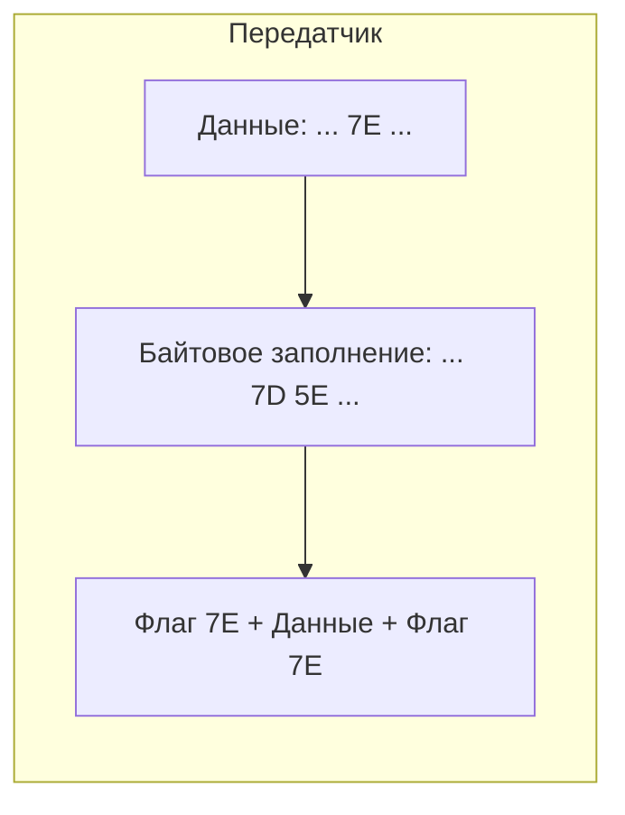
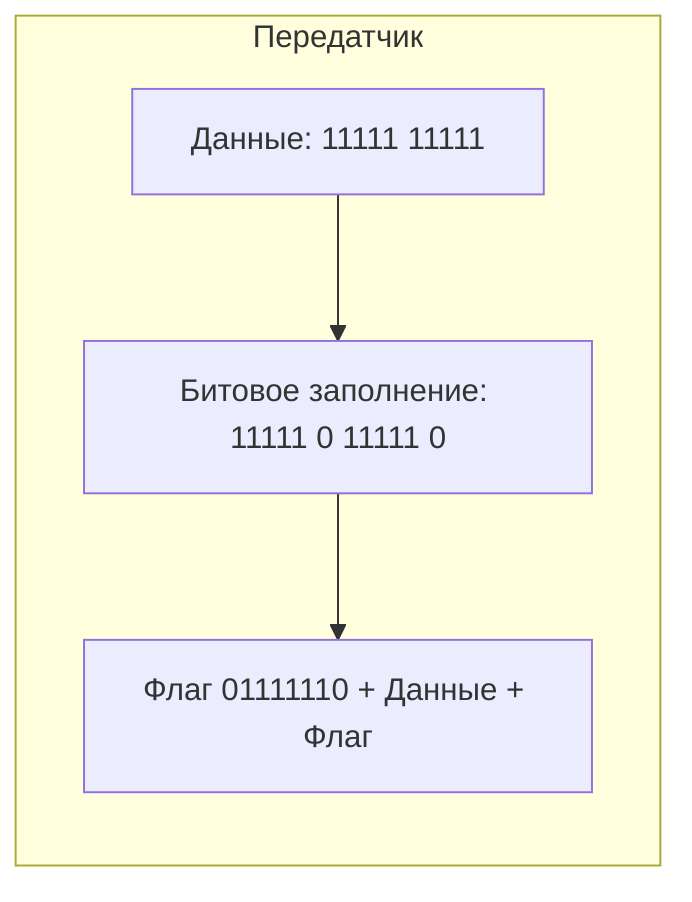
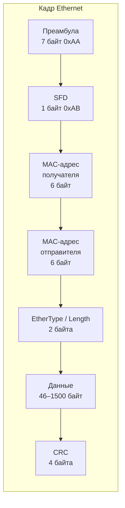
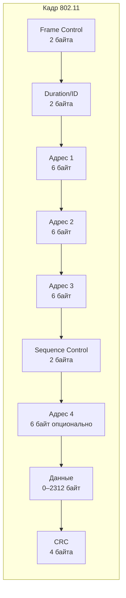
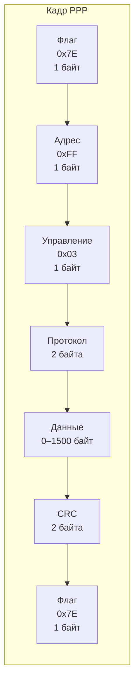

#канальный_уровень #функции_и_принципы #обрамление #кадр #etehrnet #wifi #PPP #байтовый_подсчёт #байтовое_заполнение #битовое_заполнение #физические_маркеры
___
## Введение

Физический уровень передаёт данные в виде непрерывного потока битов. Он не знает, где заканчивается одно сообщение и начинается другое. Для получателя этот поток - просто хаотичная последовательность единиц и нулей, пока он не сможет выделить из него осмысленные блоки

**Обрамление (framing)** - это процесс разделения битового потока на логические блоки, называемые **кадрами (frames)**. Каждый кадр содержит адреса, данные и контрольную информацию, а также маркеры, указывающие его начало и конец

Без обрамления получатель не смог бы отличить, где заканчиваются данные одного сообщения и начинаются данные другого. Это привело бы к ошибкам интерпретации и потере информации. Обрамление - это первая и важнейшая функция канального уровня, без которой все остальные его функции (адресация, контроль ошибок) были бы бессмысленны

---

## Зачем нужно обрамление?

Обрамление решает несколько ключевых задач:
1. **Синхронизация получателя**: Определение границ кадров позволяет получателю правильно интерпретировать биты
2. **Обнаружение ошибок**: Проверка контрольной суммы (CRC) возможна только на уровне целого кадра
3. **Адресация**: MAC-адреса отправителя и получателя должны быть привязаны к конкретному кадру
4. **Управление потоком**: Подтверждения (ACK) и управляющие кадры должны идентифицироваться как отдельные сообщения

---

## Основные методы обрамления

Существует несколько методов, позволяющих выделить кадры из потока битов. Каждый из них имеет свои преимущества и недостатки и используется в различных технологиях.

### Байтовый подсчёт (Byte Count / Character Count)

- **Принцип**: В заголовке кадра указывается количество байт (или символов) в этом кадре. Получатель отсчитывает указанное число байт от начала кадра - и получает следующий кадр
- **Схема**:
```text
| Длина (1 байт) | Данные (N байт) | Длина (след. кадра) | ...
```
- **Преимущества**: Простота реализации, высокая эффективность (нет накладных расходов на маркеры)
- **Недостатки**: Если в поле длины произойдёт ошибка (например, из-за помехи), получатель потеряет синхронизацию, и все последующие кадры будут интерпретированы неверно. Восстановить синхронизацию можно только после перезапуска соединения
- **Применение**: Используется в некоторых протоколах, но крайне редко из-за высокой уязвимости к ошибкам. Пример - протокол DDCMP (Digital Data Communications Message Protocol)

---

### Байтовое заполнение (Byte Stuffing) / Флаги с заполнением

- **Принцип**: Каждый кадр начинается и заканчивается специальным управляющим символом - **флагом (flag)** (например, `0x7E` в протоколе HDLC/PPP). Чтобы данные внутри кадра не были ошибочно интерпретированы как флаг, используется **байтовое заполнение (byte stuffing)**: все вхождения флага (или другого управляющего символа) в данных заменяются на двухбайтовую последовательность (обычно ESC (escape) + исходный символ). На приёмной стороне эта последовательность обратно преобразуется в исходный символ
- **Схема**:
```text
| Флаг | Данные (с заполнением) | Флаг |
```
- **Пример (PPP, ISO HDLC)**:
    - Флаг: `0x7E` (01111110)
    - ESC-символ: `0x7D` (01111101)
    - Правила заполнения:
        - `0x7E` в данных → `0x7D 0x5E`
        - `0x7D` в данных → `0x7D 0x5D`
- **Преимущества**: Простота восстановления синхронизации - даже если кадр потерян, получатель может найти следующий флаг в потоке
- **Недостатки**: Накладные расходы, так как каждый управляющий символ в данных заменяется на два байта. Максимальный размер кадра также может быть ограничен
- **Применение**: PPP (Point-to-Point Protocol), HDLC (High-Level Data Link Control)
- **Иллюстрация**:



---

### Битовое заполнение (Bit Stuffing)

- **Принцип**: Вместо байтового флага используется специальная битовая последовательность (например, `01111110` - 6 единиц подряд). Чтобы данные внутри кадра случайно не содержали эту последовательность, передатчик автоматически вставляет **нулевой бит** после каждых пяти подряд идущих единиц в данных. Получатель обнаруживает пять подряд идущих единиц и удаляет следующий за ними нулевой бит (если после него следует 0) или распознаёт флаг (если после пяти единиц следует 1)
- **Правило**:
    - Передатчик: после пяти единиц → вставить 0
    - Получатель: если видит пять единиц:
        - Если следующий бит = 0 → удалить его (это был вставленный бит)
        - Если следующий бит = 1 → это флаг (`01111110`)
- **Пример**:
    - Исходные данные: `11111 11111`
    - После битового заполнения: `11111 0 11111 0`
    - Получатель удаляет нули: `11111 11111`
- **Преимущества**: Более эффективно, чем байтовое заполнение, так как накладные расходы составляют в среднем 1 бит на 32 бита данных (при случайных данных). Также проще реализуется в аппаратуре
- **Недостатки**: Требует точной синхронизации битов
- **Применение**: HDLC, CAN (Controller Area Network), некоторые варианты PPP, SDLC
- **Иллюстрация**:



---

### Физические маркеры (Physical Layer Coding Violations)

- **Принцип**: В некоторых технологиях кодирования (например, Manchester) используются запрещённые комбинации сигналов (нарушения кода) для обозначения начала и конца кадра
- **Пример (10Base-T Ethernet)**: Использует манчестерское кодирование, где 1 кодируется переходом 1→0, а 0 - переходом 0→1. Последовательность, в которой два перехода идут подряд без смены уровня (например, 1→0→1→0 → «отсутствие перехода» в середине бита), является нарушением кода и используется как маркер начала кадра (preamble и SFD)
- **Преимущества**: Нет накладных расходов на байтовое или битовое заполнение
- **Недостатки**: Применимо только к определённым методам кодирования
- **Применение**: Ethernet (использовалось в ранних реализациях, но для выделения кадров Ethernet использует комбинацию методов, включая преамбулу)

---

## Сравнение методов обрамления

|Метод|Накладные расходы|Простота синхронизации|Устойчивость к ошибкам|Применение|
|---|---|---|---|---|
|**Байтовый подсчёт**|Минимальные|Низкая (потеря синхронизации)|Низкая (ошибка в поле длины)|DDCMP|
|**Байтовое заполнение**|Средние (зависит от данных)|Высокая (поиск флага)|Средняя|PPP, HDLC|
|**Битовое заполнение**|Низкие (~3%)|Высокая|Высокая|HDLC, CAN, SDLC|
|**Физические маркеры**|Нулевые|Высокая|Средняя|Ethernet (ранний)|

---

## Форматы кадров в реальных протоколах

### Кадр Ethernet II (DIX Ethernet)

Самый распространённый формат кадра в современных сетях:



- **Преамбула**: 7 байт, состоящих из чередующихся 1 и 0 (`10101010...`). Используется для синхронизации тактовой частоты приёмника
- **SFD** (Start of Frame Delimiter): 1 байт (`10101011`). Указывает на начало кадра
- **MAC-адреса**: 6 байт каждый
- **EtherType / Length**: 2 байта. Если значение ≤ 1500, это длина данных. Если ≥ 1536, это тип протокола (например, 0x0800 = IPv4)
- **Данные**: От 46 до 1500 байт (если данных меньше 46, добавляется заполнение - padding)
- **CRC**: 4 байта для контроля целостности кадра (FCS - Frame Check Sequence)

### Кадр 802.11 (Wi-Fi)

Имеет дополнительный заголовок и управляющие поля:



_Здесь используется до 4 различных MAC-адресов для указания отправителя, получателя, точки доступа и т.д._

### Кадр PPP (Point-to-Point Protocol)

Для протоколов точка-точка:



_Использует байтовое заполнение (флаг 0x7E)_

---

## Практическое значение: как браузер видит кадр?

Когда вы открываете веб-страницу, ваш браузер (прикладной уровень) формирует HTTP-запрос. Этот запрос инкапсулируется в TCP-сегмент (транспортный уровень), затем в IP-пакет (сетевой уровень), и наконец - в кадр Ethernet (канальный уровень). Кадр передаётся физическому уровню

**Если посмотреть на этот кадр через сниффер (например, Wireshark):**

```text
| Преамбула | SFD | MAC-адрес получателя | MAC-адрес отправителя | Тип: IPv4 | IP-пакет | CRC |
```

Таким образом, даже не заглядывая в содержимое IP-пакета, канальный уровень может определить, кому принадлежит кадр и не повреждён ли он

---

## Заключение

Обрамление - это фундаментальный механизм, который превращает хаотичный поток битов в структурированные кадры. Без него адресация, контроль ошибок и управление доступом к среде были бы невозможны

**Ключевые выводы:**
1. **Обрамление решает задачу синхронизации** и выделения логических блоков данных
2. Существует несколько методов, **каждый со своими компромиссами** между эффективностью, сложностью и устойчивостью к ошибкам
3. **Байтовое заполнение** (флаги + ESC) просто в реализации, но имеет накладные расходы
4. **Битовое заполнение** (вставка нулевого бита) эффективнее и широко используется в HDLC и CAN
5. **Физические маркеры** (нарушения кода) применяются в Ethernet для указания начала кадра
6. В реальных сетях (Ethernet, Wi-Fi, PPP) используются **комбинации методов** — например, в Ethernet физическая преамбула и SFD указывают начало, а внутри кадра используется CRC для проверки целостности

Понимание обрамления помогает осознать, как «сырой» битовый поток превращается в адресуемые и контролируемые блоки данных, которые затем обрабатываются вышележащими уровнями