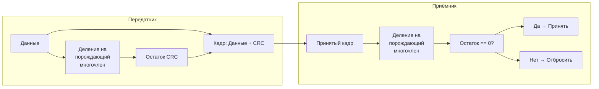

#канальный_уровень #функции_и_принципы #обнаружение_и_коррекция_ошибок #одиночная_ошибка #пакетная_ошибка #код_с_контролем_чётности #контрольная_сумма #циклический_избыточный_код #код_Хэмминга #свёрточный_код #код_Витерби #блочный_код #crc
___
## Введение

Физическая среда передачи данных не идеальна. Помехи, наводки, затухание сигнала, переходные процессы и другие факторы приводят к тому, что биты могут искажаться: 0 превращается в 1, а 1 - в 0. Такие искажения называются **битовыми ошибками**

Канальный уровень должен обеспечить целостность передаваемых данных. Для этого он использует **коды с обнаружением и исправлением ошибок** (error-detecting and error-correcting codes). Эти коды добавляют к данным избыточную информацию, которая позволяет получателю проверить, не были ли данные повреждены, а в некоторых случаях - восстановить исходные данные без повторной передачи

В этой заметке мы рассмотрим основные методы обнаружения и коррекции ошибок, их принципы работы, преимущества и недостатки, а также практическое применение в сетевых технологиях

---

## Типы ошибок и их характеристики

Прежде чем рассматривать методы борьбы с ошибками, важно понять, какие типы ошибок могут возникать

### Одиночная ошибка (Single-bit error)

- **Определение**: Искажается только один бит в кадре
- **Причина**: Кратковременный импульсный шум, переходной процесс
- **Вероятность**: В большинстве сред (например, в оптоволокне) одиночные ошибки редки, но в беспроводных каналах встречаются

### Пакетная ошибка (Burst error)

- **Определение**: Искажается несколько бит подряд (от 2 до сотен), причём они могут быть как соседними, так и разнесёнными, но принадлежать одному и тому же блоку данных
- **Причина**: Длительные помехи, затухание, многолучевое распространение в беспроводных сетях
- **Особенность**: Пакетные ошибки гораздо более распространены в реальных каналах, чем одиночные, и для их обнаружения требуются более мощные коды

---

## Обнаружение ошибок

Обнаружение ошибок - это процесс определения того, произошло ли искажение данных. Если ошибка обнаружена, канальный уровень обычно отбрасывает повреждённый кадр и, возможно, запрашивает повторную передачу (если протокол поддерживает ARQ - Automatic Repeat Request)

### Код с контролем чётности (Parity Check)

- **Принцип**: К данным добавляется один бит (бит чётности), который делает общее количество единиц в кадре чётным (или нечётным)
- **Типы**:
    - **Чётный бит (even parity)**: Количество единиц в кадре (включая бит чётности) должно быть чётным
    - **Нечётный бит (odd parity)**: Количество единиц должно быть нечётным
- **Обнаруживающая способность**: Обнаруживает только **нечётное** число ошибок (1, 3, 5...). Если искажены 2 бита, чётность не изменится, и ошибка останется незамеченной
- **Применение**: Используется в простых последовательных интерфейсах (RS-232), в некоторых старых протоколах. В современных сетях - редко, так как слишком слабый

### Контрольная сумма (Checksum)

- **Принцип**: Данные разбиваются на слова (например, 16-битные), все слова суммируются (как целые числа), и результат (или его дополнение до единицы) добавляется в конец кадра. Получатель повторяет вычисление и сравнивает с переданной контрольной суммой
- **Пример (Internet Checksum)**: Используется в протоколах TCP, UDP, IP. Вычисляется как 16-битное дополнение до единицы от суммы всех 16-битных слов заголовка и данных
- **Обнаруживающая способность**: Обнаруживает большинство ошибок, но не все (например, ошибки, которые не меняют сумму). Относительно слабая, но простая в реализации
- **Применение**: Протоколы транспортного и сетевого уровней (не канального, но это хороший пример)

### Циклический избыточный код (CRC — Cyclic Redundancy Check)

- **Принцип**: CRC - это мощный метод обнаружения ошибок, основанный на делении двоичных многочленов. Передатчик рассматривает данные как один большой двоичный многочлен и делит его на заранее заданный **порождающий многочлен** (generator polynomial). Остаток от деления (CRC-код) добавляется в конец кадра. Получатель выполняет то же деление и проверяет остаток: если он равен нулю - ошибок нет, иначе - кадр повреждён
- **Стандартные порождающие многочлены**:
    - CRC-8: `x⁸ + x² + x + 1`
    - CRC-16: `x¹⁶ + x¹⁵ + x² + 1`
    - CRC-32: `x³² + x²⁶ + x²³ + x²² + x¹⁶ + x¹² + x¹¹ + x¹⁰ + x⁸ + x⁷ + x⁵ + x⁴ + x² + x + 1` (используется в Ethernet, ZIP, PNG)
    - CRC-64: Используется в некоторых файловых системах
- **Обнаруживающая способность**:
    - Обнаруживает **все** одиночные и двойные ошибки (если порождающий многочлен имеет более одного члена)
    - Обнаруживает все ошибки нечётной кратности (если порождающий многочлен содержит множитель `(x+1)`)
    - Обнаруживает все пакетные ошибки длиной ≤ r, где r - степень порождающего многочлена (для CRC-32 это 32 бита)
- **Применение**: Широко используется в Ethernet (CRC-32), Wi-Fi, PPP, HDLC, в архиваторах, в дисковых контроллерах

---

## Коррекция ошибок

Обнаружение ошибок - это хорошо, но если кадр повреждён, его нужно либо пересылать заново, либо, что лучше, **исправить** ошибку на месте без повторной передачи. Коррекция ошибок позволяет восстановить исходные данные, если число искажённых бит не превышает некоторый порог

Основной метод коррекции ошибок - **коды с коррекцией ошибок** (Forward Error Correction, FEC). Они добавляют достаточную избыточность, чтобы получатель мог не только обнаружить, но и исправить ошибки

### Коды Хэмминга (Hamming Codes)

- **Принцип**: Код Хэмминга добавляет несколько контрольных бит (бит чётности) к данным, размещая их в позициях, которые являются степенями двойки (1, 2, 4, 8...). Каждый контрольный бит охватывает определённый набор позиций данных. Получатель вычисляет синдром (набор контрольных бит), который указывает точное местоположение ошибочного бита
- **Классический код Хэмминга (7,4)**: 4 бита данных + 3 контрольных бита = 7 бит. Может исправить одну одиночную ошибку (и обнаружить двойную, если добавить ещё один бит чётности - расширенный код Хэмминга)
- **Обобщение**: Для данных длиной `m` бит требуется `r` контрольных бит, таких что `2^r ≥ m + r + 1`. Код (n, k) может исправить `t` ошибок, если `2^r ≥ Σ_{i=0}^t C(n, i)`
- **Применение**: В компьютерных сетях коды Хэмминга используются редко (из-за избыточности), но широко применяются в памяти ECC (Error-Correcting Code RAM) и в некоторых беспроводных протоколах. В основном канальный уровень предпочитает более эффективные свёрточные и турбо-коды

### Свёрточные коды и коды Viterbi

- **Принцип**: Свёрточный код - это непрерывный код, который преобразует входную последовательность бит в более длинную выходную последовательность, добавляя избыточность с использованием сдвиговых регистров и логических элементов XOR. Декодирование выполняется с помощью алгоритма Витерби, который находит наиболее вероятную исходную последовательность
- **Эффективность**: Может исправлять множество ошибок при умеренной избыточности (обычно скорость кодирования 1/2 или 2/3)
- **Применение**: Широко используется в беспроводных системах (Wi-Fi, сотовые сети 3G/4G), в спутниковой связи

### Блочные коды (Reed-Solomon, LDPC, Turbo)

- **Reed-Solomon (RS)**: Широко используется в CD, DVD, QR-кодах, спутниковой связи, DSL. Может исправлять пакетные ошибки
- **LDPC (Low-Density Parity-Check)**: Очень мощные коды, приближающиеся к пределу Шеннона. Используются в Wi-Fi (802.11n/ac), 5G, DVB-S2
- **Turbo-коды**: Используются в 3G/4G, спутниковой связи

---

## Почему на канальном уровне обычно только обнаруживают ошибки?

В большинстве сетевых технологий (особенно Ethernet) канальный уровень **не исправляет ошибки**, а только **обнаруживает** их и отбрасывает повреждённые кадры. Причины:
1. **Избыточность**: Коды с коррекцией требуют значительно больше избыточности (обычно 20–50% накладных расходов), что снижает полезную пропускную способность
2. **Сложность**: Декодирование кодов с коррекцией требует значительных вычислительных ресурсов, что замедляет работу сетевых устройств
3. **Лучше на более высоком уровне**: Повторная передача обычно выполняется на транспортном уровне (TCP), который более эффективно работает с потерями, так как может адаптироваться к загрузке сети
4. **Историческая традиция**: Ethernet был спроектирован так, чтобы быть быстрым и дешёвым, поэтому коррекцию ошибок оставили для более высоких уровней

Тем не менее, в некоторых технологиях (например, Wi-Fi, спутниковые каналы, где ошибки часты) коррекция ошибок применяется на канальном уровне, чтобы снизить количество повторных передач и улучшить эффективность

---

## Сравнение методов обнаружения и коррекции

|Метод|Тип|Избыточность|Обнаруживающая/исправляющая способность|Применение|
|---|---|---|---|---|
|**Parity check**|Обнаружение|1 бит на кадр|Обнаруживает нечётное число ошибок|RS-232|
|**Checksum**|Обнаружение|16–32 бит|Обнаруживает большинство ошибок|TCP, UDP, IP|
|**CRC-32**|Обнаружение|32 бита|Обнаруживает все одиночные, двойные, пакетные ошибки до 32 бит|Ethernet, Wi-Fi, PPP|
|**Hamming (7,4)**|Коррекция|~43%|Исправляет 1 ошибку|ECC-память|
|**Convolutional + Viterbi**|Коррекция|~50–100%|Исправляет множество ошибок (в зависимости от скорости)|Wi-Fi, сотовые сети|
|**Reed-Solomon**|Коррекция|~20–50%|Исправляет пакетные ошибки|CD, DSL, DVB|
|**LDPC**|Коррекция|~10–30%|Приближается к пределу Шеннона|Wi-Fi 6, 5G|

---

## Реализация CRC на низком уровне (концептуальный пример)

Для программиста понимание CRC важно, так как он часто используется в драйверах устройств, сетевых протоколах и файловых системах

**Пример вычисления CRC-32 на C (упрощённо):**

```c
#include <stdint.h>

uint32_t crc32(const uint8_t *data, size_t len)
{
    uint32_t crc = 0xFFFFFFFF;
    for (size_t i = 0; i < len; i++)
    {
        crc ^= data[i];
        for (int j = 0; j < 8; j++)
        {
            if (crc & 1) crc = (crc >> 1) ^ 0xEDB88320;
            else crc >>= 1;
        }
    }
    return ~crc;
}
```

_Этот код вычисляет CRC-32 с порождающим многочленом, используемым в Ethernet и ZIP. На практике используются табличные методы для ускорения_

---

## Схема работы обнаружения ошибок (CRC)



---

## Заключение

Обнаружение и коррекция ошибок - это критически важные механизмы, обеспечивающие надёжность передачи данных по неидеальным каналам

**Ключевые выводы:**
1. **Обнаружение ошибок** - это минимально необходимая функция канального уровня. Она позволяет выявить повреждённые кадры и отбросить их, не передавая выше
2. **CRC** - наиболее распространённый и надёжный метод обнаружения ошибок в компьютерных сетях. Он обеспечивает высокую степень обнаружения при умеренных накладных расходах (32 бита на кадр)
3. **Коррекция ошибок** - мощный, но ресурсоёмкий метод. В большинстве проводных сетей (Ethernet) он не применяется на канальном уровне, но широко используется в беспроводных и спутниковых системах, где ошибки часты
4. **Выбор метода** - это компромисс между избыточностью, вычислительной сложностью и требуемой надёжностью
5. **Принцип сквозной надёжности**: Канальный уровень обеспечивает базовую защиту, но полная гарантия доставки достигается только на транспортном уровне (TCP), который использует повторные передачи

Понимание этих механизмов необходимо для разработки сетевых протоколов, диагностики проблем и оптимизации производительности сетей