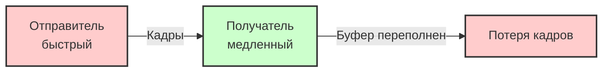
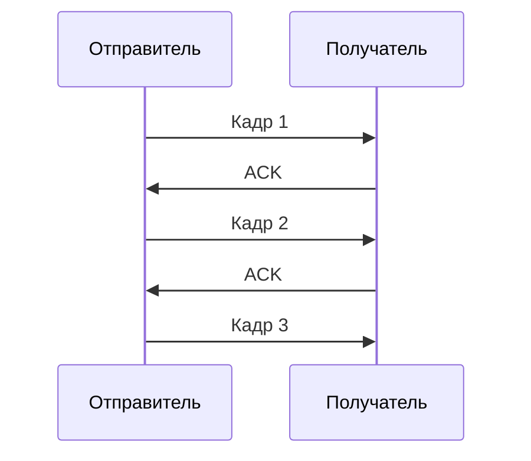
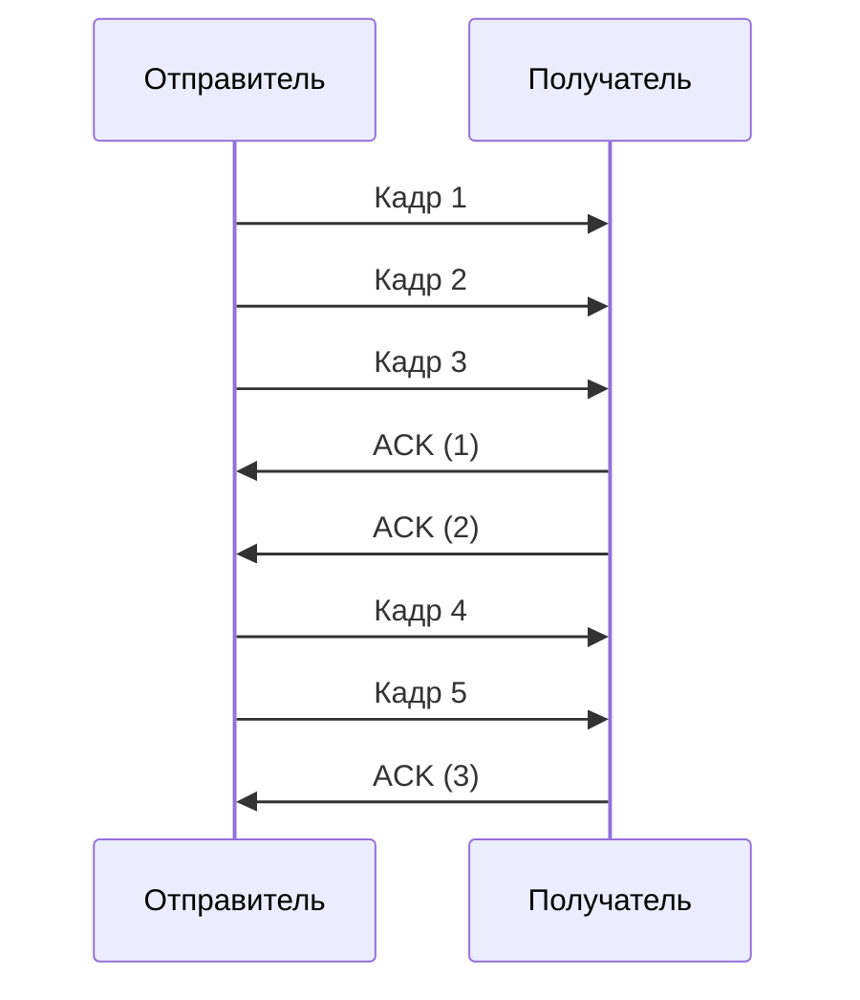

#канальный_уровень #функции_и_принципы #управление_потоком #остановка_и_ожидание #скользящее_окно #HDLC #PPP #Ethernet #TCP #PAUSE_кадры
___
## Введение

Передатчик может отправлять данные быстрее, чем получатель способен их обрабатывать. Это может произойти из-за ограниченного размера буфера получателя, низкой скорости его процессора или занятости другими задачами. Если получатель не будет успевать принимать кадры, буфер переполнится, и новые кадры будут потеряны

**Управление потоком (flow control)** - это механизм, который регулирует скорость передачи данных между отправителем и получателем, чтобы предотвратить переполнение буфера получателя. В отличие от **управления перегрузками (congestion control)**, которое заботится о состоянии сети (перегружены ли маршрутизаторы), управление потоком решает проблему «медленного» получателя на уровне канального или транспортного уровня

На канальном уровне управление потоком реализуется с помощью двух основных подходов: **остановка-и-ожидание (stop-and-wait)** и **скользящее окно (sliding window)**. Эти механизмы широко используются в протоколах канального уровня (например, HDLC, PPP) и, с некоторыми модификациями, на транспортном уровне (TCP)

---

## Проблема: передатчик быстрее получателя

Представьте, что отправитель способен генерировать кадры со скоростью 100 кадров/с, а получатель может обрабатывать только 10 кадров/с. Если отправитель не будет замедляться, буфер получателя переполнится, и часть кадров будет потеряна. Управление потоком позволяет синхронизировать эти скорости



---

## Механизмы управления потоком

### Остановка-и-ожидание (Stop-and-Wait)

Это самый простой метод управления потоком:
- **Принцип**: Отправитель передаёт один кадр и **останавливается**, ожидая подтверждения (ACK) от получателя. Только получив ACK, он отправляет следующий кадр
- **Преимущества**: Простота реализации, минимальные накладные расходы (не нужны номера кадров, достаточно одного бита для указания, какой кадр подтверждается)
- **Недостатки**: Низкая эффективность использования канала, особенно на линиях с большой задержкой (например, спутниковых). Канал простаивает, пока отправитель ждёт подтверждения
- **Применение**: Используется в некоторых протоколах канального уровня (например, в упрощённых реализациях), а также в некоторых транспортных протоколах (но не в TCP)

**Схема работы Stop-and-Wait:**



_Время простоя между отправкой кадра и получением ACK - это время, когда канал не используется_

---

### Скользящее окно (Sliding Window)

Этот метод позволяет отправлять несколько кадров без ожидания подтверждения на каждый из них, что значительно повышает эффективность использования канала:
- **Принцип**: Отправитель может передавать до `W` кадров подряд (размер окна), не дожидаясь подтверждения. Получатель отправляет подтверждения, которые «сдвигают» окно, позволяя передавать новые кадры
- **Размер окна**:
    - **Окно отправителя**: Максимальное количество кадров, которое можно отправить без подтверждения
    - **Окно получателя**: Максимальное количество кадров, которое получатель может принять и буферизировать для обработки
- **Нумерация кадров**: Каждый кадр имеет порядковый номер (обычно в диапазоне 0..2^n - 1, где n — количество бит в поле номера). Это позволяет получателю идентифицировать кадры и упорядочивать их
- **Управление потоком**: Получатель может регулировать размер окна отправителя, отправляя специальные управляющие кадры (например, в TCP это поле `Window` в заголовке)
- **Преимущества**: Значительно более эффективное использование канала, особенно на линиях с высокой пропускной способностью и задержкой (Bandwidth-Delay Product)
- **Недостатки**: Более сложная реализация, требует буферизации и обработки номеров кадров, возможны проблемы с дублированием и потерей кадров (требуются таймеры и повторные передачи)

**Схема работы Sliding Window:**



_Отправитель может отправлять несколько кадров без подтверждения. Окно сдвигается по мере получения подтверждений_

---

## Примеры протоколов с управлением потоком

### Канальный уровень

- **HDLC (High-Level Data Link Control)**: Использует скользящее окно (по умолчанию размер 7 или 127 кадров) с порядковыми номерами (3 или 7 бит). Поддерживает как полудуплексные, так и полнодуплексные соединения
- **PPP (Point-to-Point Protocol)**: Обычно использует упрощённое управление потоком (на основе остановки-и-ожидания), хотя в некоторых реализациях поддерживает скользящее окно
- **Ethernet**: На канальном уровне Ethernet **не использует управление потоком** (кадры просто передаются без подтверждений). Управление потоком в Ethernet реализуется на более высоких уровнях (например, TCP) или с помощью специальных управляющих кадров (PAUSE-кадры в протоколе 802.3x для полнодуплексного режима)

### Транспортный уровень

- **TCP**: Использует скользящее окно с динамическим размером, который адаптируется к пропускной способности и задержке (механизм управления потоком + управления перегрузками). Размер окна указывается в заголовке TCP и может изменяться в процессе передачи

---

## Разница между управлением потоком и управлением перегрузками

Эти два понятия часто путают, но они решают разные задачи:

|Характеристика|**Управление потоком**|**Управление перегрузками**|
|---|---|---|
|**Цель**|Предотвратить переполнение буфера получателя|Предотвратить перегрузку сети (маршрутизаторов, каналов)|
|**Кто регулирует**|Получатель (указывает, сколько данных может принять)|Сеть (по сигналам о потерях, задержках)|
|**Механизм**|Размер окна, подтверждения|Алгоритмы (например, Slow Start, Congestion Avoidance в TCP)|
|**Реализация**|Канальный уровень (иногда транспортный)|Транспортный уровень (TCP)|
|**Пример**|Поле `Window` в TCP|Алгоритм Reno, CUBIC в TCP|

---

## Управление потоком в Ethernet: PAUSE-кадры

В полнодуплексном Ethernet управление потоком реализовано с помощью специальных управляющих кадров **PAUSE**. Когда получатель чувствует, что его буфер переполняется, он отправляет отправителю PAUSE-кадр, указывая, на сколько времени (в единицах 512 битовых интервалов) приостановить передачу. Отправитель, получив PAUSE, прекращает отправку на указанное время. Это позволяет синхронизировать скорости в локальных сетях, хотя на практике управление потоком чаще делегируется TCP

---

## Сравнение Stop-and-Wait и Sliding Window

|Характеристика|**Stop-and-Wait**|**Sliding Window**|
|---|---|---|
|**Количество кадров в пути**|1|W (до размера окна)|
|**Эффективность на линиях с высокой задержкой**|Низкая (канал простаивает)|Высокая (заполняет канал)|
|**Сложность реализации**|Простая|Средняя/Высокая|
|**Накладные расходы**|Минимальные|Требуется нумерация кадров|
|**Устойчивость к потерям**|Простая (таймаут, повторная передача одного кадра)|Сложная (требует управления таймерами и повторами)|
|**Применение**|Простые протоколы, низкоскоростные каналы|Большинство современных протоколов (HDLC, TCP)|

---

## Практическая реализация (концептуальный пример)

Для программиста управление потоком часто реализуется на уровне сокетов (например, в TCP). Однако на канальном уровне драйверы могут реализовывать простые механизмы

**Пример (псевдокод) для Stop-and-Wait:**

```c
void send_frame(byte *data, size_t len)
{
    while (true)
    {
        send_to_physical(data, len);
        if (wait_for_ack(timeout))
        {
            break; // ACK получен, выходим из цикла
        }
        else
        {
            // Таймаут, повторная передача
            continue;
        }
    }
}
```

**Пример (псевдокод) для Sliding Window (упрощённо):**

```c
#define WINDOW_SIZE 4
int base = 0, next_seq = 0;
while (next_seq < total_frames)
{
    while (next_seq < base + WINDOW_SIZE && next_seq < total_frames)
    {
        send_frame(next_seq);
        next_seq++;
    }
    if (ack_received(ack_seq))
    {
        base = ack_seq + 1;
    }
    else
    {
        // Таймаут, повторная передача кадров от base до next_seq-1
    }
}
```

---

## Заключение

Управление потоком - это критически важный механизм канального уровня, который предотвращает потерю данных из-за переполнения буфера получателя. Оно обеспечивает синхронизацию между быстрым отправителем и медленным получателем, что особенно важно на линиях с большими задержками или в системах с разными вычислительными мощностями

**Ключевые выводы:**
1. **Управление потоком** решает проблему «медленного получателя» путём регулирования скорости отправки
2. Два основных метода: **Stop-and-Wait** (простой, но неэффективный) и **Sliding Window** (эффективный, но более сложный)
3. В современных сетях канальный уровень чаще использует **скользящее окно** (HDLC, PPP), а Ethernet применяет управление потоком только в виде PAUSE-кадров
4. Управление потоком **не следует путать** с управлением перегрузками - это разные механизмы, хотя в TCP они реализованы совместно
5. Выбор метода зависит от характеристик канала (задержка, надёжность) и требований к производительности

В следующих заметках мы перейдём к методам доступа к среде, где управление потоком также играет важную роль, но в контексте конкурентного доступа к общей среде