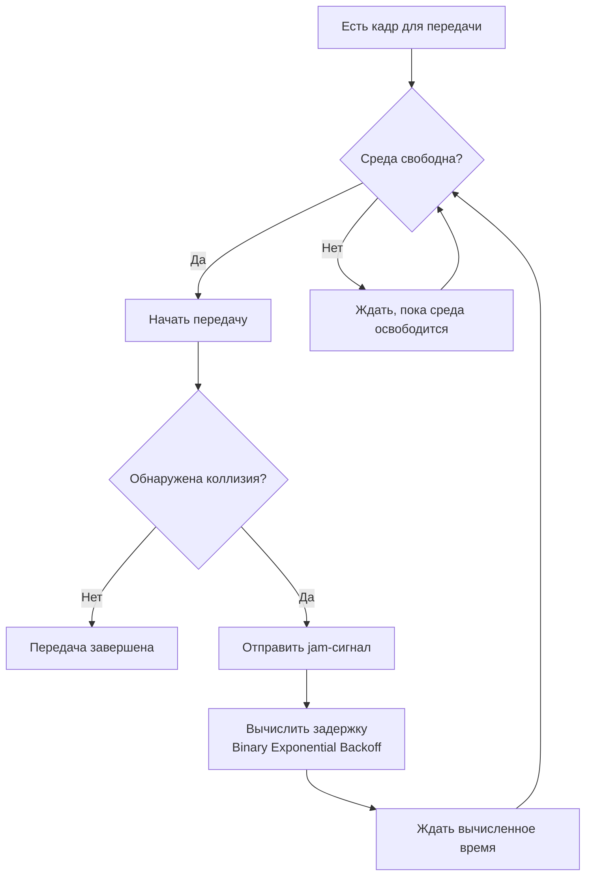

#канальный_уровень #методы_доступа_к_среде #CSMA_CD #прослушивание_несущей #множественный_доступ #обнаружение_коллизий #SLOT_TIME #двоичая_экспоненциальная_задержка #CSMA_CA
___
## Введение

**CSMA/CD (Carrier Sense Multiple Access with Collision Detection)** - это метод доступа к среде, который долгое время был основой технологии Ethernet. Он определяет, как несколько устройств, подключённых к общей среде передачи (например, коаксиальному кабелю или концентратору), могут совместно использовать её, минимизируя потери от коллизий

CSMA/CD был стандартизирован в рамках **IEEE 802.3** и использовался в полудуплексных сетях Ethernet начиная с первых реализаций (10BASE-5, 10BASE-2, 10BASE-T с концентраторами). Хотя в современных коммутируемых сетях с полным дуплексом CSMA/CD практически не используется, его понимание критически важно для осознания эволюции сетевых технологий и принципов работы разделяемых сред

В этой заметке мы подробно разберём, как работает CSMA/CD, какие механизмы он использует для обнаружения и разрешения коллизий, и почему он уступил место коммутируемому Ethernet
___

## Основные принципы CSMA/CD

Аббревиатура CSMA/CD расшифровывается следующим образом:
- **Carrier Sense (Прослушивание несущей)**: Устройство перед передачей «слушает» среду, чтобы определить, свободна ли она
- **Multiple Access (Множественный доступ)**: Несколько устройств имеют равное право на доступ к среде
- **Collision Detection (Обнаружение коллизий)**: Устройство продолжает слушать среду во время передачи и, если обнаруживает, что сигнал искажён (произошла коллизия), немедленно прекращает передачу

Протокол работает по следующему алгоритму:



___

## Прослушивание несущей (Carrier Sense)

Первое действие любого устройства, желающего передать кадр, - **прослушать среду**. Если среда занята (другое устройство уже передаёт), устройство должно ждать её освобождения. Если среда свободна, устройство начинает передачу

Однако из-за **задержки распространения сигнала** два устройства, находящиеся на противоположных концах кабеля, могут одновременно решить, что среда свободна, и начать передачу. Это приводит к коллизии. CSMA сам по себе не устраняет коллизии, а лишь снижает их вероятность

___

## Обнаружение коллизий (Collision Detection)

Ключевое отличие CSMA/CD от простого CSMA заключается в том, что устройство **продолжает слушать среду во время передачи**. Если оно обнаруживает, что уровень сигнала в кабеле отличается от того, что оно передаёт (например, из-за наложения сигнала от другого устройства), это означает коллизию

### Что происходит при обнаружении коллизии?

1. **Немедленное прекращение передачи**: Устройство немедленно останавливает передачу кадра, чтобы не тратить время на передачу повреждённых данных
2. **Отправка jam-сигнала**: Устройство отправляет короткий **jam-сигнал** (обычно 32 бита) - специальную последовательность, которая гарантированно отличается от любых данных. Это нужно, чтобы все устройства в сети узнали о коллизии и не начали передачу в ближайшее время
3. **Запуск алгоритма backoff**: Устройство вычисляет случайную задержку, после которой попытается передать кадр снова

**Важно**: CSMA/CD позволяет обнаружить коллизию только в том случае, если устройство всё ещё передаёт кадр в момент, когда сигнал от другого устройства достигнет его. Если кадр уже передан полностью, устройство не сможет обнаружить коллизию

___

## Временной слот (Slot Time) и минимальный размер кадра

Чтобы гарантировать, что передатчик сможет обнаружить коллизию до окончания передачи кадра, Ethernet определяет **временной слот (slot time)** - минимальное время, в течение которого устройство должно передавать, чтобы коллизия (если она есть) успела дойти до него

**Временной слот** равен **удвоенному времени распространения сигнала** по сети максимальной длины (round-trip time, RTT) плюс время на передачу jam-сигнала

### Расчёт для классического Ethernet (10 Мбит/с)

- Максимальная длина сети (collision domain) - 2500 м (с учётом повторителей)
- Скорость распространения сигнала в кабеле - примерно 2×10⁸ м/с
- Время распространения в одну сторону: `2500 / (2×10⁸) = 12,5 мкс`
- Round-trip time (RTT) = 25 мкс
- Slot time = RTT + время передачи jam-сигнала = 51,2 мкс

Поскольку скорость передачи 10 Мбит/с, за 51,2 мкс можно передать `51,2 × 10⁻⁶ × 10⁷ = 512` бит = **64 байта**

### Минимальный размер кадра

Таким образом, **минимальный размер кадра Ethernet** составляет **64 байта** (512 бит). Если кадр короче, передатчик может завершить передачу до того, как коллизия дойдёт до него, и не сможет её обнаружить

**Следствие**: Если данных для передачи меньше 46 байт, Ethernet добавляет **заполнение (padding)** до достижения минимального размера кадра

### Максимальная длина сети

Из формулы slot time можно вывести максимальную длину сети для заданной скорости:

```text
Максимальная длина = (slot_time × скорость_распространения) / 2
```

Для 10 Мбит/с: `(51,2 × 10⁻⁶ × 2 × 10⁸) / 2 = 5120 м`. На практике длина ограничена 2500 м из-за задержек в повторителях и интерфейсах

Для более высоких скоростей (100 Мбит/с, 1 Гбит/с) slot time уменьшается пропорционально, что приводит к сокращению максимальной длины сети или требует использования коммутаторов

___

## Алгоритм двоичной экспоненциальной задержки (Binary Exponential Backoff)

После коллизии устройства не могут немедленно начать повторную передачу - это привело бы к новой коллизии. Вместо этого используется **алгоритм двоичной экспоненциальной задержки**

### Принцип работы

1. После **n-й коллизии** (n = 1, 2, 3, ...) устройство выбирает случайное число `k` из диапазона `[0, 2^m - 1]`, где `m = min(n, 10)`
2. Устройство ждёт `k × slot_time` (для 10 Мбит/с это `k × 51,2 мкс`)
3. После ожидания устройство снова пытается передать кадр

### Пример для первых коллизий

- **1-я коллизия**: m = 1, диапазон `[0, 1]`. Устройство ждёт 0 или 1 slot time
- **2-я коллизия**: m = 2, диапазон `[0, 1, 2, 3]`. Устройство ждёт от 0 до 3 slot times
- **3-я коллизия**: m = 3, диапазон `[0, 1, 2, 3, 4, 5, 6, 7]`. Устройство ждёт от 0 до 7 slot times

Диапазон удваивается с каждой коллизией, но после 10 коллизий он фиксируется (`m = 10`), то есть максимальное окно ожидания составляет `2^10 - 1 = 1023` slot times

### Прекращение попыток

Если после **16 коллизий** кадр так и не был передан, устройство сдаётся и сообщает об ошибке (обычно на уровне драйвера)

### Зачем экспоненциальная задержка?

Алгоритм адаптируется к уровню загрузки сети:
- При низкой загрузке коллизии редки, и задержки короткие
- При высокой загрузке (много устройств конкурируют) задержки растут экспоненциально, что снижает вероятность повторных коллизий и стабилизирует сеть

### Несправедливость алгоритма

Двоичная экспоненциальная задержка **не гарантирует справедливости**. Устройства, которые «выиграли» предыдущую коллизию и передали кадр, имеют преимущество, так как их окно задержки сбрасывается. Устройства, которые много раз проигрывали, могут ждать очень долго. Это может приводить к существенной неравномерности доступа при высокой нагрузке

___

## Ограничения и современное состояние

CSMA/CD эффективен только в **полудуплексных** средах, где все устройства разделяют один канал. С появлением **коммутаторов (switches)** каждый порт стал отдельным **коллизионным доменом**. Коммутатор буферизует кадры и передаёт их только на нужный порт, поэтому коллизии между портами невозможны. В результате в современных коммутируемых сетях с полным дуплексом CSMA/CD **не используется** - он просто не нужен

Тем не менее, CSMA/CD остаётся частью стандарта Ethernet (IEEE 802.3) для обратной совместимости и для полудуплексных соединений (например, при подключении к концентратору)

### Сравнение с CSMA/CA

| Характеристика              | CSMA/CD                                      | CSMA/CA                               |
| --------------------------- | -------------------------------------------- | ------------------------------------- |
| **Обнаружение коллизий**    | Да (измерение сигнала в кабеле)              | Нет (невозможно в беспроводной среде) |
| **Предотвращение коллизий** | Нет                                          | Да (RTS/CTS, NAV)                     |
| **Среда**                   | Проводная (Ethernet)                         | Беспроводная (Wi-Fi)                  |
| **Современное состояние**   | Устарел (используется только в полудуплексе) | Активно используется                  |

___

## Практическое значение

Хотя CSMA/CD сегодня практически не используется, его понимание важно по нескольким причинам:
1. **Историческая основа Ethernet**: CSMA/CD - это фундамент, на котором развивалась технология Ethernet
2. **Понимание коллизионных доменов**: Даже в современных коммутируемых сетях остаётся концепция коллизионного домена (хотя теперь каждый порт - отдельный домен)
3. **Диагностика**: Если вы видите ошибки «late collision» в логах коммутатора, это может указывать на проблемы с дуплексом или длиной кабеля
4. **Основы для CSMA/CA**: CSMA/CA в Wi-Fi во многом использует идеи CSMA/CD, но адаптирован для беспроводной среды

___

## Заключение

CSMA/CD - это классический метод доступа к среде, который позволил Ethernet стать доминирующей технологией локальных сетей в 1980-х и 1990-х годах.

**Ключевые выводы:**
1. **CSMA/CD** сочетает прослушивание несущей (CS), множественный доступ (MA) и обнаружение коллизий (CD)
2. **Обнаружение коллизий** возможно только в проводных средах, где устройство может сравнить переданный и принятый сигнал
3. **Временной слот (slot time)** определяет минимальный размер кадра (64 байта) и максимальную длину сети
4. **Двоичная экспоненциальная задержка** адаптирует время повторной передачи к уровню загрузки сети, но не гарантирует справедливости
5. **С переходом на коммутаторы** CSMA/CD утратил актуальность, так как коллизии в полнодуплексных коммутируемых сетях невозможны

Понимание CSMA/CD даёт фундамент для изучения более современных методов доступа, таких как CSMA/CA в Wi-Fi, и помогает осознать эволюцию сетевых технологий от разделяемых сред к коммутируемым