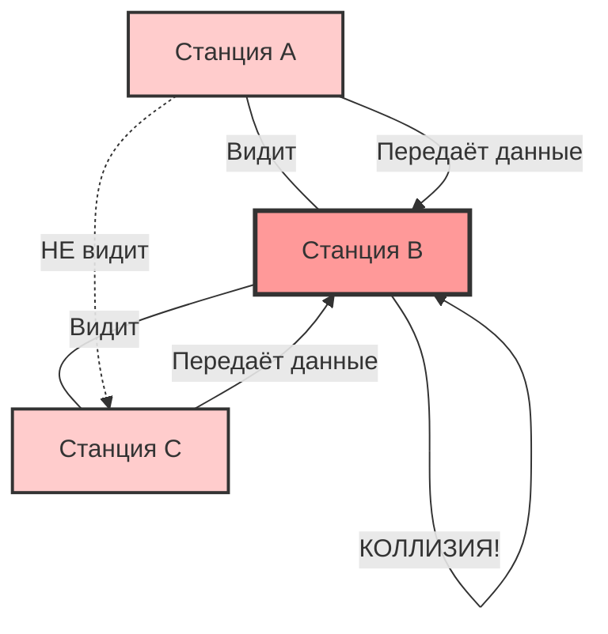
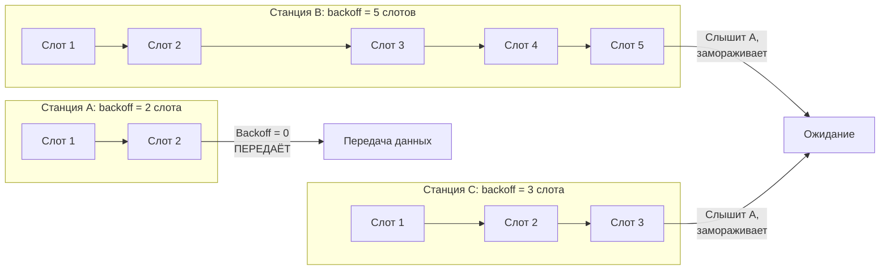
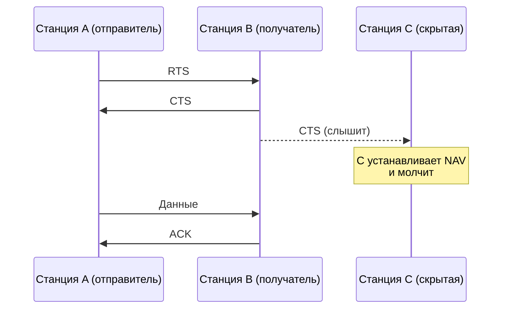
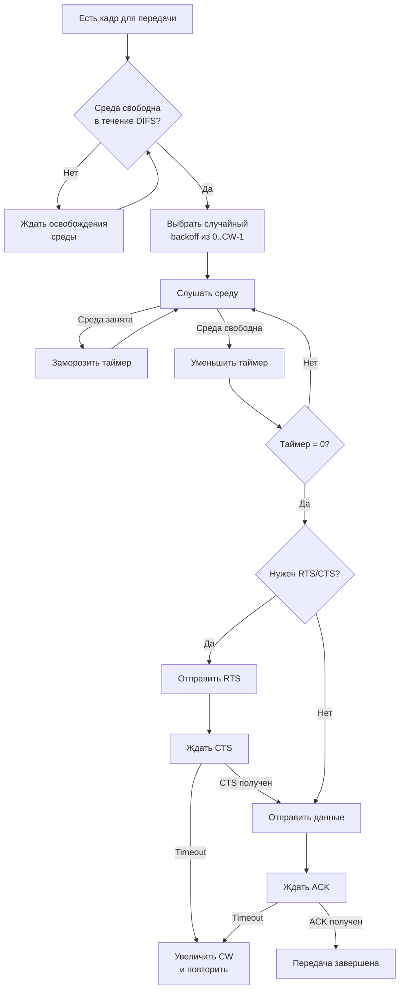

#канальный_уровень #методы_доступа_к_среде #CSMA_CA #проблема_скрытой_станции #прослушивание_несущей #межкадровые_интервалы #случайная_задержка #RTS_CTS #ACK #CSMA_CD
___
## Введение

**CSMA/CA (Carrier Sense Multiple Access with Collision Avoidance)** - это метод доступа к среде, который используется в беспроводных сетях, в первую очередь в стандарте **IEEE 802.11 (Wi-Fi)**. Как и его «проводной» предшественник CSMA/CD, он решает задачу совместного использования общей среды передачи несколькими устройствами. Однако в беспроводной среде подход к обнаружению коллизий оказывается неприменимым, что и привело к созданию принципиально другого механизма - **не обнаружения, а избегания коллизий**

В этой заметке мы разберём, почему CSMA/CD не работает в Wi-Fi, с какими уникальными проблемами сталкивается беспроводная среда, и как CSMA/CA с его механизмами DIFS, SIFS, backoff и RTS/CTS решает эти проблемы

___

## Почему CSMA/CD не работает в беспроводных сетях?

В проводном Ethernet устройство может **одновременно передавать и слушать** линию. Если во время передачи оно слышит искажение сигнала (наложение чужого сигнала), это означает коллизию - и передача немедленно прекращается. В беспроводной среде такой подход невозможен по двум причинам:
1. **Невозможность одновременной передачи и приёма на одной частоте.** Радиопередатчик, излучающий сигнал, «заглушает» собственный приёмник. Устройство физически не может слышать эфир в момент, когда само передаёт
2. **Проблема скрытой станции (Hidden Node Problem).** Даже если бы устройство могло слушать, оно не обязательно услышало бы коллизию. Два узла могут находиться вне зоны слышимости друг друга, но оба - в зоне слышимости третьего узла (получателя). Одновременная передача от них приведёт к коллизии у получателя, о которой сами отправители не узнают

Именно эти ограничения заставляют Wi-Fi использовать стратегию **избегания** коллизий, а не их обнаружения:

_Станции A и C не слышат друг друга (скрытые станции), но обе слышат B. Одновременная передача от A и C приводит к коллизии у B_

___

## Основные механизмы CSMA/CA

CSMA/CA использует несколько взаимосвязанных механизмов, которые в совокупности минимизируют вероятность коллизий

### 1. Прослушивание несущей и межкадровые интервалы (IFS)

Станция, желающая передать кадр, сначала прослушивает эфир. Если среда занята, она ждёт. Когда среда освобождается, станция не начинает передачу немедленно - она выжидает определённый **межкадровый интервал (Interframe Space, IFS)**. В стандарте 802.11 определены несколько типов IFS, различающихся длительностью:

| Тип IFS              | Длительность (пример) | Назначение                                              |
| -------------------- | --------------------- | ------------------------------------------------------- |
| **SIFS** (Short IFS) | ~10 мкс               | Наивысший приоритет: для ACK, CTS, фрагментов данных    |
| **PIFS** (PCF IFS)   | ~30 мкс               | Для режима с централизованным управлением (PCF)         |
| **DIFS** (DCF IFS)   | ~50 мкс               | Для асинхронного режима (DCF) - обычная передача данных |

Ключевой принцип: **чем короче IFS, тем выше приоритет**. SIFS используется для служебных кадров (подтверждения, CTS), которые должны быть отправлены немедленно после приёма данных. DIFS используется для обычных кадров данных

**Зачем это нужно?** Если после передачи данных получатель отправляет ACK, он делает это через SIFS. Другие станции, ожидающие DIFS, увидят этот ACK и поймут, что передача ещё идёт (или недавно завершилась), и не начнут передачу. Таким образом, SIFS «защищает» служебные кадры от конкуренции

### 2. Случайная задержка (Backoff)

Даже после того как среда освободилась и прошёл DIFS, станция не передаёт сразу. Она выбирает **случайную задержку (backoff)** из диапазона `[0, CW-1]`, где `CW` - **окно конкуренции (Contention Window)**. Этот таймер уменьшается, пока среда свободна, и «замораживается», когда среда занята

Станция, у которой backoff-таймер достигнет нуля первой, получает право на передачу. Поскольку задержки случайны, вероятность одновременного начала передачи несколькими станциями резко снижается

**Экспоненциальное увеличение окна.** При каждой неудачной передаче (коллизии или отсутствии ACK) размер окна конкуренции увеличивается по экспоненте: `CW = 2^m * W₀`, где `m` - номер попытки. Это снижает вероятность повторных коллизий и адаптирует поведение станции к уровню загрузки сети

### 3. Механизм RTS/CTS (Request to Send / Clear to Send)

Для борьбы с проблемой скрытой станции в CSMA/CA (начиная с определённого размера кадра) используется **опциональный механизм «рукопожатия»**:
1. **Отправитель A** отправляет короткий кадр **RTS (Request to Send)** получателю B
2. **Получатель B** отвечает кадром **CTS (Clear to Send)**
3. Только после получения CTS станция A передаёт данные

**Как это решает проблему скрытой станции?** Кадр CTS слышат **все** станции в зоне действия B (включая скрытую станцию C). В CTS содержится информация о том, как долго будет длиться предстоящая передача. Услышав CTS, станция C устанавливает свой **вектор сетевого распределения (NAV - Network Allocation Vector)** - таймер, в течение которого она не будет пытаться передавать

### 4. Кадр подтверждения (ACK)

После успешного приёма данных получатель отправляет **ACK (Acknowledgment)**. Если отправитель не получает ACK в течение заданного времени, он считает передачу неудачной и повторяет её. Это обеспечивает надёжность на уровне MAC, компенсируя отсутствие информации о коллизиях

___

## Полный алгоритм CSMA/CA (упрощённо)

___

## Сравнение CSMA/CA и CSMA/CD

|Характеристика|**CSMA/CD**|**CSMA/CA**|
|---|---|---|
|**Стратегия**|Обнаружение коллизий|Избегание коллизий|
|**Среда**|Проводная (Ethernet)|Беспроводная (Wi-Fi)|
|**Обнаружение коллизий**|Возможно (сравнение сигналов)|Невозможно (нет одновременного приёма/передачи)|
|**Подтверждения**|Не требуются (коллизии обнаруживаются)|Обязательны (ACK на уровне MAC)|
|**Механизм RTS/CTS**|Нет|Есть (опционально)|
|**Backoff**|После обнаружения коллизии|До передачи (всегда)|
|**Актуальность**|Устарел (только полудуплекс)|Активно используется в Wi-Fi|

CSMA/CA существенно сложнее CSMA/CD, поскольку он должен **предугадывать** коллизии, а не реагировать на них постфактум. Платой за это является более высокий уровень накладных расходов (ACK, RTS/CTS, backoff) и, как следствие, меньшая эффективная пропускная способность по сравнению с коммутируемым полнодуплексным Ethernet

___

## Заключение

CSMA/CA - это фундаментальный метод доступа, который сделал возможным существование Wi-Fi и других беспроводных сетей. Он решает уникальные проблемы беспроводной среды, которые не встречаются в проводных сетях:
1. **Невозможность обнаружения коллизий** во время передачи из-за «глухоты» приёмника к собственному сигналу
2. **Проблема скрытой станции**, при которой два узла не слышат друг друга, но мешают третьему
3. **Проблема открытой станции**, при которой узел воздерживается от передачи, хотя мог бы передавать без помех

Механизмы CSMA/CA - межкадровые интервалы (DIFS, SIFS), случайная задержка (backoff), RTS/CTS и обязательные подтверждения - в совокупности минимизируют вероятность коллизий и обеспечивают надёжную передачу данных в сложных условиях радиосвязи

Понимание CSMA/CA необходимо для осознания того, почему Wi-Fi работает так, как он работает, и почему его производительность зависит от количества активных устройств, уровня помех и правильной настройки параметров точки доступа