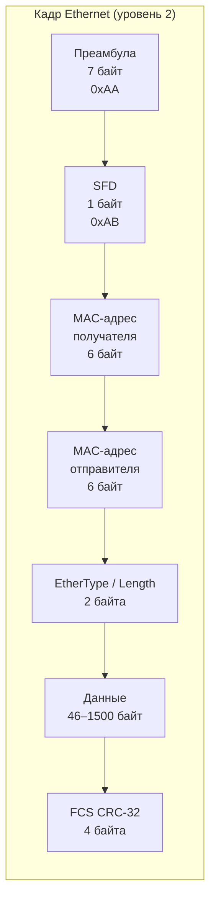
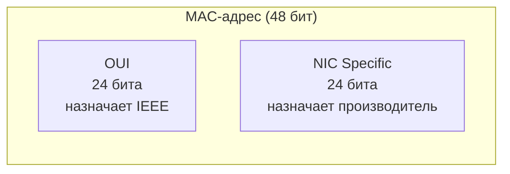
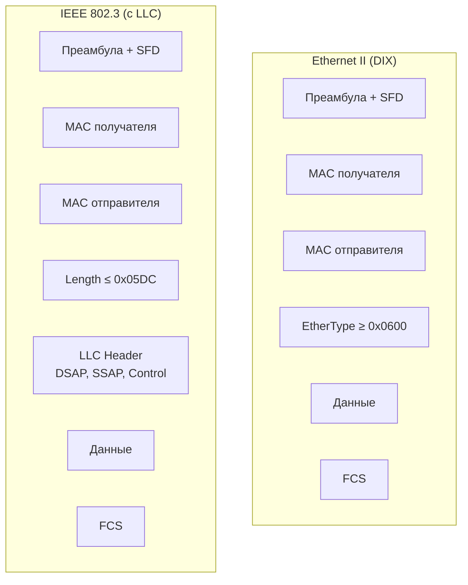

#канальный_уровень #технологии_LAN #Ethernet_и_стандарты_IEEE_802_3 #Ethernet #кадр #MAC #дуплекс #автосогласование
___
## Введение

**Ethernet** - это семейство технологий для построения проводных локальных вычислительных сетей (LAN). На сегодняшний день Ethernet является **доминирующим стандартом** для проводных сетей, вытеснившим практически все альтернативы (Token Ring, FDDI, ARCNET) благодаря простоте, масштабируемости и постоянному развитию

Стандарт Ethernet формально описан в серии документов **IEEE 802.3**, которые определяют как физический уровень (среды передачи, скорости, кодирование сигналов), так и канальный уровень (формат кадров, метод доступа к среде, MAC-адресация). Первая версия стандарта была опубликована в 1983 году, и с тех пор он непрерывно развивается, охватывая скорости от 10 Мбит/с до 400 Гбит/с и выше

В этой заметке мы рассмотрим историю Ethernet, структуру кадра, MAC-адресацию, режимы дуплекса, механизм автосогласования и эволюцию стандартов

___

## Историческая справка

Ethernet был разработан в **1973 году** инженером **Робертом Меткалфом** в исследовательском центре Xerox PARC. Первоначальная версия работала на коаксиальном кабеле со скоростью 2,94 Мбит/с. В 1980 году консорциум **DEC, Intel и Xerox (DIX)** опубликовал первую спецификацию Ethernet (Ethernet I), а в 1982 году - обновлённую версию **Ethernet II**, которая и стала основой для стандарта IEEE 802.3

В 1983 году IEEE опубликовал стандарт **802.3**, который описывал Ethernet со скоростью 10 Мбит/с на коаксиальном кабеле. С этого момента началась эволюция Ethernet, ключевые вехи которой представлены ниже:

|Стандарт|Год|Среда|Скорость|Особенности|
|---|---|---|---|---|
|**10BASE5**|1983|Толстый коаксиал|10 Мбит/с|«Thicknet», шина, до 500 м|
|**10BASE2**|1985|Тонкий коаксиал|10 Мбит/с|«Thinnet/Cheapernet», шина, до 185 м|
|**10BASE-T**|1990|Витая пара (Cat3)|10 Мбит/с|Звезда, концентратор/коммутатор|
|**100BASE-TX**|1995|Витая пара (Cat5)|100 Мбит/с|Fast Ethernet, 4B/5B|
|**1000BASE-T**|1999|Витая пара (Cat5)|1 Гбит/с|Gigabit Ethernet, полный дуплекс|
|**10GBASE-T**|2006|Витая пара (Cat6a)|10 Гбит/с|10 Gigabit Ethernet|
|**40GBASE-T**|2016|Витая пара (Cat8)|40 Гбит/с|До 30 м|
|**100GBASE**|2010|Оптоволокно|100 Гбит/с|Магистрали, DWDM|

Современные версии Ethernet (40, 100, 200, 400, 800 Гбит/с) ориентированы преимущественно на оптоволокно и используются в магистральных сетях и дата-центрах

___

## Структура кадра Ethernet (IEEE 802.3)

Кадр Ethernet - это **PDU канального уровня**, который инкапсулирует пакет сетевого уровня (обычно IP). Формат кадра определён в стандарте IEEE 802.3 и имеет следующую структуру:

### 1. Преамбула и SFD (Start Frame Delimiter)

**Преамбула** состоит из 7 байт по `0xAA` (чередующиеся 1 и 0: `10101010...`). Она используется для **синхронизации тактовой частоты** приёмника с передатчиком. **SFD** (Start Frame Delimiter) - это 1 байт `0xAB` (`10101011`), который нарушает чередование и сигнализирует о начале кадра

> _Преамбула и SFD относятся к физическому уровню (уровень 1), но обычно рассматриваются вместе с кадром_

### 2. MAC-адреса (Destination и Source)

Каждый кадр содержит **MAC-адрес получателя** (6 байт) и **MAC-адрес отправителя** (6 байт). MAC-адрес - это уникальный 48-битный идентификатор сетевого интерфейса. Первые 3 байта - **OUI (Organizationally Unique Identifier)**, назначенный IEEE производителю, последние 3 байта - уникальный номер устройства, назначаемый производителем:
- **Unicast**: Адрес конкретного устройства
- **Broadcast**: `FF:FF:FF:FF:FF:FF` - кадр доставляется всем устройствам в сети
- **Multicast**: Адрес группы устройств (первый бит OUI = 1)

### 3. EtherType / Length

Поле из 2 байт выполняет двойную функцию в зависимости от значения:
- **Ethernet II (DIX)**: Если значение ≥ `0x0600` (1536), это **EtherType** - идентификатор протокола верхнего уровня (например, `0x0800` = IPv4, `0x86DD` = IPv6, `0x0806` = ARP)
- **IEEE 802.3**: Если значение ≤ `0x05DC` (1500), это **длина** поля данных. В этом случае следом идёт заголовок **LLC (802.2)**

> _В современных сетях доминирует формат Ethernet II, поэтому поле почти всегда интерпретируется как EtherType_

### 4. Данные (Payload) и заполнение (Padding)

Поле данных содержит полезную нагрузку - обычно IP-пакет. Минимальный размер кадра Ethernet - **64 байта** (без преамбулы). Если данные меньше 46 байт, добавляется **заполнение (padding)**. Максимальный размер - **1500 байт** (MTU Ethernet). Некоторые реализации поддерживают **Jumbo Frames** до 9000 байт

### 5. FCS (Frame Check Sequence)

Последние 4 байта кадра - это **CRC-32** (Cyclic Redundancy Check). Приёмник вычисляет CRC и сравнивает с переданным. Если значения не совпадают - кадр повреждён и отбрасывается

___

## MAC-адресация

MAC-адрес - это 48-битный (6-байтовый) идентификатор, уникальный для каждого сетевого интерфейса. Формат записи: `XX:XX:XX:XX:XX:XX` (шестнадцатеричные байты)

### Структура MAC-адреса

- **OUI (Organizationally Unique Identifier)**: Первые 24 бита, назначаемые IEEE производителю
- **NIC Specific**: Последние 24 бита, назначаемые производителем для конкретного устройства

### Типы MAC-адресов

- **Unicast (индивидуальный)**: Младший бит первого байта = 0. Адрес конкретного интерфейса
- **Multicast (групповой)**: Младший бит первого байта = 1. Адрес группы интерфейсов
- **Broadcast (широковещательный)**: Все биты = 1 (`FF:FF:FF:FF:FF:FF`). Кадр доставляется всем устройствам в широковещательном домене

___

## Скорости и дуплекс

Ethernet поддерживает два режима передачи:
- **Half-Duplex (полудуплекс)**: Передача и приём по очереди. Используется **CSMA/CD** для разрешения коллизий. Применяется только в разделяемых средах (концентраторы, старые коаксиальные сети)
- **Full-Duplex (полный дуплекс)**: Одновременная передача и приём. Коллизии невозможны, CSMA/CD отключён. Требует коммутатора или прямого соединения точка-точка

Современные Ethernet-сети (100 Мбит/с и выше) работают исключительно в **полнодуплексном режиме**

### Эволюция скоростей

|Стандарт|Скорость|Среда|Кодирование|Мин. размер кадра|
|---|---|---|---|---|
|10BASE-T|10 Мбит/с|Cat3 UTP|Manchester|64 байта|
|100BASE-TX|100 Мбит/с|Cat5 UTP|4B/5B|64 байта|
|1000BASE-T|1 Гбит/с|Cat5 UTP|8B/10B, PAM-5|512 байт|
|10GBASE-T|10 Гбит/с|Cat6a UTP|64B/66B|512 байт|

_Примечание: минимальный размер кадра для Gigabit Ethernet и выше увеличен до 512 байт из-за уменьшения slot time при повышении скорости_

___

## Автосогласование (Auto-Negotiation)

**Автосогласование** - это механизм, позволяющий двум устройствам автоматически определить и выбрать **наилучший общий режим работы** (скорость и дуплекс) при подключении

Механизм работает через обмен **импульсными посылками (link pulses)**, которые содержат кодовое слово с информацией о поддерживаемых режимах. Устройства сравнивают свои возможности и выбирают максимальную общую скорость с приоритетом полного дуплекса

> _Важно: Автосогласование определено в стандарте IEEE 802.3, клаузула 28. Если автосогласование не используется, необходимо вручную настроить скорость и дуплекс на обоих концах линии_

___

## Эволюция и современное состояние

Ethernet прошёл путь от полудуплексной шины на коаксиальном кабеле до полнодуплексных коммутируемых сетей со скоростями в сотни гигабит. Ключевые изменения:
1. **От шины к звезде**: Переход от общей разделяемой среды (коаксиал) к коммутируемым сетям (витая пара, звезда). Это устранило коллизии и позволило использовать полный дуплекс
2. **От CSMA/CD к коммутации**: В современных коммутируемых сетях CSMA/CD не используется, так как каждый порт коммутатора - отдельный коллизионный домен
3. **Рост скоростей**: От 10 Мбит/с до 400 Гбит/с и выше. Для высоких скоростей используются оптоволокно и сложные методы кодирования (64B/66B, PAM-4)
4. **Расширение областей применения**: Ethernet используется не только в LAN, но и в MAN/WAN (Metro Ethernet), в дата-центрах, в промышленных сетях (Industrial Ethernet)

___

## Схематическое представление

### Сравнение форматов кадров Ethernet II и IEEE 802.3

_Различие: Ethernet II использует поле Type, IEEE 802.3 - поле Length + заголовок LLC_

___

## Заключение

Ethernet - это фундаментальная технология, на которой построены практически все проводные локальные сети. Его ключевые характеристики:
1. **Стандартизация IEEE 802.3**: Единый стандарт, обеспечивающий совместимость оборудования разных производителей
2. **Формат кадра**: Преамбула, MAC-адреса, EtherType/Length, данные, FCS. Обеспечивает адресацию, идентификацию протокола и контроль целостности
3. **MAC-адресация**: 48-битные уникальные адреса с OUI и NIC-частью
4. **Дуплекс**: Современные сети работают в полнодуплексном режиме, коллизии исключены
5. **Автосогласование**: Автоматический выбор оптимальных параметров соединения
6. **Эволюция**: От 10 Мбит/с на коаксиале до 400 Гбит/с на оптоволокне

Понимание Ethernet необходимо для любого специалиста в области сетей, так как это базовая технология, с которой начинается изучение канального уровня